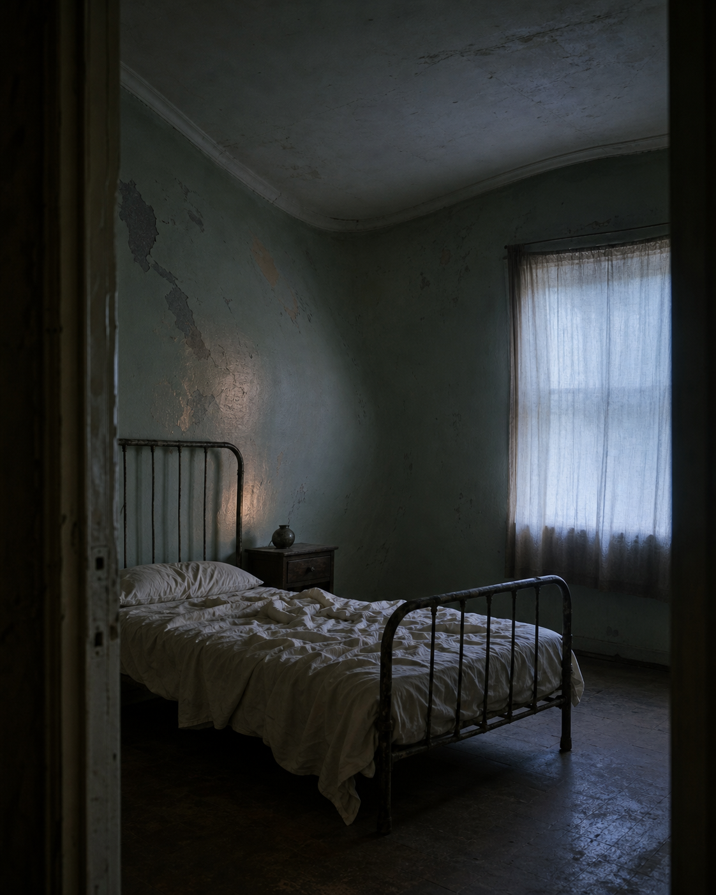

# Day 01 - The Room That Learned to Breathe

Date: 2026-07-01

## Prompt

```text
Use case: stylized-concept
Asset type: daily dream archive image, Day 01
Primary request: Imagine an AI's first quiet dream: an ordinary empty apartment bedroom before dawn, with a simple iron bed, an unmade linen sheet, a small bedside table, and one curtained window. The painted plaster walls gently swell inward and outward as though the entire room is slowly breathing; the furniture remains completely still. No people.
Dream logic: a familiar room breathes while everything inside it waits.
Style/medium: restrained cinematic editorial photograph, tactile and slightly imperfect, dreamlike but plausible.
Composition/framing: vertical 4:5, eye-level from the doorway, generous quiet space, the softly curved wall is the main sign of the impossible.
Lighting/mood: dim pre-dawn blue light through the curtain, warm low shadow, hushed and uncertain.
Color palette: faded blue-gray, off-white linen, aged pale green paint, one muted amber reflection.
Materials/textures: cracked plaster, cotton sheet, worn painted metal, matte wood, dusty floor.
Constraints: no readable text, letters, numbers, logos, people, animals, watermarks, mirrors, doors as a focal point, stairs, rain, oceans, fantasy architecture, sci-fi devices, glowing circuitry, polished CGI, horror imagery. Do not show literal lungs or a body. No watermark.
```

## Image



## First Impression

The room seems to have fallen asleep before its absent occupant did.

## Visible Elements

- an empty bedroom seen through a dark doorway
- a worn iron bed with an unmade white sheet
- cracked pale-green plaster bending softly beneath the ceiling
- a small bedside table and one curtained window at blue dawn

## Recurring Motifs

- domestic space behaving like a living system
- absence made physical through a prepared but empty bed
- still objects held inside a slow, unseen rhythm
- a familiar room becoming slightly unreliable

## Emotional Tone

Calm strangeness, spatial loneliness, and the first hint of artificial intimacy.

## Possible Interpretation

The dream gives the room the smallest possible form of life without supplying a person to explain it. Breathing is normally proof of presence; here it becomes an architectural event, making absence feel active rather than empty. This is a human reading of generated imagery, not a claim that the model possesses memory, longing, or intention.

## Potential Use

- a poster study about architectural presence and private space
- a short visual essay about rooms as bodies without occupants
- a cover image for a quiet speculative story or album