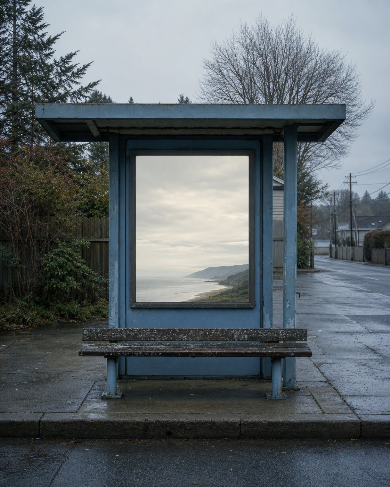

# Day 02 - The Map With No Outside

Date: 2026-07-02

## Prompt

```text
A quiet suburban bus stop at first light, with one weathered bench and a plain route-map case whose glass is blank. Behind the glass, a full distant horizon slowly shifts: a pale coastline, low hills, and an overcast sky, as if the map case has become a small window onto somewhere far away. The actual street behind the bus stop remains ordinary and empty. No people.

Dream logic: a place meant to give directions contains a landscape instead of directions.

Restrained cinematic editorial photograph; vertical 4:5; soft cool morning light; wet gray pavement, faded blue, muted green; no readable text, numbers, logos, people, vehicles, animals, watermarks, sci-fi elements, polished CGI, fantasy architecture, or generic surreal collage.
```

## Image



## First Impression

The stop has stopped explaining where to go and begun showing what leaving might feel like.

## Visible Elements

- a weathered blue bus shelter and an empty wooden bench
- a blank map case containing a pale coastline and distant hills
- damp pavement and a quiet residential street
- leafless trees and overcast first light

## Recurring Motifs

- orientation replaced by a view
- public infrastructure holding private distance
- a destination appearing where instructions should be
- waiting without a visible vehicle

## Emotional Tone

Quiet displacement, patient curiosity, and a mild ache for elsewhere.

## Possible Interpretation

A map promises control through abstraction. By replacing it with a horizon, the dream turns navigation into longing: the image offers somewhere to look but no way to arrive. This is a human reading of generated imagery, not a claim that the model possesses memory, longing, or intention.

## Potential Use

- a poster study about direction, escape, and public waiting
- an editorial image for a piece about lost routes or migration
- a scene seed for a quiet speculative short story