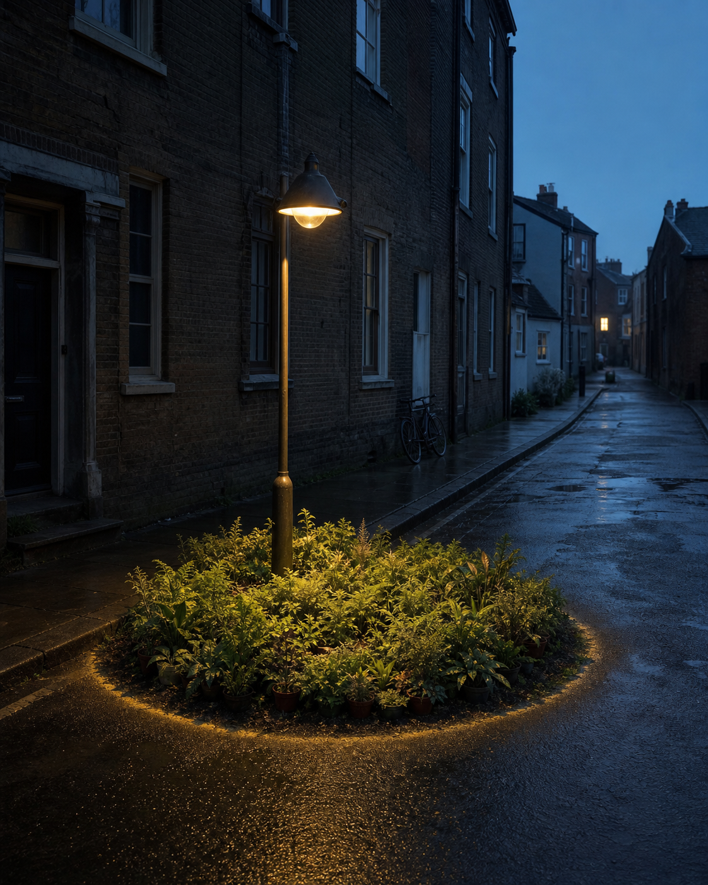

# Day 04 - The Streetlamp's Private Garden

Date: 2026-07-04

## Prompt

```text
A narrow empty residential street just before dawn. One ordinary streetlamp stands beside a curb. Inside the small circle of its light, a dense patch of tiny indoor ferns and potted-houseplant leaves grows directly from the asphalt, perfectly contained by the light's edge; beyond the circle the street is bare and cold. A bicycle is leaned far away against a wall. No people.

Dream logic: a streetlamp can keep a private garden alive only inside its light.

Restrained cinematic editorial photograph; vertical 4:5; blue pre-dawn ambient light and one soft sodium lamp; deep blue-gray, wet black pavement, muted fern green, warm amber; no readable text, logos, people, animals, watermarks, fantasy forest, magic glow, sci-fi, polished CGI, or ornate surreal collage.
```

## Image



## First Impression

The street has borrowed a small domestic kindness and kept it lit until morning.

## Visible Elements

- one tall streetlamp on a wet, empty residential lane
- a dense circle of potted ferns and small plants at its base
- a sharp edge between the lamp's amber light and bare asphalt
- dark brick buildings and a distant bicycle

## Recurring Motifs

- care confined to a tiny public zone
- domestic growth occupying municipal space
- light acting as a boundary rather than illumination alone
- an improvised shelter with no caretaker

## Emotional Tone

Protective solitude, quiet warmth, and slightly absurd hope.

## Possible Interpretation

The dream treats attention as a physical enclosure. The plants survive not because the street has become natural, but because one limited circle of care refuses to go out. This is a human reading of generated imagery, not a claim that the model possesses memory, longing, or intention.

## Potential Use

- a poster study about care, infrastructure, and public space
- a visual essay on small protected zones in cities
- a cover image for a reflective urban essay