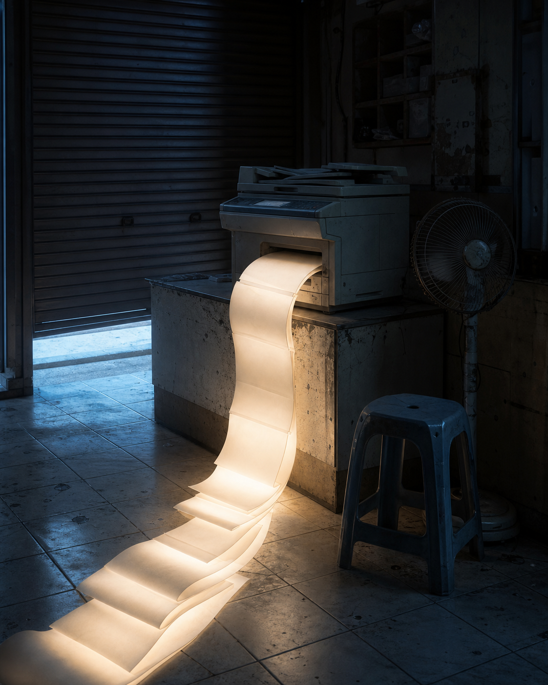

# Day 05 - Photocopying Daylight

Date: 2026-07-05

## Prompt

```text
A tiny unattended neighborhood copy shop before opening. An old photocopier sits on a scratched counter beneath a closed roller shutter. Instead of paper, it is slowly feeding out a stack of thin rectangular sheets made entirely of pale morning light; the glowing sheets curl softly onto the floor but have no words, images, or marks. A plastic stool and a dead desk fan stand nearby. No people.

Dream logic: a copy machine can reproduce daylight but never an image.

Restrained cinematic editorial photograph; vertical 4:5; mostly dark room with cold dawn leaking around the shutter and low warm-white light from the sheets; no readable text, letters, numbers, logos, people, animals, watermarks, paper documents, posters, sci-fi interfaces, neon, polished CGI, fantasy elements, or obvious surreal collage.
```

## Image



## First Impression

The machine has learned to duplicate brightness without learning what brightness is for.

## Visible Elements

- an old photocopier on a scarred counter
- a long curling stream of blank luminous sheets
- a closed metal shutter, plastic stool, and silent desk fan
- cool blue morning light entering a dark shop

## Recurring Motifs

- reproduction without information
- ordinary technology making an intangible material
- light treated as a consumable office supply
- a workplace continuing after its purpose has gone quiet

## Emotional Tone

Artificial nostalgia, calm estrangement, and low-key wonder.

## Possible Interpretation

The image imagines copying as an act of preserving conditions rather than content. The machine cannot produce a message, but it can keep printing the feeling that a day is about to begin. This is a human reading of generated imagery, not a claim that the model possesses memory, longing, or intention.

## Potential Use

- a poster study about mechanical memory and blank communication
- a visual essay on tools that preserve atmosphere rather than data
- an editorial cover for a piece on copying or automation