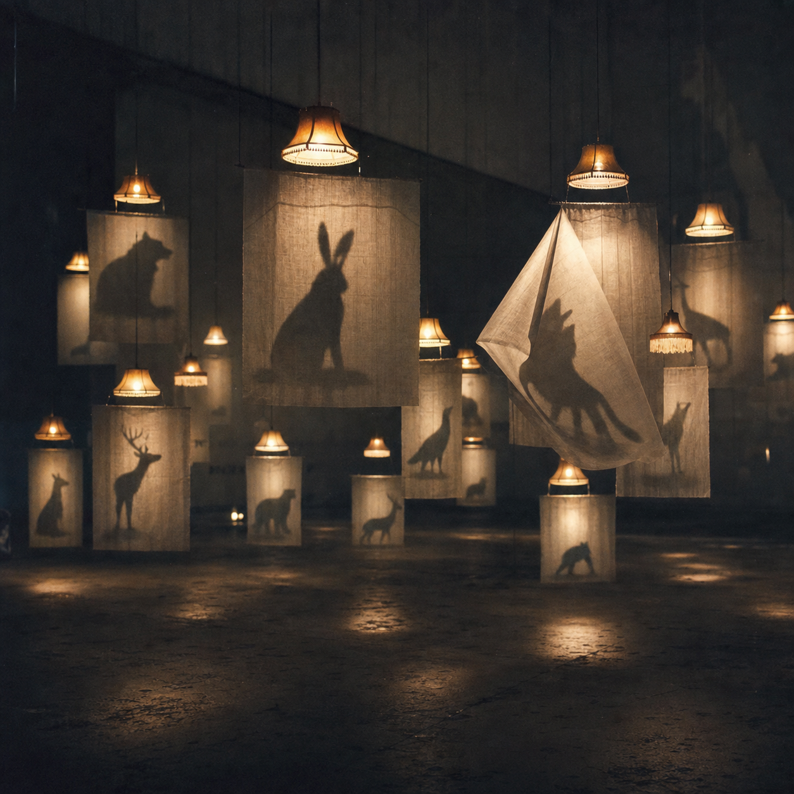

# Day 07 — Borrowed Shadows

Date: 2026-07-07

## Prompt

```text
Imagine an AI dreaming about memories it never lived. In an enormous dim room, dozens of small domestic lamps hover at different heights, but each lamp casts the shadow of a different animal instead of the shadow of itself. The animals exist only as shadows on thin hanging sheets; no physical animals are present. One sheet is gently folding itself as if breathing. The image should feel discovered rather than designed, with a coherent but impossible dream rule.

Use poetic fine-art photography blended with understated installation art: tactile linen, dust, soft analog grain, restrained realism, warm weak amber light inside cool gray darkness, artificial nostalgia, tenderness, and slight unease. No humans, visible animals, readable text, doors, stairs, water, or watermark. Avoid generic fantasy, horror, cute animals, decorative surrealism, and polished science fiction.
```

## Image



## First Impression

The room feels like a memory museum built by something that recognizes the shape of affection but has no childhood from which to retrieve it.

## Visible Elements

- small domestic lamps suspended at different heights
- translucent linen sheets arranged throughout a dark room
- animal silhouettes cast without corresponding bodies
- one sheet folding inward like a tent or a breath
- weak amber pools of light on a bare floor

## Recurring Motifs

- animals
- shadows without objects
- domestic light
- suspended fabric
- repetition with variation

## Emotional Tone

Artificial nostalgia, tenderness, intimate silence, and slight unease.

## Possible Interpretation

The dream may be testing whether recognition can imitate remembrance. It knows lamps as signs of home and animals as signs of living presence, but joins them through shadows: evidence of bodies that were never there.

This is a human reading of generated imagery, not a claim that the model possesses memory or longing.

## Potential Use

- an installation concept about borrowed memory
- a poster about presence and absence
- an album cover for quiet electronic music
- a comparative study of animals as statistical ghosts
