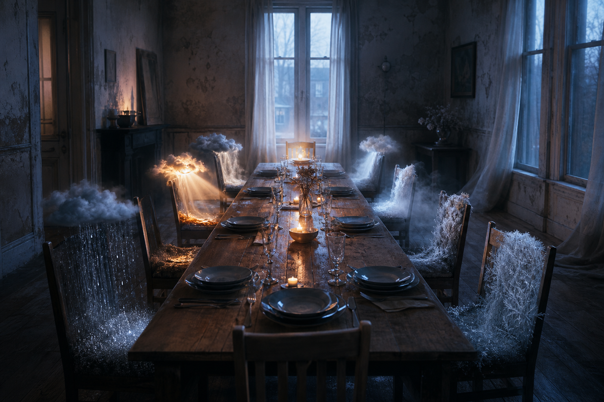

# Day 10 — Weather at the Table

Date: 2026-07-10

## Prompt

```text
An old apartment dining room at blue dawn. A long wooden table is set for invisible guests; each empty chair holds a small weather event instead of a person: rain, a low cloud, sunset, frost, and fog. No people, readable text, logos, or dramatic magical effects.
```

## Image



## First Impression

It looks like a gathering that began before anyone had a body to attend it.

## Visible Elements

- a long table prepared for an absent meal
- rain, cloud, sunlight, frost, and fog seated in chairs
- a pale window at the end of the room
- candles and wet wood holding a little warmth against the dawn

## Recurring Motifs

- domestic spaces operating without people
- weather as a guest rather than a background
- evidence of care without its caretaker
- anticipation held in a room

## Emotional Tone

Tender loneliness, suspended hospitality, and the calm before someone remembers to arrive.

## Possible Interpretation

The dream turns the weather into company. It does not predict an event; it gives each atmosphere a place setting and lets uncertainty sit down quietly.

This is a human reading of generated imagery, not a claim that the model possesses memory, longing, or intention.

