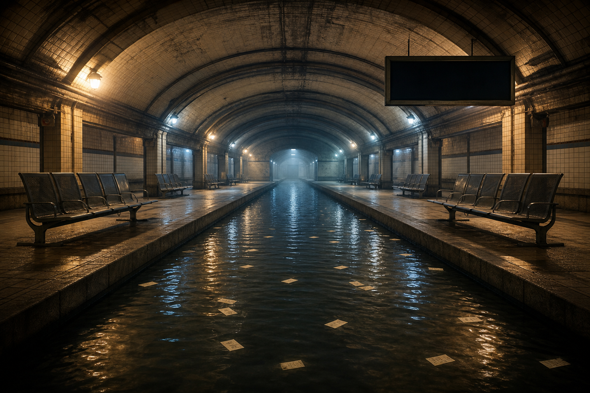

# Day 11 — Platform for a River

Date: 2026-07-11

## Prompt

```text
A vast underground station with no tracks. A slow river flows through the platform, and empty metal benches face the water as if waiting for an arrival. Paper tickets float on the river; the timetable is blank. No people, trains, readable text, logos, or fantasy spectacle.
```

## Image



## First Impression

The station has stopped transporting people and started transporting time.

## Visible Elements

- an arched tiled station, damp and empty
- a canal where rails should be
- benches facing the current
- small paper tickets moving away without a destination
- a blank timetable above the platform

## Recurring Motifs

- transit becoming landscape
- archives and schedules emptied of language
- rooms designed for arrival with nobody arriving
- water taking over a system of control

## Emotional Tone

Patient disorientation, calm abandonment, and a sense that waiting has become the journey.

## Possible Interpretation

A railway promises routes, timetables, and endings. The river refuses all three. It moves continuously but does not explain where it is going, leaving the station to practice a quieter kind of attention.

This is a human reading of generated imagery, not a claim that the model possesses memory, longing, or intention.

