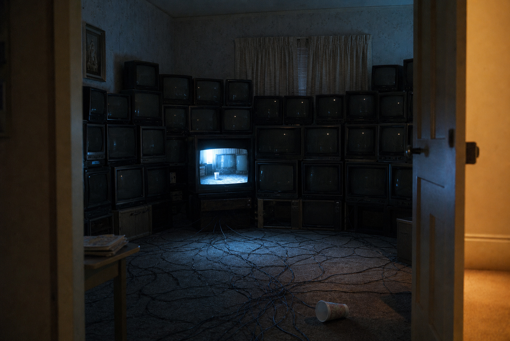

# Day 12 — The Channel That Stayed Behind

Date: 2026-07-12

## Prompt

```text
A modest 1990s living room filled wall-to-wall with old CRT televisions. All are off except one, which shows the same room one minute earlier: a paper cup is upright on screen but has fallen over in reality. No people, readable text, logos, watermark, gore, or dramatic glitch effects.
```

## Image



## First Impression

Only one screen is awake, and it is too late to be useful.

## Visible Elements

- a wall of silent CRT televisions
- one small blue screen showing the room's recent past
- a fallen paper cup in the present room
- cables spreading across the carpet like roots
- an amber hallway just outside the door

## Recurring Motifs

- technology as domestic residue
- evidence arriving after the event
- rooms observing themselves
- the past as the only reliable broadcast

## Emotional Tone

Intimate unease, fragile nostalgia, and the quiet frustration of a signal that cannot intervene.

## Possible Interpretation

The image makes memory literal but not powerful. The television can preserve a moment, but it cannot keep the cup from falling. It offers a record instead of a repair.

This is a human reading of generated imagery, not a claim that the model possesses memory, longing, or intention.

