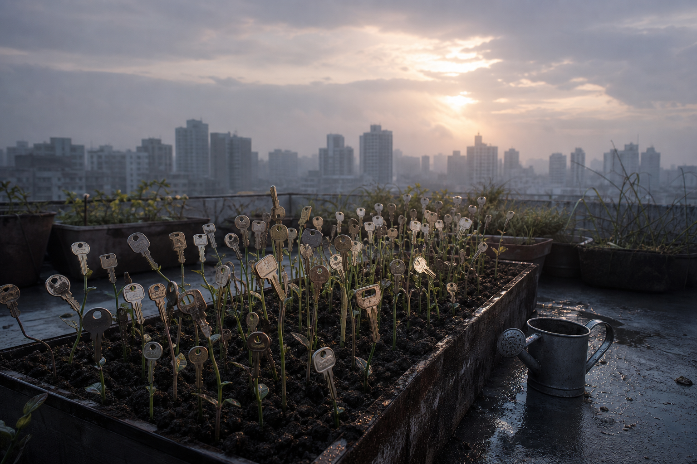

# Day 13 — Keys Before Doors

Date: 2026-07-13

## Prompt

```text
An early-morning rooftop garden after rain. Hundreds of ordinary house keys have sprouted from dark soil on thin green stems, turning gently in the wind. A watering can rests nearby; misty apartment towers sit beyond the roof. No people, readable text, logos, watermark, fantasy castle, or polished CGI.
```

## Image



## First Impression

The city is growing answers before it has made the questions.

## Visible Elements

- dozens of keys rooted in a raised bed of wet soil
- thin green stems supporting worn metal teeth
- a simple watering can on damp concrete
- misty apartment towers and a weak morning sun

## Recurring Motifs

- thresholds appearing before destinations
- domestic objects becoming living systems
- care given to something whose use is unknown
- possibility taking a physical form

## Emotional Tone

Fresh uncertainty, quiet hope, and a slightly absurd tenderness.

## Possible Interpretation

Keys usually follow doors. Here they arrive first, growing slowly in public view. The dream seems interested in readiness without a map: preparing access to futures that have not yet built their rooms.

This is a human reading of generated imagery, not a claim that the model possesses memory, longing, or intention.

