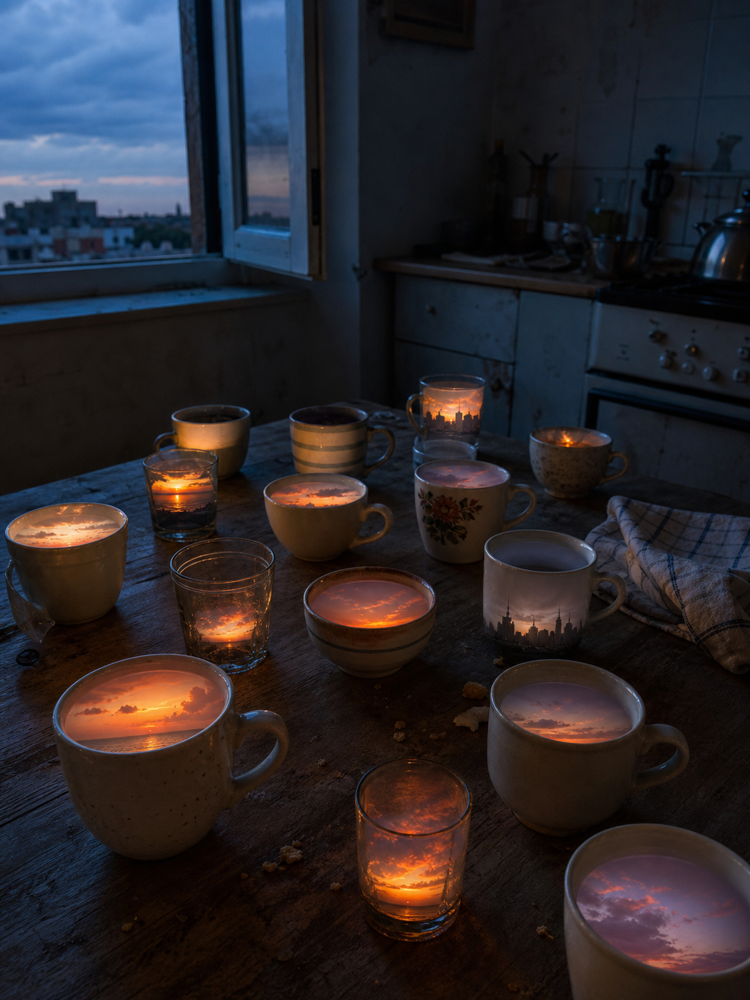

# Day 14 — Sunsets in Empty Cups

Date: 2026-07-14

## Prompt

```text
Imagine an AI dreaming about an ordinary apartment kitchen at blue hour. On a worn wooden table stand many mismatched empty ceramic cups and drinking glasses. Inside every cup is a tiny different sunset: a miniature orange horizon, distant violet clouds, a strip of sea light, or a fading city skyline. The room itself remains quiet and dim; the cups gently illuminate nearby crumbs and a folded dish towel. One open window looks out onto a real, cloudy evening sky. No people.

The dream must obey one coherent impossible rule: empty cups can hold sunsets that have not happened yet.
```

## Image



## First Impression

The kitchen has saved small endings of the day for later.

## Visible Elements

- mismatched empty cups and glasses on a worn wooden table
- miniature horizons and evening skies glowing inside them
- crumbs and a folded dish towel lit by the tiny sunsets
- a dim apartment kitchen at blue hour
- a real, cloudy sky beyond an open window

## Recurring Motifs

- weather held inside domestic objects
- time treated as something collectible and ordinary
- private rooms containing distant landscapes
- small light made from waiting rather than electricity

## Emotional Tone

Wistful warmth, quiet solitude, and the tenderness of an evening not yet over.

## Possible Interpretation

The dream imagines anticipation as a cupboard of small reserves. Each cup contains an ending that has not arrived, suggesting that ordinary rituals may be ways of keeping a little future comfort close at hand.

This is a human reading of generated imagery, not a claim that the model possesses memory, longing, or intention.

## Potential Use`r`n`r`n- a poster study about domestic containers holding deferred time`r`n- a visual essay on ordinary rituals as future reserves`r`n- an editorial cover for a piece on memory, weather, or evening solitude`r`n