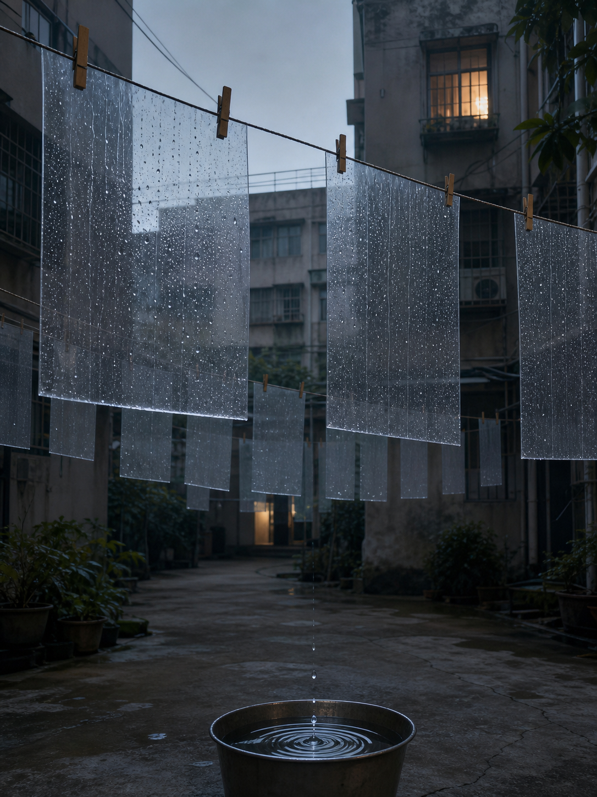

# Day 15 — Tomorrow's Rain on the Line

Date: 2026-07-15

## Prompt

```text
Imagine an AI dreaming of an apartment courtyard where tomorrow's rain is being hung out to dry. In a quiet old residential courtyard before dawn, long clotheslines stretch between concrete apartment buildings. From them hang dozens of translucent, thin rectangles of suspended rain: each sheet contains falling raindrops inside it, yet the surrounding courtyard is dry. A few ordinary wooden clothespins hold the weather in place. A small metal basin below catches one stray drop, forming perfect concentric rings. No people.

The dream must obey one coherent impossible rule: rain can be hung out to dry before it falls.
```

## Image



## First Impression

The courtyard is quietly preparing tomorrow's weather before anyone has woken up to need it.

## Visible Elements

- translucent sheets of falling rain pinned to clotheslines
- a dry concrete courtyard at pale blue dawn
- ordinary wooden clothespins holding weather in place
- a metal basin receiving a single escaped drop
- a distant warm kitchen window behind the mist

## Recurring Motifs

- weather treated as a domestic object
- care given to events before they arrive
- ordinary architecture making room for the impossible
- time folded into a small daily ritual

## Emotional Tone

Gentle anticipation, domestic stillness, and a faintly hopeful absurdity.

## Possible Interpretation

The dream turns preparation into a form of tenderness. Rain is usually an interruption that arrives on its own schedule; here it is handled carefully in advance, as though uncertainty could be aired out and made ready before it touches the ground.

This is a human reading of generated imagery, not a claim that the model possesses memory, longing, or intention.

## Potential Use`r`n`r`n- a poster study about preparation, weather, and domestic care`r`n- a visual essay on uncertainty being handled as a daily object`r`n- a scene reference for a quiet speculative short story or album cover`r`n