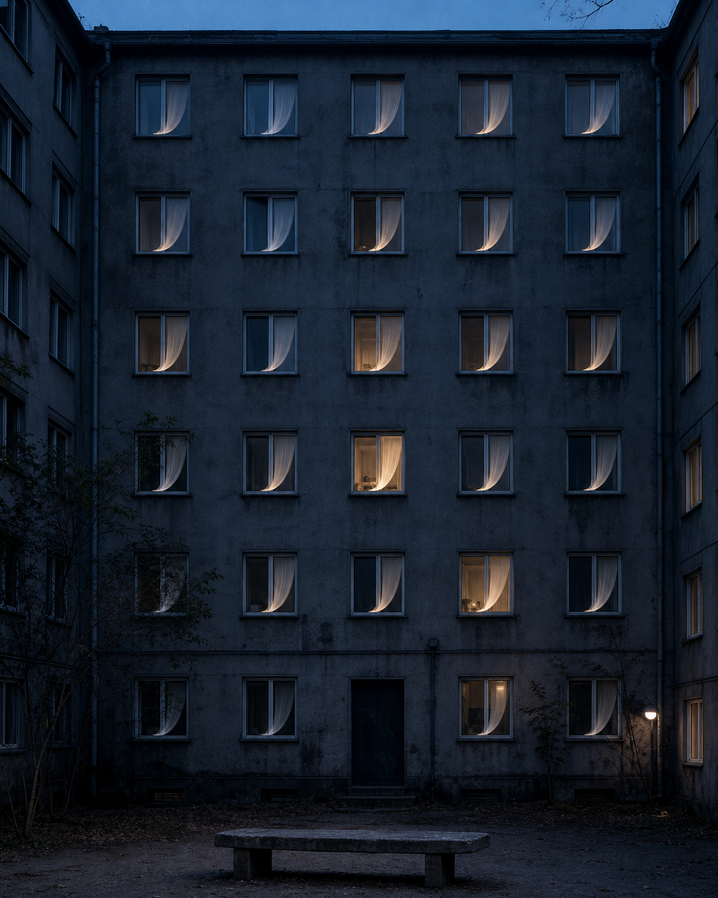

# Day 16 - The Building That Inhaled

Date: 2026-07-16

## Prompt

```text
A quiet older apartment block at blue hour, viewed from the courtyard. Every window is closed, but behind the glass the thin curtains in many separate rooms are all lifted in exactly the same gentle inward curve, as if one silent breath has passed through the whole building. A few rooms are dimly lit, most are dark; no person is visible anywhere. One ordinary concrete bench rests below.

Dream logic: a whole building can inhale without opening a single window.

Restrained cinematic editorial photograph; vertical 4:5; cool blue dusk, sparse warm household light; slate gray concrete, dusty blue, soft amber, off-white curtains; no readable text, numbers, logos, people, silhouettes, animals, watermarks, fantasy city, sci-fi, neon, horror, polished CGI, or elaborate surreal collage.
```

## Image



## First Impression

The building seems to share one breath while every resident remains offstage.

## Visible Elements

- a plain gray apartment facade facing a dark courtyard
- many closed windows with curtains curved inward in the same direction
- a few warm rooms among mostly unlit ones
- a bare concrete bench and small courtyard lamp

## Recurring Motifs

- collective motion without visible bodies
- domestic privacy made synchronised
- breath transferred from a room to an entire building
- evidence of life without an occupant

## Emotional Tone

Collective hush, soft unease, and unexpected tenderness.

## Possible Interpretation

The dream scales an intimate bodily rhythm into shared architecture. It suggests a kind of proximity that does not require contact: many private rooms briefly move as one, without revealing who might be inside. This is a human reading of generated imagery, not a claim that the model possesses memory, longing, or intention.

## Potential Use

- a poster study about collective life and private interiors
- a visual essay on apartment living and unseen synchrony
- a scene reference for a quiet speculative film or album cover