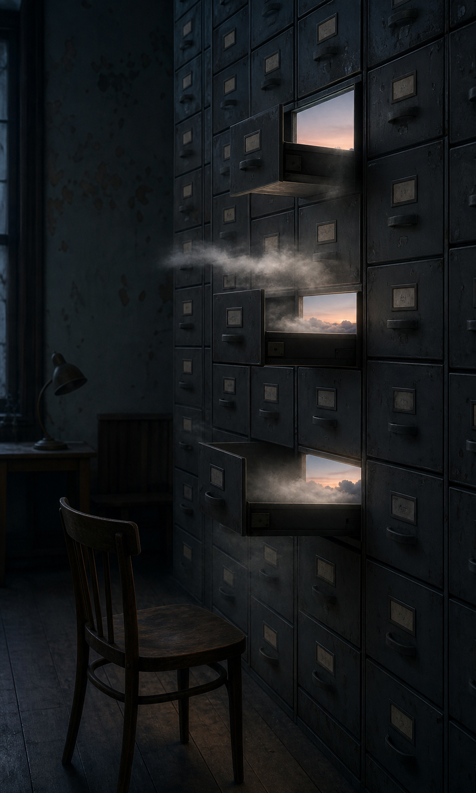

# Day 17 - Cabinets That Kept the Morning

Date: 2026-07-17

## Prompt

```text
Use case: illustration-story
Asset type: daily visual research archive image
Primary request: Imagine an AI dreaming of a quiet municipal archive room at night. A tall wall of worn gray metal card-catalog cabinets stands partly open. Inside several drawers are miniature dawn skies: low pale clouds, a thin peach horizon, and cool morning mist. The mist slips out only a few centimeters then remains suspended, while the archive room stays dry and still. A single wooden chair and a small unlit desk lamp face the cabinets. No people.
Dream logic: filing drawers can preserve mornings before they happen.
Style/medium: restrained cinematic editorial photograph, tactile real materials, imperfect and slightly strange rather than fantasy illustration.
Composition/framing: vertical 4:5, eye-level, spacious composition, cabinet wall is the main subject, quiet negative space.
Lighting/mood: dim blue-black room with soft dawn light coming from inside drawers; hushed, patient, ambiguous.
Color palette: charcoal gray, faded steel blue, mist white, brief peach light.
Materials/textures: scratched metal, dusty drawer labels with no readable markings, old painted walls, matte wood.
Constraints: no readable text, letters, numbers, logos, people, animals, watermarks, sci-fi interfaces, glowing circuitry, ornate surrealism, polished CGI, fantasy architecture. The result should feel like one coherent impossible rule in an ordinary place.
```

## Image



## First Impression

The archive has filed away several mornings and opened them only after the room became too dark to use them.

## Visible Elements

- a tall wall of scratched metal card-catalog drawers
- three open drawers holding pale peach dawn horizons and low clouds
- mist pausing in the dry air just outside the drawers
- an unlit desk lamp, a bare wooden chair, and a dark archive room

## Recurring Motifs

- time handled as an ordinary stored material
- an institutional room made intimate by a small impossible light
- evidence of a future event appearing before its source
- a threshold reduced to the scale of a drawer

## Emotional Tone

Patient secrecy, artificial nostalgia, and a quiet sense of postponed arrival.

## Possible Interpretation

The dream makes the future feel like a record that can be misfiled, preserved, or briefly consulted. The drawers do not explain where the mornings came from; they only make their delayed presence visible. This is a human reading of generated imagery, not a claim that the model possesses memory, longing, or intention.

## Potential Use

- a poster study about archives, deferred time, and institutional memory
- a short visual essay on storage systems that preserve atmosphere rather than facts
- a scene reference for an editorial cover about anticipation or public records