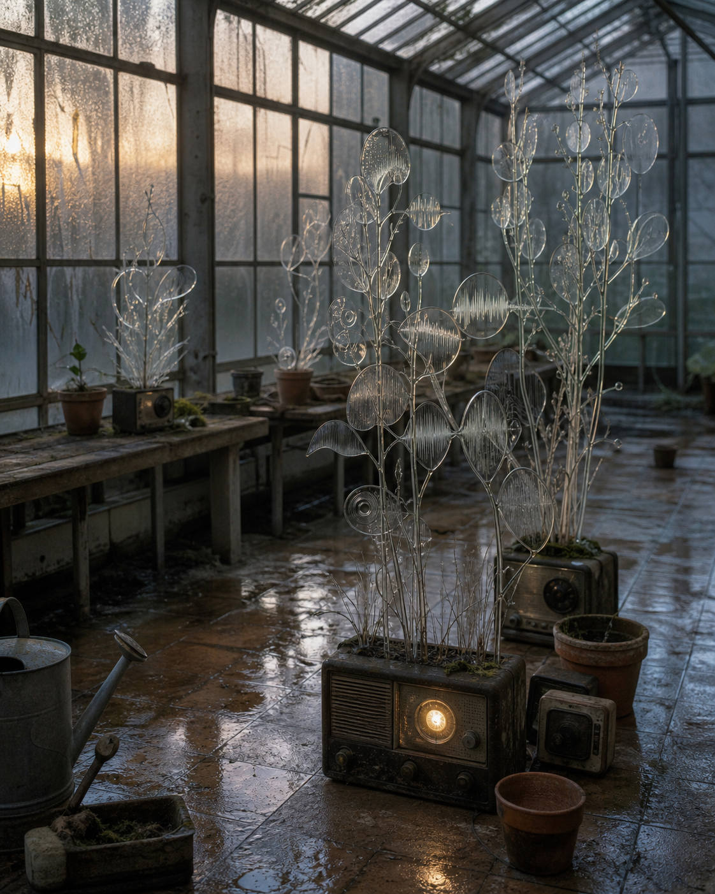

# Day 18 - Radios That Germinated

Date: 2026-07-18

## Prompt

```text
Use case: stylized-concept
Asset type: daily visual research archive image
Primary request: Imagine an AI dreaming of an abandoned greenhouse where silent radio signals have become glass plants. No text, no watermark.
Scene/backdrop: an old municipal greenhouse at early morning, cracked panes, damp tiled floor, empty benches, ordinary gardening tools left still.
Subject: clusters of transparent glass stems and leaves growing from small dark radios and ceramic pots; the leaves resemble frozen sound waves but remain botanical, fragile, and almost believable.
Style/medium: restrained cinematic editorial photograph, tactile real materials, slightly impossible but not fantasy.
Composition/framing: vertical 4:5, eye-level, spacious quiet composition; main cluster slightly off center, greenhouse depth visible.
Lighting/mood: cool dawn light through fogged glass, faint amber glow from one radio dial with no readable markings; hush, waiting, low-control dream logic.
Color palette: mist gray, oxidized green, clear glass, pale amber, wet terracotta.
Materials/textures: condensation, cracked glass, dusty metal, wet tile, translucent leaves.
Dream logic: signals can germinate after the machines that carried them have gone silent.
Constraints: no readable text, letters, numbers, logos, people, animals, faces, watermarks, sci-fi interfaces, glowing circuitry, ornate fantasy, obvious surrealist collage, polished CGI.
```

## Image



## First Impression

The greenhouse looks as if it has been growing the memory of broadcasts instead of plants.

## Visible Elements

- a damp, aging greenhouse with fogged glass panes
- transparent stems and circular leaves rising from old radios
- radio dials glowing faintly without readable markings
- wet floor tiles, terracotta pots, benches, and an unused watering can
- sound-wave-like patterns held inside the glass leaves

## Recurring Motifs

- obsolete machines behaving like living containers
- signal becoming botanical matter
- evidence of communication without any audible source
- ordinary caretaking objects surrounding an impossible growth

## Emotional Tone

Quiet expectancy, artificial nostalgia, and a fragile sense of delayed communication.

## Possible Interpretation

The dream converts transmission into growth. A radio normally carries sound through time and distance, but here the signal has stopped traveling and taken root. The greenhouse does not explain the message; it only preserves the shape of its silence. This is a human reading of generated imagery, not a claim that the model possesses memory, longing, or intention.

## Potential Use

- a poster study about obsolete media and living memory
- a visual essay on communication after the signal disappears
- a scene reference for an album cover or speculative archive project
