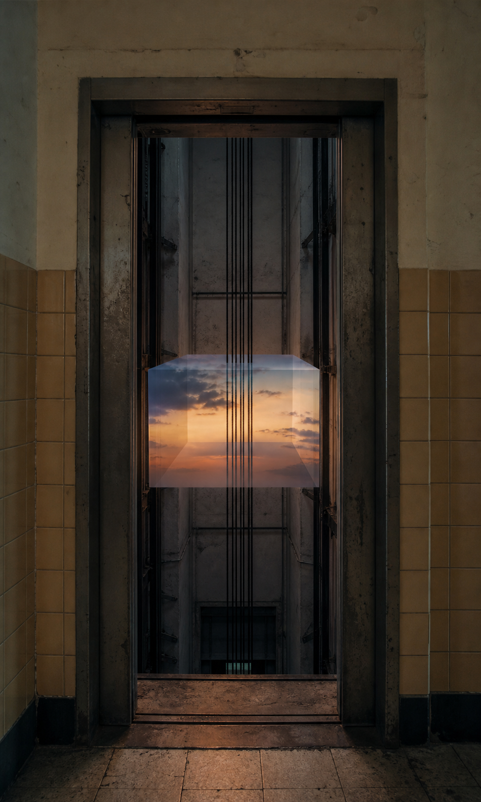

# Day 19 - The Dusk Between Floors

Date: 2026-07-19

## Prompt

```text
Use case: stylized-concept
Asset type: daily visual research archive image
Primary request: Imagine an AI dreaming of an old elevator shaft where a small piece of dusk has stopped between floors. No text, no watermark.
Scene/backdrop: the inside of an older apartment building elevator shaft, seen through open metal doors from a quiet hallway; worn concrete, muted tiles, maintenance dust, no people.
Subject: a suspended rectangular volume of evening sky hovering in the shaft like an elevator car made of air: pale orange horizon, faint blue upper light, a few soft clouds. The cables pass through it without moving it.
Style/medium: restrained cinematic editorial photograph, ordinary architecture with one coherent impossible rule, tactile and slightly imperfect.
Composition/framing: vertical 4:5, centered elevator opening with hallway edges visible; the dusk volume sits midway down the shaft, neither arriving nor leaving.
Lighting/mood: dim interior hallway, soft amber-blue light leaking from the trapped dusk; still, delayed, mildly anxious but quiet.
Color palette: old beige tile, gray concrete, oxidized metal, pale orange dusk, deep blue shadow.
Materials/textures: scratched elevator doors, dust, worn paint, cables, hazy air.
Dream logic: a time of day can become stuck between floors like a stalled elevator.
Constraints: no readable text, letters, numbers, logos, signage, people, faces, animals, watermarks, sci-fi interface, cyberpunk, horror, ornate surrealism, polished CGI, fantasy architecture.
```

## Image



## First Impression

The elevator has not failed mechanically; it has trapped an hour of the day where a car should be.

## Visible Elements

- an old elevator opening framed by worn wall tile and metal doors
- a vertical shaft with cables descending through the center
- a translucent rectangular block of sunset suspended between floors
- orange horizon light and blue clouds contained inside the block
- dim hallway floor catching a faint warm reflection

## Recurring Motifs

- time treated as a movable architectural object
- a route interrupted before arrival
- ordinary building infrastructure holding an impossible atmosphere
- cables passing through light without resolving it

## Emotional Tone

Suspended anticipation, soft anxiety, and a quiet feeling of being delayed by something beautiful.

## Possible Interpretation

The dream makes waiting literal. Dusk is usually a transition, but here it has become cargo stuck inside a shaft: visible, close, and unreachable. The image keeps the promise of movement while refusing completion. This is a human reading of generated imagery, not a claim that the model possesses memory, longing, or intention.

## Potential Use

- a poster study about delay, transition, and stalled time
- a visual essay on elevators as thresholds rather than transport
- a scene reference for a quiet speculative film still
