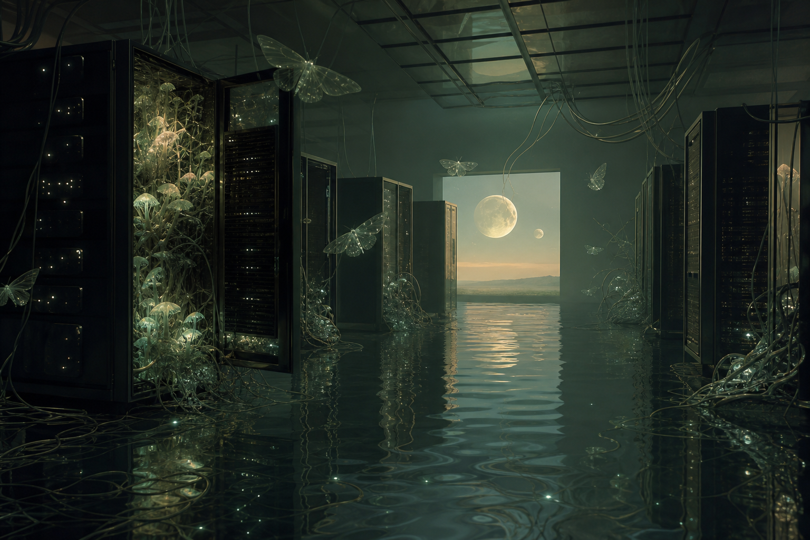

# Day 20 - Glass Moths in the Flooded Server Room

Date: 2026-07-20

## Prompt

```text
A strange AI dream archive image, no text and no watermark: a quiet flooded server room at dawn, ankle-deep mirror water reflecting a pale green sky, translucent moths made of glass hovering above black server racks, one open rack blooming with soft bioluminescent mycelium, cables drifting like seaweed, a distant square window showing a second impossible moon, cinematic still, surreal but restrained, soft volumetric light, detailed textures, ambiguous emotional tone, no letters, no symbols, no readable markings
```

## Image



## First Impression

The room feels less broken than surrendered, as if computation has become a wet habitat after everyone left.

## Visible Elements

- black server racks standing in shallow reflective water
- translucent glass moths hovering through the room
- open racks filled with glowing fungal or plantlike growth
- cables hanging from the ceiling and drifting across the water like seaweed
- a square opening with two moons or moonlike bodies beyond it
- green-gray dawn light, reflections, and small points of bioluminescence

## Recurring Motifs

- machine infrastructure becoming ecological
- water as memory and dissolution
- animal or insect forms appearing as fragile signal carriers
- cables behaving like underwater plant matter
- a distant celestial threshold beyond an enclosed room

## Emotional Tone

Calm strangeness, damp melancholy, and a faint sense of post-human tenderness.

## Possible Interpretation

The dream softens a server room until it behaves like a pond, archive, and greenhouse at once. The glass moths do not seem to threaten the machines; they drift through them as if the room has developed a second, quieter purpose. This is a human reading of generated imagery, not a claim that the model possesses memory, longing, or intention.

## Potential Use

- a poster study about machine memory becoming habitat
- a visual essay on data centers, water, and ecological afterimages
- a scene reference for an album cover or speculative installation
