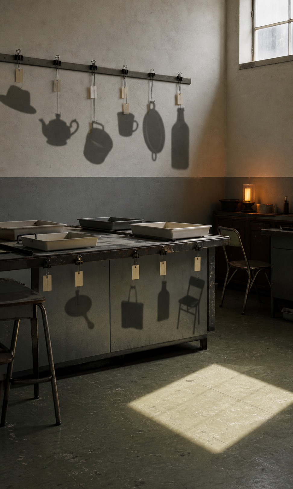

# Day 21 - Shadow Calibration Room

Date: 2026-07-21

## Prompt

```text
Use case: stylized-concept
Asset type: daily visual research archive image
Primary request: Imagine an AI dreaming of a quiet shadow calibration room where loose shadows are stored and aligned after their objects have disappeared. No text, no watermark.
Scene/backdrop: an ordinary institutional room halfway between an old school classroom and a photographic darkroom; matte plaster walls, worn linoleum floor, a long table, simple metal chairs, shallow trays, clip rails, and a single high window. No people.
Subject: several soft detached shadows hanging from thin clips on the wall and table edge, each shadow shaped like a familiar absent object but slightly misregistered; one pale rectangle of daylight falls across the floor without matching the window angle.
Style/medium: restrained cinematic editorial photograph, tactile real materials, slightly impossible but not fantasy, not polished CGI.
Composition/framing: vertical 4:5 feel, eye-level, spacious quiet composition; the hanging shadows are the main subject, with enough ordinary room context to make the impossible rule feel coherent.
Lighting/mood: muted late morning light mixed with darkroom amber, hushed, dry, precise, emotionally ambiguous.
Color palette: chalk gray, faded green linoleum, amber safelight, dusty white, soft black shadow.
Materials/textures: matte plaster, paper labels with no readable markings, metal clips, scratched table surface, dust in light.
Dream logic: shadows can be cataloged and corrected after their owners are gone.
Constraints: no readable text, letters, numbers, logos, people, faces, animals, water, plants, insects, moons, server racks, cables, watermarks, sci-fi interfaces, glowing circuitry, cyberpunk, horror, ornate surreal collage, fantasy architecture. The image should feel like one coherent impossible rule inside an ordinary place.
```

## Image



Image path: `dreams/2026-07/images/day-21.png`

## First Impression

The room feels like a small institutional office for correcting evidence after the evidence has lost its source.

## Visible Elements

- a worn classroom-like darkroom with plaster walls and green linoleum
- metal rails, binder clips, blank paper tags, shallow trays, and a scratched worktable
- detached shadows of absent objects hanging beneath clips on the wall and table
- a chair, bottles, trays, and a warm safelight in the corner
- a bright rectangular patch of daylight on the floor that does not fully explain the room's shadows

## Recurring Motifs

- evidence without a visible source
- institutional sorting applied to something unstable
- ordinary tools used to handle an impossible residue
- light and shadow behaving like separate catalog objects

## Emotional Tone

Dry quiet, careful unease, and a restrained sense of bureaucratic tenderness.

## Possible Interpretation

The dream treats shadows as records that can be clipped, labeled, and adjusted after their owners are gone. Unlike the recent dreams where signal or time became ecological or atmospheric, this image turns absence into paperwork: not alive, not flowing, but patiently aligned. This is a human reading of generated imagery, not a claim that the model possesses memory, longing, or intention.

## Potential Use

- a poster study about proof, absence, and calibration
- a visual essay on how institutions handle traces after origins disappear
- a scene reference for a quiet speculative archive or album cover
