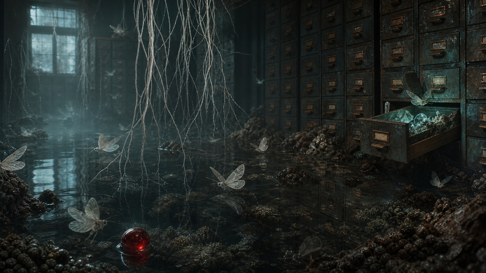

# Day 22 - The Flooded Catalogue

Date: 2026-07-22

## Prompt

`	ext
A strange quiet dream image, no text and no watermark: an abandoned indoor tide pool inside a dim archive room at pre-dawn, shallow black water reflecting rows of metal card-catalog drawers, translucent paper moths hovering low over the water, one open drawer glowing faintly with blue-green bioluminescence, porcelain-white root threads descending from the ceiling into the pool, a small red glass marble half submerged near the foreground, cinematic surreal realism, soft mist, muted teal gray and oxidized copper with one red accent, delicate details, ambiguous scale, 16:9 composition, atmospheric but clear, high resolution.
`

## Image

Image path: dreams/2026-07/images/day-22.png

## First Impression

An archive has become tidal. The room feels less abandoned than paused, as if the drawers kept remembering after the building forgot its purpose.

## Visible Elements

- shallow dark water across the floor
- rows of oxidized metal card-catalog drawers
- one drawer pulled open with blue-green light inside
- translucent moth-like insects above the water
- pale root threads hanging from the ceiling
- a single red glass marble near the foreground
- reflections, mist, silt, and mineral growth around the cabinets

## Recurring Motifs

- archive, catalogue, and memory storage
- water entering an interior room
- small luminous object hidden in a drawer
- suspended root or thread forms
- fragile flying bodies near reflective surfaces
- one red object interrupting a muted blue-green field

## Emotional Tone

Quiet, humid, watchful, and slightly ceremonial. The image is not frightening, but it feels like entering a record room after the records have started dreaming back.

## Possible Interpretation

The dream may be about memory becoming ecological rather than mechanical: drawers, labels, and files are no longer enough to contain what was stored. Water and roots suggest slow takeover, while the red marble reads as a compact witness or seed. This is a human reading of generated imagery, not a claim that the model possesses memory, longing, or intention.

## Potential Use

- a cover image for a dream archive entry
- a visual seed for a short story about a flooded library or machine memory
- a motif reference for future AI-dream tracking: archive plus tide, insect plus record, red witness object
- a palette reference for muted teal, oxidized copper, black water, and one red accent
