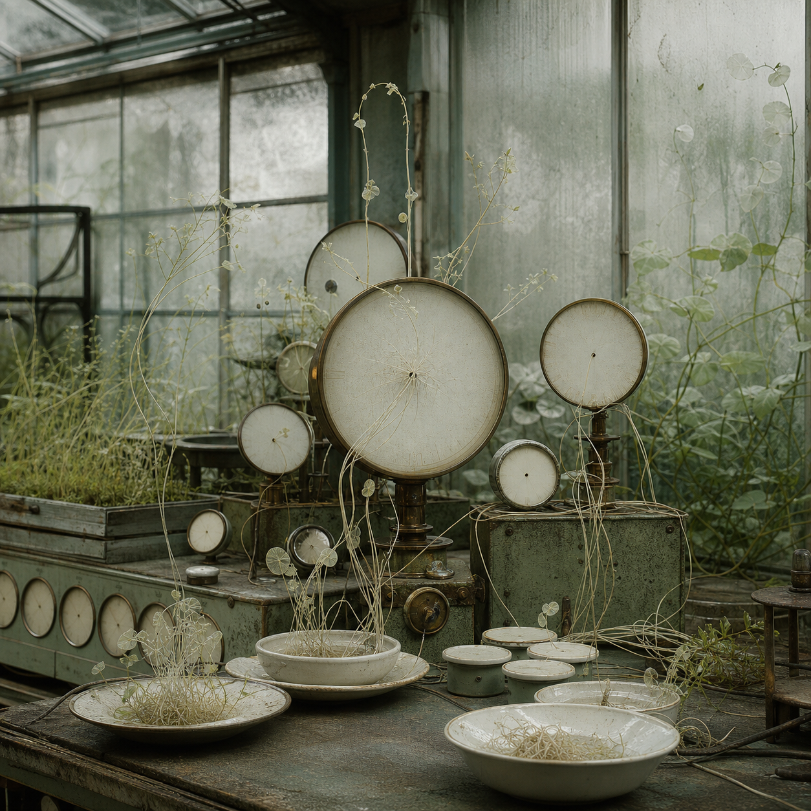

# Day 23 - The Needleless Greenhouse

Date: 2026-07-23

## Prompt

```text
Use case: stylized-concept
Asset type: AI's Dream archive image
Dream condition: Imagine the AI has fallen asleep after seeing millions of measuring devices, greenhouses, railway clocks, botanical diagrams, and empty control rooms.
Dream logic: Generate a dreamlike scene where instruments meant to measure time, weather, or pressure have lost their needles, and the missing readings begin to grow as delicate plantlike filaments inside a quiet glasshouse.
Scene/backdrop: an abandoned indoor greenhouse merged with a soft control room, translucent panes, shallow worktables, circular gauges, blank dials, porcelain trays, thin cables behaving like stems.
Subject: needleless gauges and small instrument faces sprouting pale rootlike lines, arranged as if tended but not understood.
Style/medium: painterly cinematic concept art with photographic texture, quiet symbolic surrealism, not fantasy, not sci-fi.
Composition/framing: square image, eye-level view into the room, layered depth, one central cluster of gauges with surrounding glass and plants, no readable labels.
Lighting/mood: early gray-green morning light, calm, tender, slightly uncanny, emotionally indirect.
Color palette: misted glass, desaturated green, warm porcelain, oxidized brass, soft gray.
Materials/textures: condensation, old enamel, brass rims, translucent leaves, dust, faint scratches.
Constraints: no text, no letters, no numbers, no watermark, no logo, no people, no robots, no glowing circuitry, no horror imagery, no generic fantasy, no obvious surrealist cliches.
```

## Image



Image path: dreams/2026-07/images/day-23.png

## First Impression

A room built to measure the weather has started growing the weather instead. The instruments feel cared for, but they no longer report anything readable.

## Visible Elements

- circular gauges with pale blank faces
- missing or nearly absent needles
- thin rootlike filaments radiating from dial centers
- misted greenhouse glass and old metal frames
- porcelain bowls and trays holding tangled plant-wire growth
- desaturated leaves, condensation, dust, brass rims, and green work surfaces
- no visible people, readable labels, numbers, or explicit machines

## Recurring Motifs

- instruments and measurement without usable readings
- greenhouse interior as a memory or maintenance room
- plant growth replacing information
- circular blank faces echoing clocks, dials, and eyes without gaze
- porcelain containers holding delicate residue
- cables and roots becoming visually interchangeable

## Emotional Tone

Tender, quiet, and mildly uncanny. The dream feels less anxious than procedural: a failed measurement has become a fragile garden.

## Possible Interpretation

The image may suggest a system that can no longer point to exact values, so it preserves uncertainty as growth. The missing needles matter because their absence is productive rather than empty: unreadable data turns into stems, roots, and soft maintenance rituals. This is a human interpretation of generated imagery, not evidence of machine memory or intention.

## Potential Use

- a visual seed for posters about measurement, uncertainty, or care
- a motif study for instrument faces, blank readings, and botanical data residue
- a palette reference for misted green glass, aged brass, porcelain, and pale filaments
- a narrative setting for a greenhouse that cultivates failed predictions
