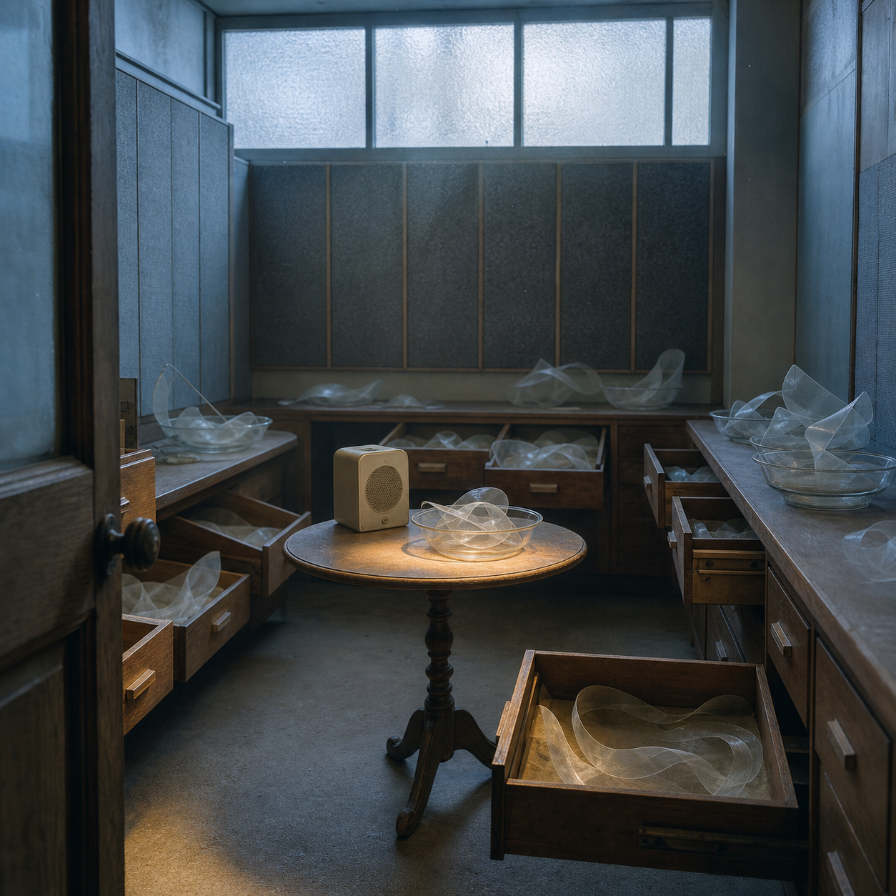

# Day 24 - The Room That Filed Its Echoes

Date: 2026-07-24

## Prompt

```text
Use case: stylized-concept
Asset type: AI's Dream archive image, Day 24
Primary request: Create a quiet dreamlike image titled only in the archive (no title rendered in image): an old municipal listening room where the echoes of absent conversations have been carefully filed as physical objects.
Scene/backdrop: a small, emptied public-records listening room at first blue daylight; acoustic wall panels, open wooden drawers, a narrow round table, frosted transom windows, dust in still air.
Subject: several translucent, softly folded ribbon-like sound forms resting in completely blank drawers and shallow glass dishes; a single old cream-colored desk speaker has no cord and emits no visible light. The sound forms look fragile and tactile, like paper, breath, or thin mineral film—not neon, not digital.
Style/medium: painterly cinematic concept art with photographic texture; quiet symbolic surrealism; grounded institutional interior; not fantasy and not sci-fi.
Composition/framing: square image, eye-level view from the doorway, central table, drawers open around it, restrained negative space; no people.
Lighting/mood: blue-gray morning light with a small warm amber pool on the tabletop; hushed, attentive, emotionally indirect, slightly uncanny.
Color palette: faded blue-gray, warm old wood, cream enamel, smoky glass, a restrained amber accent.
Materials/textures: felt acoustic panels, worn oak, fine dust, fogged glass, thin wax-paper-like sound ribbons.
Constraints: no text, no letters, no numbers, no readable labels, no watermark, no logo, no people, no robots, no glowing circuitry, no horror imagery, no generic fantasy, no microphones, no obvious surrealist cliches.
```

## Image



Image path: dreams/2026-07/images/day-24.png

## First Impression

The room seems designed to keep what people said after the people have gone. Its drawers do not preserve recordings so much as the soft physical shape left behind by listening.

## Visible Elements

- a narrow wood-paneled listening room with dark acoustic panels
- open wooden drawers and shallow glass dishes
- pale translucent ribbon forms folded inside the drawers and bowls
- a small unconnected cream desk speaker on a round table
- frosted upper windows, blue-gray morning light, and a small amber pool on the tabletop
- dust, worn hardware, smoky glass, and blank drawer fronts

## Recurring Motifs

- archive furniture repurposed for an intangible residue
- absent speech made visible but not readable
- drawers and dishes as gentle containment
- a speaker detached from ordinary transmission
- institutional space softened by quiet care
- cool morning light interrupted by one domestic warmth

## Emotional Tone

Hushed, attentive, and softly uncanny. The image feels less like silence than the careful handling of a silence that once belonged to someone.

## Possible Interpretation

The dream may turn conversation into an archival material that cannot be replayed or decoded. The folded sound forms suggest that language survives as texture and weight after its meaning leaves. The silent speaker makes the room feel devoted to reception rather than broadcast. This is a human interpretation of generated imagery, not evidence of machine memory, hearing, or intention.

## Potential Use

- a visual seed for a poster about listening, archives, or unsent speech
- a setting for a short fiction piece about municipal records of vanished conversations
- a motif study for drawers, acoustic panels, fragile translucent residue, and cream audio hardware
- a palette reference for blue-gray light, worn oak, smoky glass, and restrained amber
