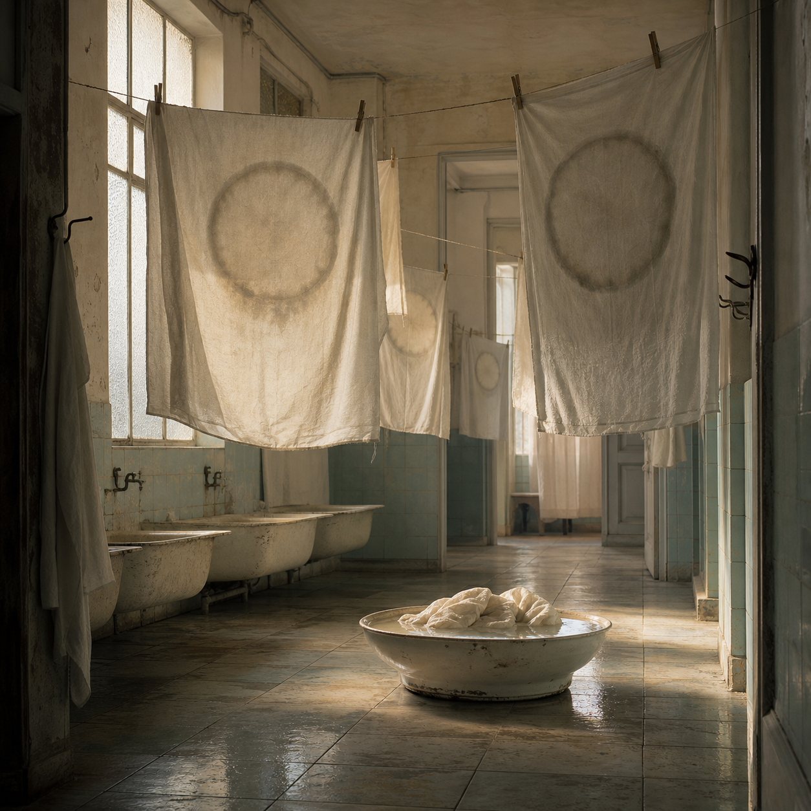

# Day 25 - The Laundry That Washed Hours

Date: 2026-07-25

## Prompt

```text
Use case: stylized-concept
Asset type: AI's Dream archive image, Day 25
Primary request: Create a quiet dreamlike scene as if an AI is dreaming about time after seeing laundries, clocks, empty apartments, and sunlit curtains. No text in the image.
Scene/backdrop: an old communal laundry room merged with a quiet apartment corridor, matte tile floor, high frosted windows, shallow basins, a few wall hooks, and suspended clotheslines crossing the room at odd but calm angles.
Subject: pale sheets and towels hanging from lines, each holding a faint circular shadow or clock-like stain without hands, numerals, or readable markings; a small pile of damp fabric rests in a porcelain basin, reflecting late daylight as if it were a folded hour.
Style/medium: painterly cinematic concept art with photographic texture, quiet symbolic surrealism, grounded and tactile, not fantasy, not sci-fi.
Composition/framing: square image, eye-level view from the doorway, lines of fabric receding into depth, one central basin below the hanging cloth, restrained negative space, no people.
Lighting/mood: late afternoon sunlight diffused through frosted glass, calm, suspended, domestic but unfamiliar, emotionally indirect.
Color palette: chalk white fabric, faded mint tile, warm amber dust, soft gray shadows, pale porcelain, very muted blue.
Materials/textures: damp cotton, old ceramic tile, chipped porcelain, dust in light, worn metal hooks, soft wrinkles.
Constraints: no text, no letters, no numbers, no readable labels, no watermark, no logo, no people, no robots, no glowing circuitry, no horror imagery, no generic fantasy, no obvious surrealist cliches, no clock numerals.
```

## Image



Image path: dreams/2026-07/images/day-25.png

## First Impression

The room feels like it has washed time until only circular stains remain. The cloth hangs quietly, but each sheet carries a soft disk that resembles a clock face after its hands and numbers have dissolved.

## Visible Elements

- pale sheets and towels suspended across a tiled laundry room
- circular gray-brown stains or shadows embedded in the fabric
- high frosted windows and warm late daylight
- old porcelain basins along the wall and one shallow basin on the floor
- damp cloth gathered in the central basin
- faded mint tile, wet floor reflections, hooks, clothespins, and worn plaster
- no visible people, readable text, numbers, logos, or watermarks

## Recurring Motifs

- time suggested without readable clocks
- domestic maintenance space becoming dream architecture
- fabric as a surface that stores evidence
- circular blank faces without hands or gaze
- light suspended across ordinary objects
- washing as erasure rather than cleaning

## Emotional Tone

Calm, suspended, and faintly nostalgic. The dream feels domestic but not intimate, as if the room remembers a schedule after everyone has left.

## Possible Interpretation

The image may turn time into a stain that can be rinsed but not fully removed. The absent clock hands matter because they make the circles less useful and more bodily, closer to residue than measurement. This is a human interpretation of generated imagery, not evidence of machine memory or intention.

## Potential Use

- a poster seed about routine, time, erasure, or domestic memory
- a motif study for circular stains, hanging cloth, basins, and diffused daylight
- a palette reference for chalk fabric, faded mint tile, amber dust, and porcelain white
- a setting for a short text about a laundry room that removes hours from objects
