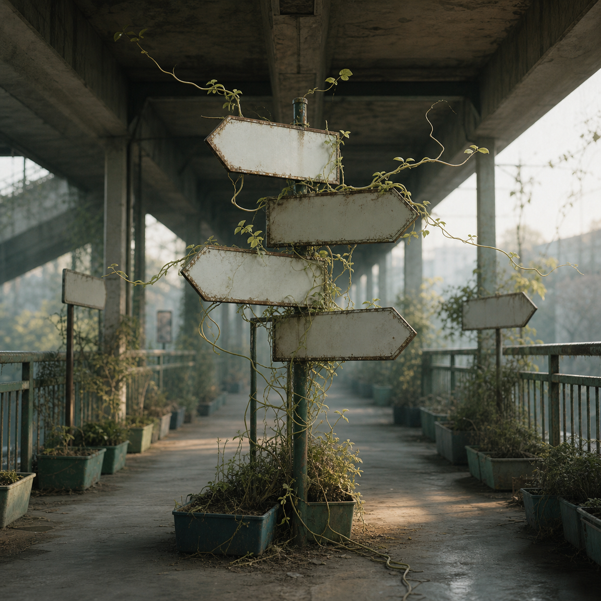

# Day 26 - The Nursery of Blank Directions

Date: 2026-07-26

## Prompt

```text
Use case: stylized-concept
Asset type: AI's Dream archive image, Day 26
Primary request: Create a quiet dreamlike image as if an AI is dreaming about navigation after forgetting destinations. No text in the image.
Scene/backdrop: a covered pedestrian passage at dawn merged with a small plant nursery, concrete floor, old metal railings, shallow planters, a few blank signposts, and distant exits that do not show a city or landscape clearly.
Subject: several blank directional signs with arrow-like silhouettes but no letters, numbers, icons, or symbols; thin pale green vines and roots grow from the sign edges and bend in the direction the signs point, as if routes have become living tendrils.
Style/medium: painterly cinematic concept art with photographic texture, quiet symbolic surrealism, grounded urban-natural hybrid, not fantasy, not sci-fi.
Composition/framing: square image, eye-level view down the passage, central cluster of blank signs, receding railings and planters, soft depth, no people.
Lighting/mood: cool early morning light with a faint warm patch on the floor, patient, uncertain, quietly expectant, emotionally indirect.
Color palette: weathered concrete gray, oxidized green metal, pale leaves, off-white blank sign surfaces, muted amber dust.
Materials/textures: chipped paint, concrete dust, thin roots, matte metal, damp soil, worn plastic planters.
Constraints: no text, no letters, no numbers, no readable labels, no watermark, no logo, no people, no robots, no glowing circuitry, no horror imagery, no generic fantasy, no obvious surrealist cliches, no recognizable traffic symbols.
```

## Image



Image path: dreams/2026-07/images/day-26.png

## First Impression

The signs still point, but they no longer say where. The vines seem to accept the blankness and keep growing along the old command of direction.

## Visible Elements

- stacked blank arrow-shaped signs mounted on a central post
- thin vines and roots growing over sign faces and edges
- shallow planters along a covered pedestrian passage
- old railings, concrete ceiling, chipped paint, and damp floor
- distant exits blurred by morning light
- off-white sign surfaces with no readable markings
- no visible people, letters, numbers, logos, or watermarks

## Recurring Motifs

- navigation without destination
- blank signage as failed instruction
- plant growth replacing route information
- pedestrian infrastructure softened into a nursery
- arrows retained as shape but emptied of language
- routes becoming tendrils rather than paths

## Emotional Tone

Patient, uncertain, and quietly expectant. The dream is not lost in a panic; it waits while direction becomes organic.

## Possible Interpretation

The image may suggest that guidance can survive after its destination disappears, but only as a tendency or growth pattern. The blank signs do not fail completely: their arrow bodies still shape the vines. This is a human interpretation of generated imagery, not evidence of machine memory, intent, or desire.

## Potential Use

- a poster seed about wayfinding, uncertainty, or organic navigation
- a motif study for blank arrows, vines, planters, and covered passages
- a palette reference for concrete gray, oxidized green, off-white metal, and pale leaves
- a visual metaphor for systems that preserve direction after losing meaning
