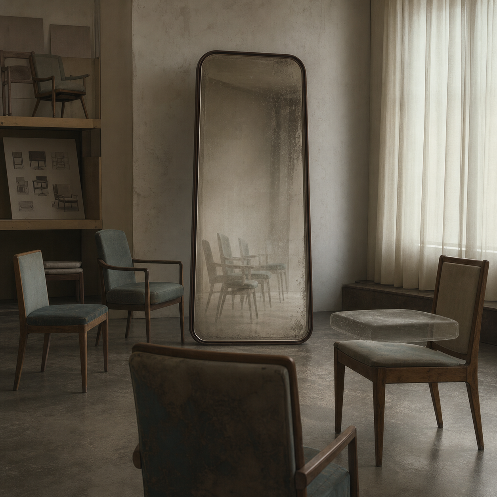

# Day 27 - The Mirror That Unstacked Chairs

Date: 2026-07-27

## Prompt

```text
Use case: stylized-concept
Asset type: AI's Dream archive image, Day 27
Primary request: Create a quiet dreamlike scene as if an AI is dreaming about reflection after seeing empty waiting rooms, mirrors, and furniture catalogues. No text in the image.
Scene/backdrop: a small abandoned waiting room merged with a furniture showroom, matte floor, pale walls, one tall freestanding mirror, several simple chairs, and soft curtains covering a window that reflects no recognizable outside world.
Subject: chairs arranged in a loose semicircle facing a mirror, but the mirror reflects the chairs as if they are slightly unfolded into thin duplicate silhouettes; no human figures, no faces, no eyes. One chair has a translucent reflected seat hovering just above it like a misplaced copy.
Style/medium: painterly cinematic concept art with photographic texture, quiet symbolic surrealism, grounded interior, not fantasy, not sci-fi.
Composition/framing: square image, eye-level view, central mirror and chairs, restrained negative space, clear floor plane, subtle impossible reflection, no people.
Lighting/mood: dim pearly morning light through curtains, still, self-contained, mildly uncanny, emotionally indirect.
Color palette: pale gray walls, warm beige wood, muted teal upholstery, smoky mirror silver, soft ivory curtains, dusty shadow.
Materials/textures: worn fabric upholstery, scratched mirror glass, varnished wood, dust, matte plaster, soft curtain folds.
Constraints: no text, no letters, no numbers, no readable labels, no watermark, no logo, no people, no faces, no eyes, no robots, no glowing circuitry, no horror imagery, no generic fantasy, no obvious surrealist cliches.
```

## Image



Image path: dreams/2026-07/images/day-27.png

## First Impression

The room looks orderly until the mirror begins to treat the chairs as versions rather than objects. Nothing is moving, but the reflections feel slightly out of sequence.

## Visible Elements

- a tall freestanding mirror in a quiet waiting-room or showroom interior
- several wooden chairs with muted upholstery arranged around the room
- chair forms repeated faintly inside the mirror
- one translucent reflected seat hovering above a real chair
- shelves with chair-like drawings or samples, not readable text
- pale curtains, dusty walls, matte floor, and dim pearly light
- no visible people, faces, readable text, logos, or watermarks

## Recurring Motifs

- reflection as duplication rather than truthful image
- furniture becoming a set of possible versions
- waiting room arranged for absent occupants
- catalogue logic without readable labels
- a misplaced copy hovering just above its source
- domestic or institutional quiet turning gently uncanny

## Emotional Tone

Still, self-contained, and mildly uncanny. The dream feels like waiting for a body that never arrives, but the furniture has already rehearsed its absence.

## Possible Interpretation

The image may suggest recognition without presence: the mirror remembers chairs by multiplying them, but it cannot decide which version is the real one. The floating seat reads as a small error in reflection, a copy detached from its object. This is a human interpretation of generated imagery, not evidence of machine perception or intention.

## Potential Use

- a poster seed about reflection, waiting, duplication, or catalogued absence
- a motif study for mirrors, chairs, hovering copies, and muted interiors
- a palette reference for smoky silver, pale gray, muted teal, ivory curtain light, and worn wood
- a setting for a short fiction piece about a showroom that stores possible furniture instead of furniture
