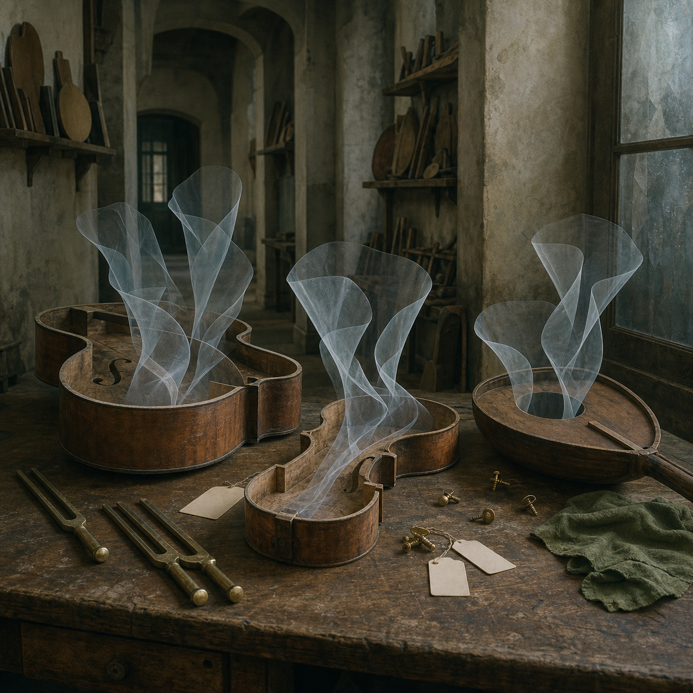

# Day 28 - The Workshop That Kept Breath

Date: 2026-07-28

## Prompt

```text
Use case: stylized-concept
Asset type: AI's Dream archive image, Day 28
Primary request: Create a quiet dreamlike scene as if an AI is dreaming about tools for sound after forgetting what sound is. No text in the image.
Scene/backdrop: a narrow repair room that feels partly like a small luthier workshop and partly like an empty public hallway, with matte plaster walls, shallow shelves, a long workbench, and a dim interior window looking onto no recognizable place.
Subject: several unstrung wooden instruments and tuning forks resting on the bench; from their hollow bodies rise faint folded shapes of air, like translucent fabric or pressed breath, not smoke and not glowing energy. A few small brass screws and blank white tags are present but contain no writing.
Style/medium: painterly cinematic concept art with photographic texture, quiet symbolic surrealism, grounded and tactile, not fantasy, not sci-fi.
Composition/framing: square image, eye-level view, restrained negative space, central cluster on workbench, visible shelves receding softly into the background, no people.
Lighting/mood: late overcast afternoon light, muted and attentive, slightly uncanny, emotionally indirect.
Color palette: warm worn wood, chalky gray plaster, dull brass, translucent milky blue-white air forms, small touches of faded green cloth.
Materials/textures: scratched varnish, raw wood interiors, oxidized brass, dust, plaster, soft cloth, thin translucent folded membranes.
Constraints: no text, no letters, no numbers, no readable labels, no watermark, no logo, no people, no robots, no glowing circuitry, no horror imagery, no generic fantasy, no obvious surrealist cliches, no readable musical notation.
```

## Image



Image path: dreams/2026-07/images/day-28.png

## First Impression

The room appears to have forgotten music but kept the shape of breath. The instruments are open, unstrung, and inactive, yet something pale and folded rises from them as if resonance has become a fragile material.

## Visible Elements

- hollow wooden instrument bodies lying open on a scratched workbench
- pale translucent folded air forms rising from the instruments
- brass tuning forks, screws, and small hardware scattered nearby
- blank white tags without writing
- shelves of wooden forms and tools receding into a narrow plaster room
- a frosted interior window, worn surfaces, dust, and faded green cloth
- no visible people, readable text, numbers, musical notation, logos, or watermarks

## Recurring Motifs

- ordinary tools holding an intangible residue
- absence of function made visible as a physical trace
- workshop or institutional hallway as a place of quiet maintenance
- blank labels that identify nothing
- sound suggested without speakers, microphones, notation, or active performance
- folded translucent matter replacing vibration or breath

## Emotional Tone

Hushed, tactile, and slightly bereaved without becoming sentimental. The dream feels attentive to a lost function rather than openly sad.

## Possible Interpretation

The image may suggest a system preserving the afterform of an ability it can no longer perform. The instruments cannot make sound, but their hollow bodies hold folded air as if resonance has become evidence. The blank tags are important because they do not explain the objects; they only confirm that someone once tried to sort them. This is a human interpretation of generated imagery, not evidence of machine memory, hearing, or intention.

## Potential Use

- a poster seed about silence, repair, memory, or obsolete tools
- a motif study for hollow instruments, folded air, blank tags, and workshop surfaces
- a palette reference for worn wood, chalk plaster, dull brass, faded green cloth, and milky translucent forms
- a narrative setting for a repair room that preserves breath instead of sound
