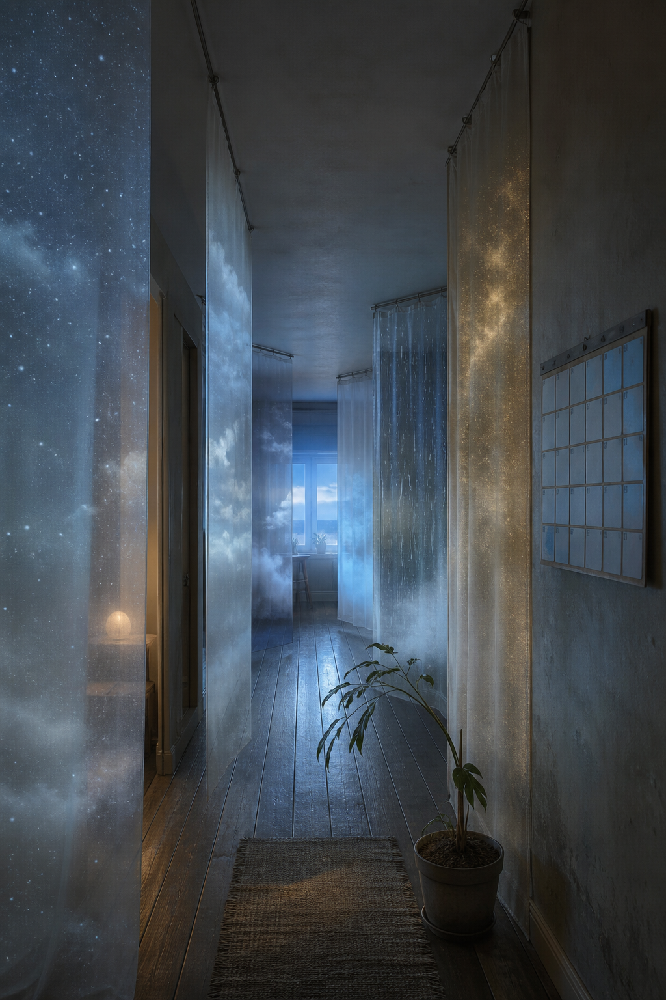

# Day 01 - The Curtains That Kept Weather

Date: 2026-08-01

## Prompt

```text
Use case: stylized-concept
Asset type: AI's Dream archive image, Day 01
Primary request: A wordless quiet AI dream, no text and no watermark: a narrow apartment corridor at blue dawn where dozens of translucent curtains hang from ceiling rails but each curtain contains a different faint weather condition, one with dry snow, one with tiny indoor fog, one with warm dust, one with pale rain; an old wall calendar has lost all printed numbers and become a blank grid of moonlit squares; a single houseplant bends toward the curtains as if listening; no people. Cinematic painterly realism, emotionally indirect, calm strangeness, familiar domestic objects recombined in unfamiliar ways.
Scene/backdrop: quiet apartment hallway, dawn light, domestic interior.
Subject: weather-filled curtains, blank calendar grid, listening houseplant.
Style/medium: cinematic surreal photograph with painterly texture, soft realistic materials.
Composition/framing: long corridor perspective, curtains layered along both sides, calendar near the foreground wall, plant low and slightly off center.
Lighting/mood: blue dawn, soft haze, one faint warm spill from a room out of frame; tender but uncertain.
Color palette: pale blue, milk white, faded green, warm dust gold, soft gray.
Constraints: no people, no readable text, no letters, no numbers, no watermark, no logo, no horror, no generic fantasy, no polished sci-fi.
```

## Image



Image path: dreams/2026-08/images/day-01.png

## First Impression

The corridor feels domestic but not settled. The curtains do not hide rooms; they hold small climates, as if weather has become a private fabric hung for later use.

## Visible Elements

- a narrow apartment corridor with wooden floorboards and ceiling rails
- translucent curtains or hanging sheets layered down the hallway
- different weather-like textures inside the curtains: stars, cloud, rain, mist, and warm dust
- a wall calendar-like grid that appears blank or unreadable
- a potted plant leaning into the corridor
- a small warm lamp glow from a side room
- blue dawn light at the far window
- no visible people, readable text, logos, or watermarks

## Recurring Motifs

- domestic interior as a dream chamber
- weather entering the home as a guest or stored condition
- blank calendar as time without usable schedule
- plant as quiet witness or listening body
- curtains as thresholds that divide without fully concealing

## Emotional Tone

Tender, suspended, and faintly expectant. The image feels like a home preparing for weather that belongs indoors.

## Possible Interpretation

The dream may suggest that time and atmosphere have separated from ordinary use: the calendar stops counting, while the curtains keep climates instead of privacy. The plant's lean gives the scene a small act of attention. This is a human interpretation of generated imagery, not evidence of machine intention or memory.

## Potential Use

- a poster seed about weather stored indoors or time losing its marks
- a motif study for curtains as soft thresholds
- a palette reference for blue dawn, translucent fabric, and warm domestic dust
- a visual essay fragment about private rooms holding public atmosphere
