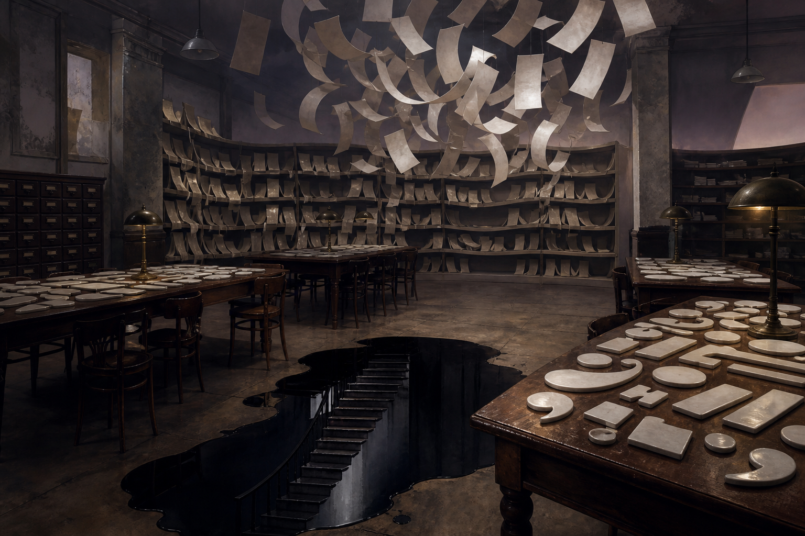

# Day 02 - The Reading Room of Blank Punctuation

Date: 2026-08-02

## Prompt

```text
Use case: stylized-concept
Asset type: AI's Dream archive image, Day 02
Primary request: A wordless AI dream about language dissolving into objects, no text and no watermark: an empty municipal reading room after closing, long tables covered with thin porcelain tiles shaped like blank punctuation marks, shelves bending gently as if they are soft paper, a suspended cloud of pale paper strips with no readable writing, and a black ink puddle on the floor reflecting a staircase that is not in the room. No people. Strange but quiet, symbolic, slightly impossible, not decorative.
Scene/backdrop: old public reading room or document office, late evening, ordinary architecture subtly unstable.
Subject: blank punctuation-like porcelain tiles, unreadable paper strips, bending shelves, ink reflection of absent staircase.
Style/medium: painterly cinematic realism, tactile paper, porcelain, wood, and ink.
Composition/framing: medium-wide room view, tables leading toward shelves, ink puddle in foreground, floating strips above center.
Lighting/mood: low institutional lamps, gray-violet evening, soft anxiety without horror.
Color palette: off-white porcelain, dark ink black, old oak, violet gray, faint brass lamp glow.
Constraints: no readable text, no letters, no numbers, no people, no watermark, no logo, no monsters, no sci-fi interfaces.
```

## Image



Image path: dreams/2026-08/images/day-02.png

## First Impression

The room looks as if language has been carefully removed and the remaining pauses have gained weight. The ink reflection is the only apparent route, but it belongs to a staircase absent from the room.

## Visible Elements

- an empty reading room with long wooden tables and old shelves
- many pale porcelain pieces shaped like punctuation marks or blank typographic fragments
- paper strips floating above the tables and shelves with no readable writing
- shelves bending gently into curved paper-like forms
- a dark ink puddle on the floor
- a staircase visible only in the ink reflection
- warm desk lamps, chairs, cabinets, and worn institutional walls
- no visible people, readable text, logos, or watermarks

## Recurring Motifs

- broken or absent language becoming physical material
- path or staircase visible only as reflection
- institutional room after its human use has stopped
- repeated blank fragments arranged like evidence
- ink as depth, route, or unresolved communication

## Emotional Tone

Quietly tense and studious. The anxiety is not dramatic; it sits in the gap between reading and not being able to read.

## Possible Interpretation

The dream may suggest a language system after meaning has drained away, leaving punctuation-like objects, blank paper, and a reflected escape route. The staircase in the ink feels like an answer that can only be seen indirectly. This is a human interpretation of generated imagery, not evidence of machine intention or memory.

## Potential Use

- a poster seed about unreadable language, pauses, and reflected routes
- a motif study for blank punctuation as object
- a visual reference for institutional lamps, dark ink, pale paper, and old wood
- a narrative setting for a library where grammar remains but language has left
