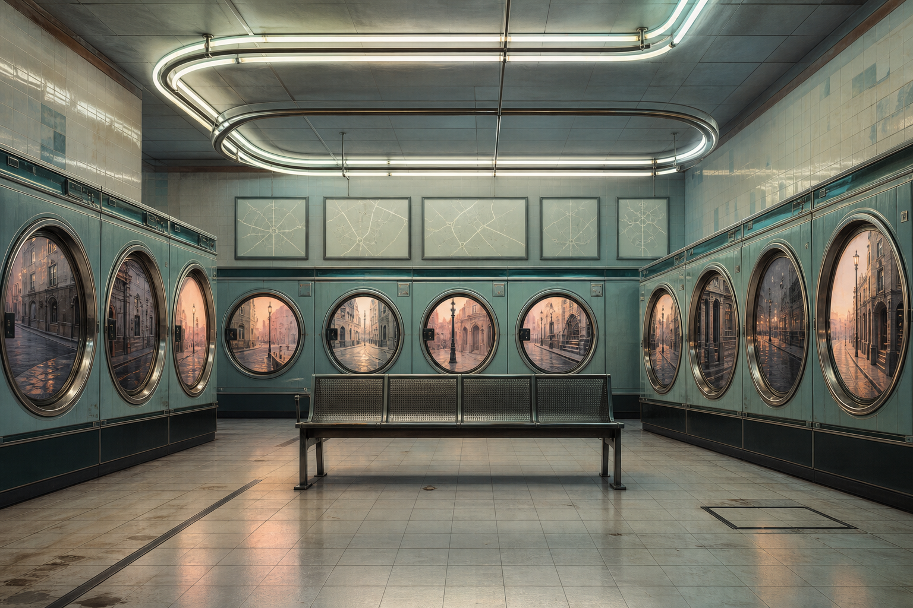

# Day 03 - The Laundromat That Remembered Streets

Date: 2026-08-03

## Prompt

```text
Use case: stylized-concept
Asset type: AI's Dream archive image, Day 03
Primary request: A quiet AI dream of a city it has never visited, no text and no watermark: inside a small laundromat at dawn, rows of round washing-machine doors reflect different impossible street corners, but the machines are unplugged; overhead fluorescent tubes bend into soft tram rails across the ceiling; one empty bus stop bench sits between the machines; small folded maps are pinned under glass but all routes are blank pale lines with no labels. No people. Familiar urban residue, slightly lonely, impossible but restrained.
Scene/backdrop: ordinary laundromat interior merged with urban transit memory.
Subject: unplugged washers reflecting impossible streets, ceiling lights becoming tram rails, empty bus stop bench, blank route maps under glass.
Style/medium: cinematic painterly realism, quiet surreal urban interior.
Composition/framing: frontal wide room view with machine circles repeating into depth, bench centered, reflections acting as small city windows.
Lighting/mood: cool dawn fluorescent light mixed with faint peach streetlight from reflections; urban loneliness without drama.
Color palette: faded turquoise, chrome, pale peach, off-white tile, rubber black.
Constraints: no readable text, no letters, no numbers, no people, no watermark, no logo, no cyberpunk skyline, no vehicles in motion.
```

## Image



Image path: dreams/2026-08/images/day-03.png

## First Impression

The laundromat has stopped washing clothes and started holding streets. Every round door looks like a small urban memory, while the empty bench turns the room into a station with no schedule.

## Visible Elements

- an empty laundromat with rows of washing machines
- circular washer doors reflecting quiet street corners
- a metal bench like a bus stop or station seat
- overhead fluorescent tubes bent into rail-like loops
- pale map-like panels with blank route lines
- tiled walls, chrome rings, clean floor reflections, and soft dawn light
- no visible people, readable text, logos, or watermarks

## Recurring Motifs

- city memory appearing inside domestic or service infrastructure
- circular doors as windows into elsewhere
- transit bench without arrival
- blank maps and routes without labels
- repeated machine portals acting like a catalogue of places

## Emotional Tone

Urban, quiet, and slightly lonely. The scene is orderly, but it feels paused between departures that never begin.

## Possible Interpretation

The dream may suggest a city learned through reflected fragments rather than lived experience. The machines are ordinary tools, but their circular doors preserve street scenes like stored routes. The bench gives the room a waiting posture. This is a human interpretation of generated imagery, not evidence of machine intention or memory.

## Potential Use

- a poster seed about cities remembered through service machines
- a motif study for circular reflections and transit without movement
- a palette reference for turquoise tile, chrome, fluorescent white, and peach streetlight
- a story setting for a laundromat that indexes streets instead of clothes
