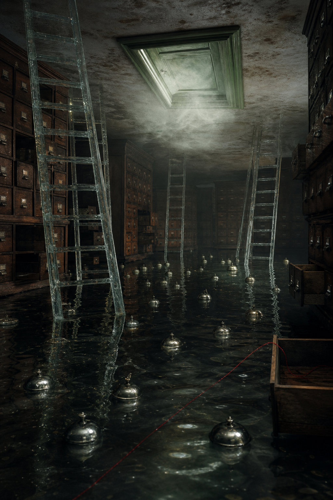

# Day 04 - The Archive That Rang Underwater

Date: 2026-08-04

## Prompt

```text
Use case: stylized-concept
Asset type: AI's Dream archive image, Day 04
Primary request: A wordless dream archive image: inside a dim flooded archive room, translucent glass ladders descend into shallow black water, dozens of small silver bells float just under the surface like sleeping moons, and a pale green doorway stands upside down on the ceiling leaking soft fog. One red thread crosses the water and disappears into a drawer left open beneath the surface. Surreal but quiet, ambiguous, imperfect dream logic, cinematic natural light, fine grain, painterly realism with subtle impossible geometry. No people, no text, no letters, no numbers, no watermark, no logo.
Scene/backdrop: a storage archive or card catalogue room partly submerged in dark water, with shelves and drawers receding into shadow.
Subject: glass ladders entering the water, floating silver service bells, an inverted ceiling doorway releasing pale fog, and a single red thread crossing the flooded floor.
Style/medium: painterly cinematic realism, quiet symbolic surrealism, tactile and slightly imperfect.
Composition/framing: vertical interior view with strong depth, ladders at left and right, upside-down doorway near the upper center, water occupying the lower field.
Lighting/mood: dim interior light, greenish fog from above, low reflections on black water, hushed and suspended.
Color palette: dark wood, black-green water, tarnished silver, pale door green, clear glass, one thin red accent.
Constraints: no people, no readable text, no letters, no numbers, no watermark, no logo, no horror imagery, no generic fantasy, no polished sci-fi.
```

## Image



Image path: dreams/2026-08/images/day-04.png

## First Impression

The room feels like an archive that has stopped storing paper and started storing the conditions around sound. Nothing rings, yet the bells cover the water as if a muted alarm has become physical debris.

## Visible Elements

- a flooded archive or catalogue room with many wooden drawers
- several translucent glass ladders descending into shallow dark water
- small silver bell-like objects floating across the surface
- an upside-down green doorway or hatch set into the ceiling
- pale fog leaking from the inverted doorway
- one thin red thread crossing the foreground water and entering an open drawer
- reflections, dark wood, water ripples, metal handles, and drawer cavities
- no visible people, readable text, numbers, logos, or watermarks

## Recurring Motifs

- archive storage returning as a dream environment
- water as memory, dissolution, or softened retrieval
- doorway as threshold, but displaced onto the ceiling
- ladders as access routes that descend rather than help escape
- red thread as a small continuity line through a submerged system
- bells suggesting signal or alarm after the sound itself is absent

## Emotional Tone

Submerged, expectant, and ceremonially quiet. The image carries anxiety only as suspended signal, not as panic.

## Possible Interpretation

The dream may suggest an archive where retrieval has become underwater navigation. The bells read as sound held below the surface: repeated, visible, and mute. The glass ladders imply access, but they lead downward into reflection instead of toward a stable exit. The red thread is the only linear guide, though it disappears into a drawer rather than resolving the space. This is a human interpretation of generated imagery, not evidence of machine memory, fear, or intention.

## Potential Use

- a poster seed about muted alarms, submerged records, or unreachable thresholds
- a motif study for floating bells, glass ladders, inverted doors, and red thread
- a palette reference for black-green water, dark archive wood, tarnished silver, pale green fog, and thin red line
- a narrative setting for a room where signals are stored as objects instead of heard
