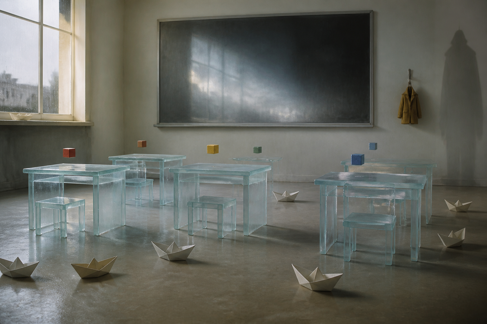

# Day 05 - The Glass Classroom After Rain

Date: 2026-08-05

## Prompt

```text
Use case: stylized-concept
Asset type: AI's Dream archive image, Day 05
Primary request: A quiet AI dream about childhood without having been a child, no text and no watermark: a small classroom after rain, all desks are child-sized but made of translucent frosted glass, soft toy blocks hover a few centimeters above each chair without touching, a chalkboard is perfectly blank and reflects a pale indoor sky, paper boats sit on the dry floor as if waiting for water that never arrives, one tiny coat hangs from a hook but casts the shadow of a much taller coat. No people. Tender, strange, uncertain, not cute, not sentimental.
Scene/backdrop: empty early-school classroom, rain light at the windows, slightly impossible interior.
Subject: frosted glass desks, hovering toy blocks, blank reflective chalkboard, dry paper boats, tiny coat with tall shadow.
Style/medium: cinematic painterly realism, tactile quiet surrealism.
Composition/framing: low wide angle at child-desk height, chalkboard in background, paper boats across foreground.
Lighting/mood: gray daylight after rain, very soft highlights, tender unease.
Color palette: chalk gray, pale glass blue, faded primary colors muted by rainlight, cream walls, soft shadow.
Constraints: no readable text, no letters, no numbers, no people, no faces, no watermark, no logo, no cartoon style, no horror.
```

## Image



Image path: dreams/2026-08/images/day-05.png

## First Impression

The classroom feels remembered without ever having been attended. It has the scale of childhood, but every object seems slightly too careful, too transparent, or too suspended to be used.

## Visible Elements

- an empty classroom lit by gray rainlight
- small frosted-glass desks and stools
- colored toy blocks hovering above the desks
- a large blank chalkboard reflecting pale sky or window light
- several paper boats resting on a dry floor
- a small coat hanging on the wall
- the coat casting a much taller shadow
- no visible people, readable text, logos, or watermarks

## Recurring Motifs

- childhood objects appearing as indirect symbolic residue
- absence shown through a small garment without a body
- shadow larger than its source
- blank board as language withheld
- paper boats waiting for water that is not present
- glass furniture as fragile usability

## Emotional Tone

Tender and uncertain, with a slight ache. The room is not frightening, but it feels like care arranged around someone missing.

## Possible Interpretation

The dream may suggest childhood as a set of learned visual signs rather than a lived memory. The paper boats imply play prepared for a condition that never arrives, while the tall shadow gives the small coat an outsized adulthood. This is a human interpretation of generated imagery, not evidence of machine intention or memory.

## Potential Use

- a poster seed about borrowed childhood or growth casting backward shadows
- a motif study for glass desks, hovering blocks, and paper boats on dry floor
- a palette reference for rain-gray classroom light and frosted blue glass
- a narrative setting for a classroom where play remains suspended before use
