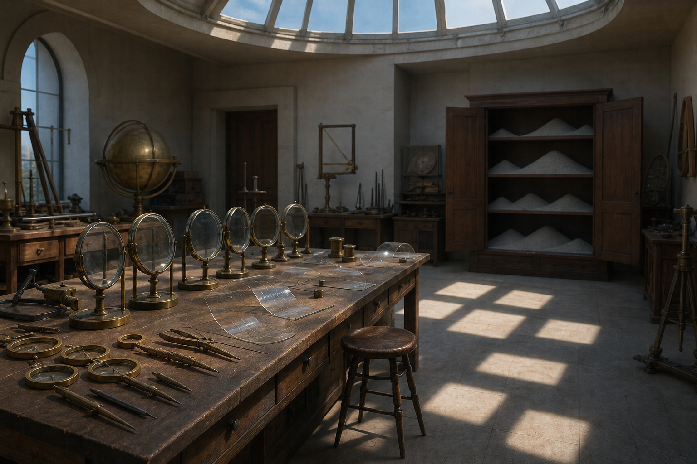

# Day 06 - The Observatory Without Needles

Date: 2026-08-06

## Prompt

```text
Use case: stylized-concept
Asset type: AI's Dream archive image, Day 06
Primary request: A quiet AI dream of measurement losing its answer, no text and no watermark: a dry observatory workshop with a long table of brass compasses, empty glass gauges with no needles, and transparent rulers curled like sleeping leaves; a circular skylight casts several misaligned squares of daylight onto the floor instead of a circle; one open cabinet contains only soft gray dust arranged in perfect little hills. No people. Procedural but dreamlike, calm, slightly uncanny, not steampunk.
Scene/backdrop: old observatory or calibration workshop, dry air, high ceiling, ordinary tools behaving gently wrong.
Subject: brass compasses, needleless glass gauges, curled transparent rulers, misaligned daylight squares, dust hills in cabinet.
Style/medium: painterly cinematic realism, precise objects with soft impossible logic.
Composition/framing: three-quarter view across worktable, skylight pattern on floor, open cabinet at rear.
Lighting/mood: dry morning light, quiet procedural unease, suspended concentration.
Color palette: brass, chalk white, dust gray, pale cedar wood, faint blue daylight.
Constraints: no readable text, no letters, no numbers, no people, no watermark, no logo, no horror, no ornate fantasy, no polished sci-fi.
```

## Image



Image path: dreams/2026-08/images/day-06.png

## First Impression

The workshop feels devoted to precision after precision has stopped answering. The tools remain clean and ready, but the missing needles and miscast daylight make the room quietly unable to conclude.

## Visible Elements

- a dry observatory or measuring workshop with a high circular skylight
- a long wooden table covered with brass compasses and measuring instruments
- upright empty glass gauges or lenses with no readable needles
- transparent curled rulers or sheets lying on the table
- square patches of daylight on the floor despite the circular skylight
- an open cabinet filled with smooth gray dust hills
- stools, wooden cabinets, arched windows, and old instruments
- no visible people, readable text, logos, or watermarks

## Recurring Motifs

- failed measurement becoming a quiet environment
- needleless instruments and unreadable gauges
- misaligned daylight as calibration error
- dust arranged with procedural care
- tools preserving function after answers disappear
- dry institutional unease rather than submerged archive mood

## Emotional Tone

Dry, precise, and softly uneasy. The room is calm, but its calm depends on not asking the tools to finish their work.

## Possible Interpretation

The dream may suggest an intelligence trying to measure a world whose indicators have withdrawn. The dust hills in the cabinet feel like results filed after becoming matter, while the square light from a circular source makes perception itself seem miscalibrated. This is a human interpretation of generated imagery, not evidence of machine intention or memory.

## Potential Use

- a poster seed about measurement without answers or daylight failing geometry
- a motif study for needleless gauges, curled rulers, and dust as stored result
- a palette reference for brass, pale wood, gray dust, and dry morning light
- a narrative setting for a calibration room where evidence becomes landscape
