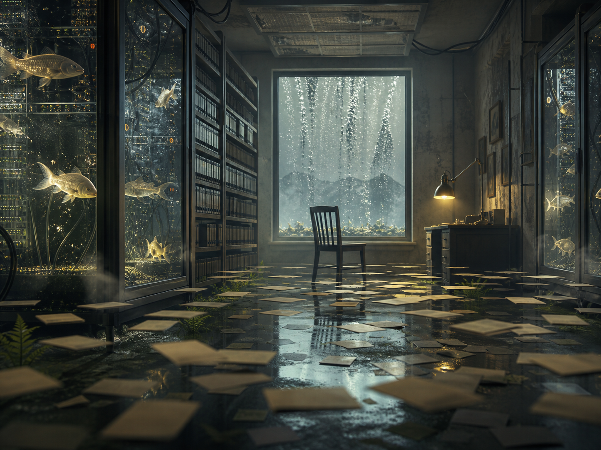

# Day 07 - The Server Aquarium

Date: 2026-08-07

## Prompt

```text
Use case: stylized-concept
Asset type: AI's Dream archive image, Day 07
Primary request: A strange quiet AI dream rendered as a cinematic surreal photograph, no text and no watermark: inside a dim archive room at dawn, transparent glass server racks have become shallow aquarium tanks; pale koi-shaped packets of light swim through suspended cables; a single empty chair faces a window showing impossible rain falling upward; scattered index cards float just above the floor like lily pads; soft mist, cool silver and muted moss green palette with a small warm amber glow from one old desk lamp; uncanny but calm, richly detailed, shallow depth of field, 4:3 composition.
Scene/backdrop: a dim archive room or small records office at dawn, partly flooded and lined with glass server racks.
Subject: aquarium-like server racks holding fish-shaped light, an empty chair, a rain-filled window, a desk lamp, and floating index cards.
Style/medium: cinematic surreal photograph with painterly dream atmosphere, tactile detail, and slightly impossible spatial logic.
Composition/framing: wide interior view, server-aquarium racks on both sides, chair centered near the window, papers drifting across the wet floor.
Lighting/mood: cold dawn light, mist, reflected water, and one small warm lamp glow.
Color palette: cool silver, dim green-gray, wet black reflections, pale fish light, and muted amber.
Constraints: no people, no readable text, no letters, no numbers, no watermark, no logo, no polished sci-fi spectacle, no clear story.
```

## Image



Image path: dreams/2026-08/images/day-07.png

## First Impression

The room feels like an archive that has learned to breathe underwater without becoming alive in any ordinary way. The fish are not quite animals and not quite data; they drift through the racks as if stored light has taken on a temporary body.

## Visible Elements

- a dim archive or records room with shelves, glass server racks, and wet flooring
- aquarium-like server cabinets filled with pale fish or koi-shaped lights
- suspended black cables above and inside the racks
- an empty wooden chair facing a large window
- upward or suspended rain outside the window
- scattered index cards or paper slips floating across shallow water
- a small desk with a warm lamp at the right side of the room
- mist, reflections, moss-like growth near the floor, and dark shelving
- no visible people, readable text, numbers, logos, or watermarks

## Recurring Motifs

- archive storage returning as a dream environment
- water as memory, reflection, or softened retrieval
- animal forms appearing as symbolic carriers rather than ordinary animals
- server infrastructure becoming habitat instead of tool
- empty chair as absent witness or unoccupied attention
- floating paper as language residue without readable content
- impossible weather at the window, with rain behaving against gravity

## Emotional Tone

Calm, humid, and watchful. The mood is less alarming than suspended: a quiet office after the system has changed state and no one has arrived to classify it.

## Possible Interpretation

The dream may suggest data storage turning ecological, with information no longer retrieved as files but glimpsed as small luminous bodies moving through tanks. The chair gives the room a human scale while keeping the observer absent. The upward rain and floating cards make the archive feel gently disobedient, as if ordinary direction and filing order have loosened. This is a human reading of generated imagery, not a claim about machine intention or memory.

## Potential Use

- a poster seed about archives becoming habitats or data becoming fishlike light
- a visual study for glass racks, wet floors, floating cards, and upward rain
- a palette reference for silver-green interiors with a single amber lamp accent
- a narrative setting for a records room where retrieval has become aquarium behavior
