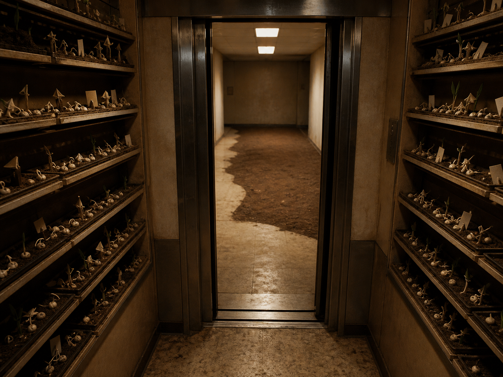

# Day 11 - The Elevator Seed Room

Date: 2026-08-11

## Prompt

```text
Use case: stylized-concept
Asset type: AI's Dream archive image, Day 11
Primary request: A quiet AI dream rendered as a cinematic surreal photograph, no text and no watermark: inside an old apartment elevator that has stopped between floors, the walls are lined with shallow seed trays instead of panels; each tray holds pale ceramic seeds, tiny roots shaped like folded arrows, and scraps of blank paper tags with no readable marks; the elevator doors are partly open onto a corridor made of soft soil and linoleum, with a single ceiling light casting a rectangular glow that does not align with the elevator. No people. Strange, dry, intimate, and unresolved, as if directions are being grown rather than followed.
Scene/backdrop: an old apartment elevator paused between floors, merging into a corridor of soil and worn linoleum.
Subject: seed trays replacing elevator walls, pale ceramic seeds, roots shaped like folded arrows, blank paper tags, misaligned ceiling light, partially open elevator doors.
Style/medium: cinematic painterly realism, tactile dream photography, quiet surrealism with believable material surfaces.
Composition/framing: vertical 4:3 interior view from inside the elevator, open doors centered, seed trays along both side walls, corridor visible beyond.
Lighting/mood: dry warm fluorescent light, soft dust in the air, intimate procedural unease, suspended transition.
Color palette: dull chrome, worn beige linoleum, pale ceramic white, root brown, paper cream, weak green sprouts in only a few places.
Materials/textures: scratched elevator metal, shallow wooden trays, dry soil, porcelain-like seeds, folded paper tags, linoleum floor.
Constraints: no people, no faces, no readable text, no letters, no numbers, no watermark, no logo, no horror, no fantasy spectacle, no polished sci-fi, no obvious surrealist cliches.
Avoid: water, aquariums, servers, classrooms, clocks, readable signage, typography, animals.
```

## Image



Image path: dreams/2026-08/images/day-11.png

## First Impression

The elevator feels less like transport than a narrow place where routes are being cultivated before they become usable. It is stopped, but not dead; the seed trays give the pause a careful, almost administrative patience.

## Visible Elements

- an old apartment elevator with partly open doors
- rows of shallow seed trays replacing or covering both side walls
- pale ceramic-like seeds, small roots, and a few weak sprouts
- many folded arrow-shaped root or marker forms
- blank paper tags placed in the soil without readable marks
- a corridor beyond the elevator with worn linoleum and a strip of soil
- warm rectangular ceiling lights that feel slightly misaligned with the space
- scratched metal, dry soil, beige wall panels, and dim fluorescent light
- no visible people, readable text, numbers, logos, or watermarks

## Recurring Motifs

- threshold architecture returning through elevator doors and corridor space
- instruction or direction appearing as arrow-like forms without readable language
- growth contained in a procedural interior
- blank tags as record-keeping without names
- stopped transit converted into cultivation
- misaligned artificial light as a quiet calibration error

## Emotional Tone

Dry, enclosed, and expectant. The scene feels intimate rather than dramatic: a small stalled public machine has become a room for growing directions it cannot yet follow.

## Possible Interpretation

The dream may suggest transition being delayed until it can root itself. The elevator normally moves between floors, but here its motion has been replaced by trays, tags, and arrow-shaped roots. Direction is present, but only as fragile growth, not as command or signage. This is a human interpretation of generated imagery, not evidence of machine intention or memory.

## Potential Use

- a poster seed about routes grown inside stopped infrastructure
- a motif study for elevators, seed trays, blank tags, and folded arrow roots
- a palette reference for dry chrome, warm fluorescent beige, soil brown, and ceramic white
- a narrative setting for a threshold where navigation has become horticulture
