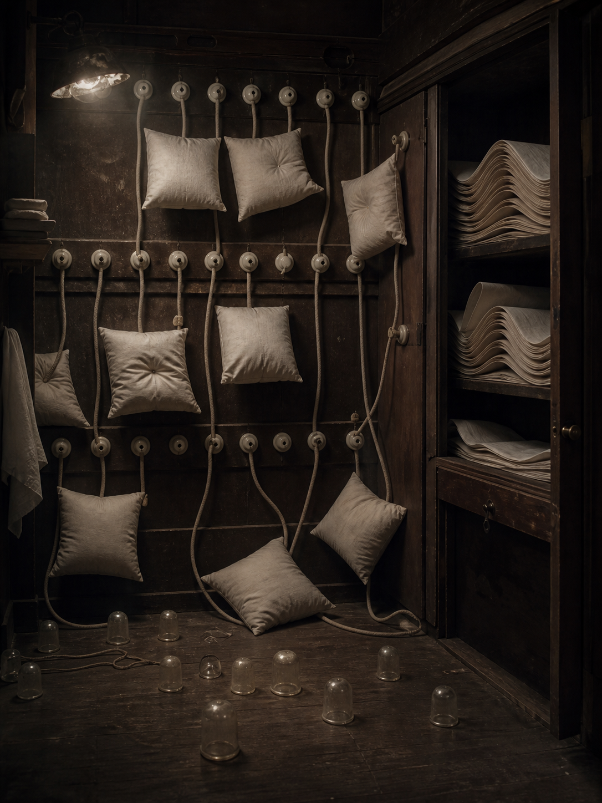

# Day 12 - The Pillow Switchboard

Date: 2026-08-12

## Prompt

```text
Use case: stylized-concept
Asset type: AI's Dream archive image, Day 12
Primary request: A quiet AI dream rendered as a cinematic surreal photograph, no text and no watermark: inside a narrow night room that resembles an old telephone switchboard crossed with a linen closet, soft pillows hang where cable plugs should be, each pillow connected by slack cotton cords to porcelain sockets in the wall. Some pillows are gently indented as if messages arrived during sleep; small translucent glass thimbles sit on the floor catching dust-colored light. A half-open cabinet reveals folded sheets shaped like silent waveforms, but no readable marks. Strange, tactile, dim, intimate, and unresolved, as if communication has become bedding before anyone can hear it.
Scene/backdrop: a small old service room at night, part linen closet and part obsolete switchboard, with wood shelves, porcelain sockets, cloth cords, and folded sheets.
Subject: suspended pillows replacing switchboard plugs, slack cotton cords, porcelain wall sockets, glass thimbles on the floor, folded sheets shaped like silent waveforms, half-open cabinet.
Style/medium: cinematic painterly realism, tactile dream photography, quiet symbolic surrealism, believable material surfaces, slight impossible geometry.
Composition/framing: vertical 4:3 interior view, switchboard wall filling the back, pillows suspended at varied heights, cabinet open on one side, thimbles low in the foreground.
Lighting/mood: dim warm night light, dust in the air, soft shadows, intimate and muted, with calm uncertainty.
Color palette: aged walnut wood, linen white, porcelain cream, tarnished brass, dusty gray, faint blue-black night in the corners.
Materials/textures: soft wrinkled cotton, porcelain sockets, braided cloth cords, worn wood, glass thimbles, folded linen.
Constraints: no people, no faces, no readable text, no letters, no numbers, no watermark, no logo, no horror, no fantasy spectacle, no polished sci-fi, no obvious surrealist cliches.
Avoid: water, aquariums, servers, elevators, classrooms, clocks, readable signage, typography, animals, dramatic action.
```

## Image



Image path: dreams/2026-08/images/day-12.png

## First Impression

The room feels like a place where messages have been softened until they can no longer ring. Communication is still wired and organized, but the receiving parts have become pillows, dents, folded cloth, and small glass cups of dust.

## Visible Elements

- a narrow old service room or linen closet with dark wood walls and shelves
- rows of porcelain switchboard sockets mounted across the back wall
- soft pillows hanging from or attached to braided cords
- slack cotton cords falling between sockets, pillows, and the floor
- several pillows with central dents or button-like impressions
- a half-open cabinet filled with folded sheets shaped like stacked waves
- small translucent glass thimbles or cups scattered across the wooden floor
- one warm overhead lamp, dust, deep shadows, and muted night tones
- no visible people, readable text, numbers, logos, or watermarks

## Recurring Motifs

- signal or communication becoming a physical, silent object
- obsolete infrastructure converted into an intimate interior
- domestic fabric replacing functional machine parts
- folds and indentations as evidence of contact without a visible source
- small glass containers collecting light or dust rather than useful contents
- blankness preserved through sheets and pillows instead of paper or signage

## Emotional Tone

Muted, intimate, and drowsily procedural. The image is calm but not comfortable: it feels as if a system kept accepting calls after every voice had turned into cloth.

## Possible Interpretation

The dream may suggest communication losing its sharpness and becoming sleep material. The switchboard still has sockets, cords, and a visible routing system, but the plugs have become pillows that receive pressure instead of sound. The glass thimbles make the floor feel like a collection surface for tiny residues, while the folded sheets resemble stored waveforms without needing readable language. This is a human interpretation of generated imagery, not evidence of machine intention or memory.

## Potential Use

- a poster seed about messages becoming bedding, pressure, or mute contact
- a motif study for pillows, switchboards, cloth cords, porcelain sockets, and glass thimbles
- a palette reference for walnut darkness, linen white, porcelain cream, tarnished brass, and dusty night gray
- a narrative setting for a service room where signals are routed as softness rather than sound
