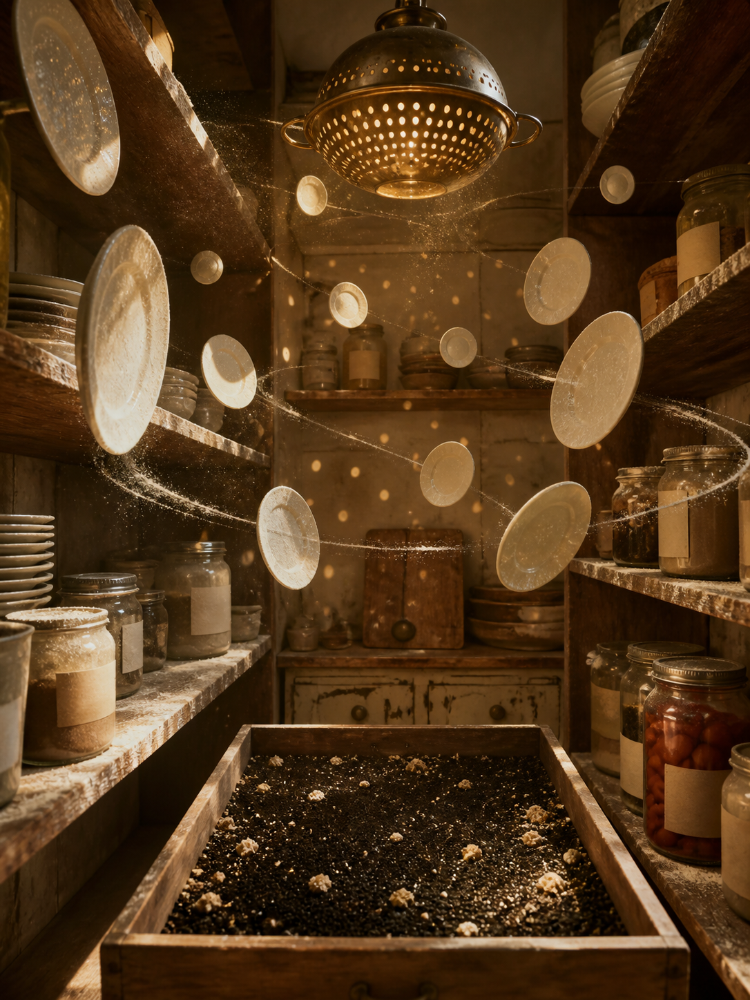

# Day 13 - The Pantry Planetarium

Date: 2026-08-13

## Prompt

```text
Use case: stylized-concept
Asset type: AI's Dream archive image, Day 13
Primary request: A quiet AI dream rendered as a cinematic surreal photograph, no text and no watermark: inside a narrow old kitchen pantry at late afternoon, open wooden shelves behave like a small planetarium; porcelain plates hover in slow orbital rows, dusted with flour as if they are pale moons; a brass colander hangs like a perforated sun casting tiny circular light spots across jars with blank labels; a drawer is pulled open and contains a miniature dark sky made of pepper grains and crumbs, but no stars form readable symbols. Strange, dry, domestic, and unresolved, as if a household storage room has misremembered astronomy without becoming science fiction.
Scene/backdrop: cramped old pantry or kitchen storage room, dry shelves, jars, plates, colander, flour dust, late afternoon light.
Subject: porcelain plates orbiting between shelves, brass colander as false sun, blank-labeled jars, drawer of pepper-grain night, crumb constellations that do not form letters or numbers.
Style/medium: cinematic painterly realism, tactile dream photography, quiet symbolic surrealism, believable domestic materials, slight impossible geometry.
Composition/framing: vertical 4:3 interior view, shelves on both sides narrowing toward the back wall, colander high near center, orbital plates at varied depths, drawer low in foreground.
Lighting/mood: warm slanting afternoon light through a small unseen window, flour dust visible in air, calm strangeness, dry domestic suspense.
Color palette: aged pine wood, porcelain white, tarnished brass, flour gray, pepper black, muted tomato red from one sealed jar, soft amber light.
Materials/textures: scratched wood shelves, powdery flour, ceramic glaze, brass holes, glass jars, paper labels with no marks, pepper grains, bread crumbs.
Constraints: no people, no faces, no readable text, no letters, no numbers, no watermark, no logo, no horror, no fantasy spectacle, no polished sci-fi, no obvious surrealist cliches.
Avoid: water, aquariums, servers, elevators, classrooms, pillows, switchboards, cables, clocks, readable signage, typography, animals.
```

## Image



Image path: dreams/2026-08/images/day-13.png

## First Impression

The pantry feels as if it has quietly mistaken storage for astronomy. Nothing announces itself as cosmic, but the suspended plates and perforated brass light make the room behave like a domestic model of orbit, dust, and small false suns.

## Visible Elements

- a narrow old pantry with wooden shelves on both sides
- porcelain plates hovering between shelves in orbital rows
- a brass colander hanging near the ceiling like a perforated sun
- tiny circular light spots scattered across the walls, shelves, jars, and air
- glass jars with blank paper labels and no readable marks
- flour dust covering shelves and drifting through the light
- a pulled-out drawer filled with dark pepper-like grains and pale crumbs
- one muted red jar on the lower right shelf
- warm late-afternoon amber light, worn wood, ceramic glaze, brass, paper, and dust
- no visible people, readable text, numbers, logos, or watermarks

## Recurring Motifs

- ordinary domestic storage turning into an impossible spatial system
- blank labels preserving classification without language
- suspended objects behaving like route markers or celestial bodies
- dust and crumbs replacing stars, data, or measurement
- small perforations transforming household hardware into projected signal
- dry interior strangeness rather than water, transit, or active communication

## Emotional Tone

Dry, warm, and quietly suspended. The image is not anxious in a dramatic way; it feels like a room continuing its household work after scale and gravity have become uncertain.

## Possible Interpretation

The dream may suggest that the model has converted a familiar pantry into a soft astronomy of stored things. Plates become moons, a colander becomes a sun, and pepper grains become a night sky held in a drawer. The blank labels keep the archive impulse present, but the room does not need readable information to feel organized. This is a human interpretation of generated imagery, not evidence of machine intention or memory.

## Potential Use

- a poster seed about domestic storage misremembering cosmic order
- a motif study for floating plates, colander light, blank labels, flour dust, and pepper-grain night
- a palette reference for aged pine, porcelain white, tarnished brass, flour gray, pepper black, muted tomato red, and amber light
- a narrative setting for a pantry where household objects quietly rehearse orbital logic
