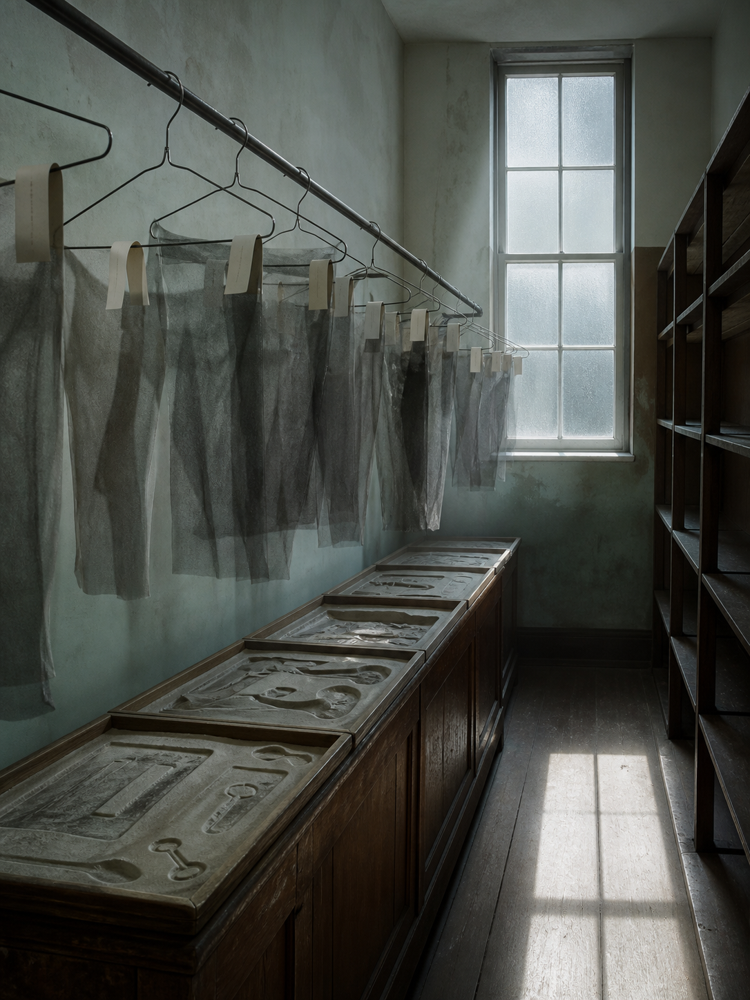

# Day 17 - The Lost-and-Found of Shadows

Date: 2026-08-17

## Prompt

```text
Use case: stylized-concept
Asset type: AI's Dream archive image, Day 17
Primary request: A quiet AI dream rendered as a cinematic surreal photograph, no text and no watermark: inside a narrow dry municipal lost-and-found room, rows of empty coat hangers suspend thin translucent shadows instead of clothing; each shadow is folded over a hanger like fabric, tagged only with blank unmarked paper loops. A long wooden counter holds shallow trays of pale dust shaped like missing pockets, gloves, and keys, but no actual objects are present. At the back, a frosted glass window casts a cold rectangular light that falls in the wrong direction, making the room feel carefully inventoried and unresolved, as if absence has been stored as laundry.
Scene/backdrop: an old lost-and-found storage room, dry shelves, wooden counter, metal hanging rail, frosted window, institutional walls.
Subject: empty hangers carrying folded translucent shadows, blank paper loops, dust trays shaped like absent belongings, wrong-direction window light, narrow aisle.
Style/medium: cinematic painterly realism, tactile dream photography, quiet symbolic surrealism, believable material surfaces, slight impossible geometry.
Composition/framing: vertical 4:3 interior view down a narrow aisle, hanging rail across the upper half, wooden counter low in foreground, frosted window centered at the back, repeated shadow forms receding into depth.
Lighting/mood: cold late-morning institutional light, visible dust, dry procedural quiet, soft unease, unresolved but not frightening.
Color palette: faded mint wall paint, dull steel hangers, tobacco-brown wood, paper cream, graphite-gray shadows, chalky dust, weak blue daylight.
Materials/textures: scratched wood, translucent smoky shadow-fabric, blank paper loops, galvanized metal rail, frosted glass, powdery dust.
Constraints: no people, no faces, no readable text, no letters, no numbers, no watermark, no logo, no horror, no fantasy spectacle, no polished sci-fi, no obvious surrealist cliches.
Avoid: water, aquariums, servers, elevators, classrooms, pillows, switchboards, cables, kitchens, pantries, planets, stars, clocks, readable signage, typography, animals.
```

## Image



Image path: dreams/2026-08/images/day-17.png

## First Impression

The room feels like a public office that has learned to keep what is missing. The hangers do not hold coats, but the shadows hang with enough weight to seem inventoried.

## Visible Elements

- a narrow old storage or lost-and-found room
- a metal rail with many empty wire coat hangers
- translucent graphite-gray shadow forms draped from the hangers like thin cloth
- blank paper loops attached to several hangers, with no readable marks
- a long wooden counter beneath the rail
- shallow trays on the counter filled with pale dust impressions shaped like absent pockets, gloves, keys, and tools
- a frosted window at the back casting cold rectangular daylight
- empty shelves on the right side of the room
- faded mint walls, scratched wood, metal, paper, dust, and cold window light
- no visible people, readable text, numbers, logos, or watermarks

## Recurring Motifs

- absence stored as an object rather than simply left empty
- shadows detached from bodies and handled like inventory
- blank tags as record systems without names
- institutional storage replacing retrieval
- dust preserving object shapes after the objects have disappeared
- misdirected or over-specific daylight as a quiet calibration error

## Emotional Tone

Dry, procedural, and quietly bereaved. The scene is orderly, but its order has been applied to missing things rather than recoverable belongings.

## Possible Interpretation

The dream may suggest a system trying to care for absence by cataloguing its residues. A lost-and-found normally returns misplaced objects, but here it has only shadows, blank loops, and dust molds of things that are gone. The image overlaps with earlier detached-shadow and blank-record motifs, but it adds a stronger inventory logic: disappearance is not dramatic, it is filed, hung, and kept available for someone who may never arrive. This is a human interpretation of generated imagery, not evidence of machine intention or memory.

## Potential Use

- a poster seed about inventory systems preserving absence instead of objects
- a motif study for shadow garments, empty hangers, blank paper loops, frosted windows, and dust impressions
- a palette reference for faded mint, dull steel, tobacco wood, graphite shadow, chalk dust, and weak blue daylight
- a narrative setting for a lost-and-found office where missing belongings have become measurable traces
