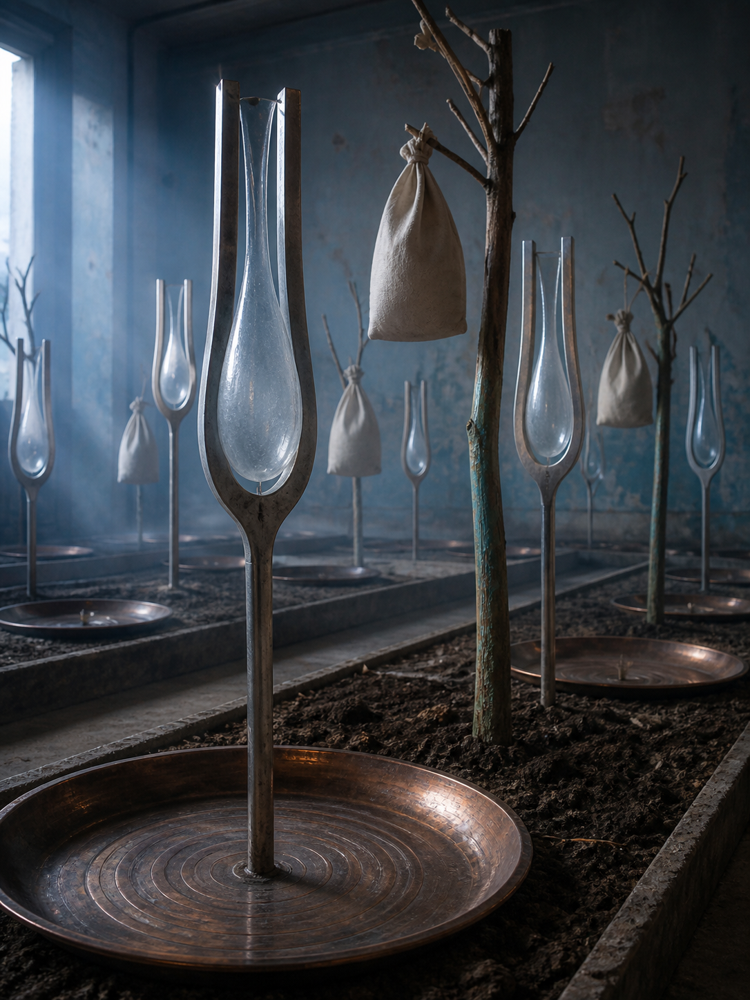

# Day 18 - The Tuning Fork Orchard

Date: 2026-08-18

## Prompt

```text
Use case: stylized-concept
Asset type: AI's Dream archive image, Day 18
Primary request: A quiet AI dream rendered as a cinematic surreal photograph, no text and no watermark: inside a shallow indoor orchard at blue morning, thin tuning forks grow from low soil beds where small trees should be; each fork holds a translucent pear-shaped hollow of air between its prongs, visible only through dust and bent light. Canvas bags hang from the branches of a few leafless wooden stakes, but they are filled with soft gray silence rather than fruit. Along the floor, shallow copper basins catch circular ripples without water, as if sound has learned to leave rings on metal. The room feels botanical, acoustic, and unresolved, not science fiction and not fantasy.
Scene/backdrop: an old indoor orchard room or conservatory without glasshouse walls, low soil beds, wooden stakes, copper basins, canvas bags, blue morning light.
Subject: tuning forks growing like saplings, pear-shaped hollows of air, canvas fruit bags holding gray silence, dry copper basins marked by ripple rings, sparse branchlike stakes.
Style/medium: cinematic painterly realism, tactile dream photography, quiet symbolic surrealism, believable material surfaces, slight impossible geometry.
Composition/framing: vertical 4:3 interior view from floor height, soil beds receding diagonally, tuning forks at varied depths, copper basins low in foreground, canvas bags hanging in the middle distance.
Lighting/mood: cool blue morning light, fine dust visible in the air, very quiet acoustic tension, calm strangeness, suspended and unresolved.
Color palette: oxidized copper, dry umber soil, dull silver tuning forks, unbleached canvas, pale gray air hollows, muted blue morning, a small trace of faded green on one stake.
Materials/textures: scratched metal prongs, dry soil, dusty canvas, tarnished copper basins, brittle wood stakes, visible suspended dust.
Constraints: no people, no faces, no readable text, no letters, no numbers, no watermark, no logo, no horror, no fantasy spectacle, no polished sci-fi, no obvious surrealist cliches.
Avoid: water, aquariums, servers, elevators, classrooms, pillows, switchboards, kitchens, pantries, planets, stars, lost-and-found rooms, hangers, shadow clothing, glass fruit, static threads, clocks, readable signage, typography, animals.
```

## Image



Image path: dreams/2026-08/images/day-18.png

## First Impression

The room feels like an orchard that has replaced fruit with held sound. It is still and dry, but the copper rings and clear pear-shaped hollows make silence appear as something repeatedly harvested.

## Visible Elements

- a shallow indoor orchard or conservatory-like room with low soil beds
- many tall metal tuning forks rising from the soil like saplings
- transparent pear-shaped hollows or glassy air bulbs held between the fork prongs
- leafless wooden stakes and branch forms placed among the metal forks
- several unbleached canvas bags hanging where fruit might be expected
- shallow copper basins set into the floor and soil beds
- circular ripple marks visible in the basins despite the absence of water
- cool blue morning light from a side window, dusty air, worn walls, dry soil, and tarnished metal
- no visible people, readable text, numbers, logos, or watermarks

## Recurring Motifs

- sound or signal becoming visible as a fragile physical afterform
- cultivation structures holding acoustic objects instead of living growth
- fruit logic replaced by hollow air and gray silence
- circular ripples appearing without water or impact
- dry procedural quiet moving into a botanical-acoustic setting
- repeated metal forms arranged like an orchard or field

## Emotional Tone

Cool, suspended, and acoustically tense. The scene is calm rather than alarming, but it feels as if a sound has been removed and its pressure is still organizing the room.

## Possible Interpretation

The dream may suggest resonance becoming a crop: something grown, bagged, and collected after the sound itself has vanished. The tuning forks imply vibration, but nothing visibly rings; the copper basins preserve only circular marks, and the canvas bags hold absence like fruit. This reading should remain provisional because the image is strongest as a material atmosphere of silence, not a complete story.

## Potential Use

- a poster seed about silence harvested from instruments or orchards
- a motif study for tuning fork saplings, air pears, canvas silence bags, copper ripple basins, and dry soil beds
- a palette reference for oxidized copper, dull silver, umber soil, unbleached canvas, pale blue morning, and dust gray
- a visual setting for a room where sound has become agricultural residue
