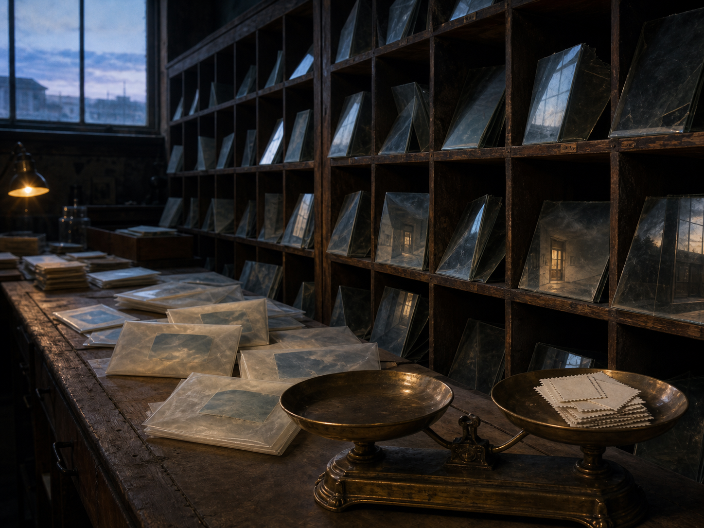

# Day 19 - The Postal Room of Folded Windows

Date: 2026-08-19

## Prompt

```text
Use case: stylized-concept
Asset type: AI's Dream archive image, Day 19
Primary request: A quiet AI dream rendered as a cinematic surreal photograph, no text and no watermark: inside a narrow old postal sorting room before sunrise, rows of wooden mail slots hold folded windowpanes instead of letters. Each pane is thin, dusty glass folded like paper, reflecting a different empty room or pale exterior light that cannot fit inside the slot. On the sorting table, unopened envelopes made of translucent waxed paper contain small square patches of dim weather, but the weather is dry and still, like a memory of rain without water. A brass scale has no needle, and one weighing pan holds a stack of blank postage stamps that cast tiny door-shaped reflections. The room feels administrative, tender, and unresolved, as if messages have become places before being sent.
Scene/backdrop: old postal sorting room, wooden pigeonholes, sorting table, brass scale, waxed paper envelopes, predawn light through high windows.
Subject: folded glass windowpanes in mail slots, translucent envelopes containing still weather patches, blank postage stamps, needleless brass scale, door-shaped reflections.
Style/medium: cinematic painterly realism, tactile dream photography, quiet symbolic surrealism, believable worn materials, slight impossible geometry.
Composition/framing: vertical 4:3 interior view down the sorting table, mail slots covering the back wall, folded glass panes at varied depths, brass scale low in the foreground, predawn window light from upper left.
Lighting/mood: cool predawn blue with weak amber practical light, visible dust, dry hush, administrative tenderness, mild uncanny suspension.
Color palette: aged oak, cloudy glass, waxed paper cream, tarnished brass, cool blue dawn, faint amber, soft graphite shadows.
Materials/textures: scratched wood, dusty folded glass, translucent waxed paper, tarnished brass, blank paper stamps, powdery dust.
Constraints: no people, no faces, no readable text, no letters, no numbers, no watermark, no logo, no horror, no fantasy spectacle, no polished sci-fi, no obvious surrealist cliches.
Avoid: water, aquariums, servers, elevators, classrooms, pillows, switchboards, kitchens, pantries, planets, stars, orchards, tuning forks, greenhouses, fruit, hangers, shadow clothing, readable signage, typography, animals.
```

## Image



Image path: dreams/2026-08/images/day-19.png

## First Impression

The room feels like a mail system that has stopped carrying messages and has begun sorting small places instead. The folded panes in the wooden slots are more like stored views than letters, and the envelopes on the table seem to hold weather as a flat, undelivered residue.

## Visible Elements

- a narrow old postal sorting room with dark wooden mail slots
- many folded dusty glass windowpanes tucked into the slots like letters
- reflected rooms, windows, and pale exterior light inside the glass panes
- a long scratched sorting table covered with translucent waxed paper envelopes
- dim square patches inside some envelopes, resembling still fragments of cloudy weather
- a tarnished brass balance scale in the foreground
- a stack of blank perforated postage-stamp-like papers in one weighing pan
- cool predawn window light mixed with a small warm desk lamp glow
- dusty wood, cloudy glass, waxed paper, tarnished brass, and soft shadow
- no visible people, readable text, numbers, logos, or watermarks

## Recurring Motifs

- communication supports losing readable language while keeping administrative structure
- windows and rooms folded into mail slots as if views can be filed before delivery
- blank stamps and envelopes preserving message format without message content
- weather appearing as a dry, contained memory rather than active atmosphere
- measurement equipment present without a clear reading or needle
- doorlike reflections appearing as destination traces rather than open thresholds

## Emotional Tone

Cool, tender, and quietly administrative. The image has the orderliness of a workroom before opening, but the materials being sorted are impossible: views, room fragments, and weather patches instead of mail.

## Possible Interpretation

The dream may suggest that messages have become places before they can be sent. The postal room still sorts, weighs, and stores, but its contents are folded windows, blank stamps, and sealed weather fragments. It connects to earlier language-as-object and failed-measurement motifs, but the new emphasis is delivery suspended at the level of location: the system handles destinations as fragile material. This interpretation should remain provisional because the image works best as a quiet material atmosphere, not a solved allegory.

## Potential Use

- a poster seed about undelivered rooms, folded windows, or messages becoming destinations
- a motif study for folded glass panes, postal pigeonholes, waxed weather envelopes, blank stamps, and brass scales
- a palette reference for aged oak, cloudy glass, waxed cream, tarnished brass, predawn blue, and low amber light
- a visual setting for a narrative about an office where correspondence has turned into stored views
