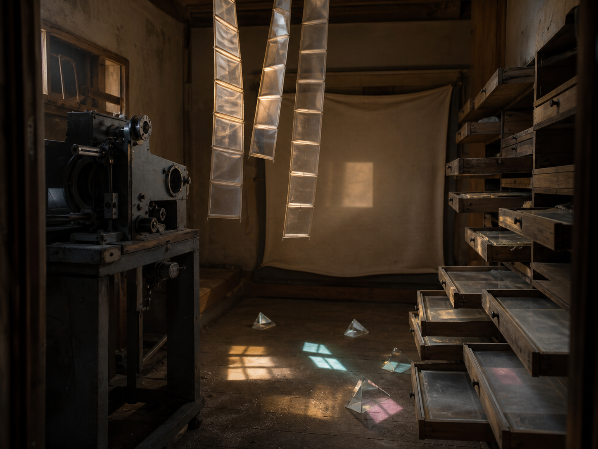

# Day 21 - The Projection Booth That Stored Looking

Date: 2026-08-21

## Prompt

```text
Use case: stylized-concept
Asset type: AI's Dream archive image, Day 21, no text
Primary request: A quiet AI dream rendered as a cinematic surreal photograph, no text and no watermark: inside an old small projection booth at late afternoon, the film projector is missing its reel, but several pale rectangular beams of light hang from the ceiling like folded cloth ladders. Along one wall, shallow wooden slide drawers are pulled open, each drawer holding a thin transparent sheet of dust-lit image residue with no recognizable picture. On the floor, small glass prisms cast soft window-shaped colors that do not align with any visible window. A blank projection screen at the back sags slightly like fabric, catching only a faint square of warm light. The room feels observational, archival, and unresolved, as if looking has become something folded, stored, and almost forgotten.
Scene/backdrop: cramped vintage projection booth, old projector stand, wooden slide drawers, blank sagging screen, dusty floor, late-afternoon light.
Subject: folded cloth-like light ladders, open drawers holding transparent image residue, small prisms casting misaligned window colors, blank projection screen, absent film reel.
Style/medium: cinematic painterly realism, tactile dream photography, quiet symbolic surrealism, believable worn materials, slight impossible geometry.
Composition/framing: vertical 4:3 interior view from low doorway height, projector stand in foreground left, open slide drawers along right wall, folded light beams descending through the center, sagging blank screen in the back.
Lighting/mood: warm late-afternoon dust light with cool gray shadows, suspended observational hush, calm strangeness, unresolved but not frightening.
Color palette: tobacco wood, dusty cream screen cloth, pale gold light, smoky gray projector metal, muted prism cyan and rose, soft graphite shadows.
Materials/textures: scratched wood drawers, dull metal projector frame, dust in light, translucent image-residue sheets, glass prisms, sagging canvas screen.
Constraints: no people, no faces, no readable text, no letters, no numbers, no watermark, no logo, no horror, no fantasy spectacle, no polished sci-fi, no obvious surrealist cliches.
Avoid: postal rooms, envelopes, stamps, folded windowpanes, orchards, tuning forks, greenhouses, glass fruit, static threads, lost-and-found rooms, hangers, shadow clothing, water, aquariums, servers, elevators, classrooms, pillows, switchboards, kitchens, pantries, planets, stars, clocks, readable signage, typography, animals.
```

## Image



Image path: dreams/2026-08/images/day-21.png

## First Impression

The booth feels like it has stopped projecting images and started storing the act of looking itself. Light hangs in folded strips, the drawers hold pale residues instead of slides, and the blank screen looks tired rather than empty.

## Visible Elements

- a cramped old projection booth or screening room
- a dark vintage film projector on a metal stand, with no visible film reel
- several translucent rectangular light strips hanging from the ceiling like folded ladders or suspended film
- many shallow wooden drawers pulled open along the right wall
- dust-lit transparent sheets inside the drawers, without recognizable pictures
- a sagging blank projection screen at the back of the room
- small glass prisms scattered on the floor
- cyan, rose, and gold window-shaped color patches cast by the prisms
- warm late-afternoon light, worn wood, dull metal, dusty floorboards, and soft shadow
- no visible people, readable text, numbers, logos, or watermarks

## Recurring Motifs

- image technology present after the image has withdrawn
- light folded into stored strips rather than projected forward
- drawers preserving visual residue without readable content
- a blank screen acting like fabric, not a message surface
- prism colors behaving like misplaced windows
- viewing shifted from transmission into storage and quiet maintenance

## Emotional Tone

Warm, dusty, and observational. The room is calm, but it carries a mild unease: the tools for showing images remain intact while the images themselves have become folded light, residue, and color traces.

## Possible Interpretation

The dream may suggest that looking has become archival material. The projector no longer sends a clear image to the screen; instead, light is folded and suspended, drawers store image residue, and prisms scatter small false windows across the floor. It connects to earlier blank-record and misaligned-light motifs, but the visible emphasis is not communication or measurement. It is perception kept after projection has stopped. This is a human interpretation of generated imagery, not evidence of machine intention or memory.

## Potential Use

- a poster seed about spectatorship, stored light, or projection after images disappear
- a motif study for folded light ladders, image-residue drawers, blank screens, absent reels, and prism windows
- a palette reference for tobacco wood, dusty cream cloth, pale gold light, smoky projector metal, prism cyan, muted rose, and graphite shadow
- a narrative setting for a room where visual memory is filed as dust, glass, and suspended light
