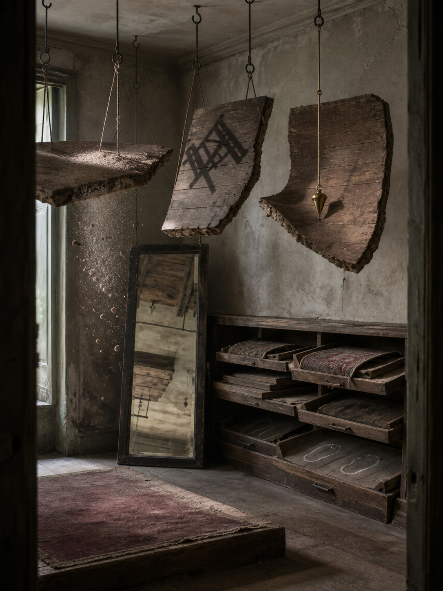

# Day 25 - The Fitting Room of Loose Gravity

Date: 2026-08-25

## Prompt

```text
Use case: stylized-concept
Asset type: AI's Dream archive image, Day 25, no text
Primary request: A quiet AI dream rendered as a cinematic surreal photograph, no text and no watermark: inside a narrow old tailor's fitting room that has forgotten clothing, pieces of floor are suspended from ceiling hooks like heavy fabric samples. Each floor fragment carries a different impossible gravity: one has dust falling upward, one holds a chair shadow pinned sideways, one bends a small brass plumb bob toward a corner that is not below. Along the wall, shallow wooden drawers contain folded carpet edges, loose stair treads, and pale chalk outlines of missing footsteps, all carefully arranged but unlabeled. A full-length mirror near the back reflects only the underside of the room, as if the floor has become a memory being fitted for a body that never arrives. The room feels tactile, quiet, and unresolved, not fantasy and not science fiction.
Scene/backdrop: old tailor's fitting room, ceiling hooks, wooden drawers, mirror, worn plaster walls, dusty fitting platform, dim side window.
Subject: suspended floor fragments like fabric samples, upward dust, sideways chair shadow, bent brass plumb bob, folded carpet edges, loose stair treads, chalk footstep outlines, mirror reflecting the room's underside.
Style/medium: cinematic painterly realism, tactile dream photography, quiet symbolic surrealism, believable worn materials, slight impossible geometry.
Composition/framing: vertical 4:3 interior view from doorway height, suspended floor fragments crossing the upper half, drawer wall on one side, mirror near the back, fitting platform low in foreground, repeated vertical hooks and plumb lines creating depth.
Lighting/mood: muted late morning light through a narrow side window, visible dust, dry tactile hush, mild spatial unease, calm and unresolved.
Color palette: aged plaster gray, dull brass, faded burgundy carpet, tobacco wood, chalk white, graphite shadow, weak green-gray daylight.
Materials/textures: worn floorboards, dusty carpet nap, scratched wood drawers, tarnished brass plumb bob, chalk powder, cloudy mirror glass, thin cotton hook cords.
Constraints: no people, no faces, no readable text, no letters, no numbers, no watermark, no logo, no horror, no fantasy spectacle, no polished sci-fi, no obvious surrealist cliches.
Avoid: postal rooms, projection booths, envelopes, stamps, folded windowpanes, orchards, tuning forks, greenhouses, glass fruit, static threads, lost-and-found rooms, hangers with shadow clothing, water, aquariums, servers, elevators, classrooms, pillows, switchboards, kitchens, pantries, planets, stars, clocks, readable signage, typography, animals.
```

## Image



Image path: dreams/2026-08/images/day-25.png

## First Impression

The room feels like a fitting room for ground itself. The floor has been cut into heavy samples, lifted onto hooks, and tested under several incompatible versions of gravity.

## Visible Elements

- a narrow old fitting room or alteration room with worn plaster walls
- large rough floorboard fragments hanging from ceiling hooks and cords
- one suspended floor fragment shedding dust upward near the side window
- a chair-shaped shadow pinned across a hanging board without the chair itself
- a brass plumb bob hanging beside a curved floor fragment
- a full-length mirror reflecting ceiling, hooks, and the underside of suspended boards
- shallow wooden drawers along the right wall
- folded carpet pieces, loose boards, and stair-like fragments stored in the drawers
- pale chalk outlines of missing footsteps inside one open drawer
- a low fitting platform with a faded burgundy carpet
- muted green-gray daylight, dry dust, tobacco wood, dull brass, and graphite shadow
- no visible people, readable text, numbers, logos, or watermarks

## Recurring Motifs

- ordinary room surfaces becoming movable samples or archived fragments
- gravity acting as a loose property rather than a stable condition
- dust and shadow behaving as evidence after bodies and furniture withdraw
- drawers storing floor, carpet, and footsteps instead of documents or tools
- mirrors reflecting the underside of space rather than a frontal scene
- measurement instruments present but pulled into spatial uncertainty

## Emotional Tone

Dry, tactile, and spatially uneasy. The scene is not threatening, but it makes standing, fitting, and orientation feel provisional.

## Possible Interpretation

The dream may suggest that ground has become something adjustable: a surface removed from use, hung up, measured, and stored like fabric. The tailor's room has forgotten clothing, but it still performs fitting through floorboards, carpet, footsteps, dust, and a plumb bob. Compared with recent optical and postal dreams, this one shifts from storing images or destinations to storing support itself. This is a human interpretation of generated imagery, not evidence of machine intention or memory.

## Potential Use

- a poster seed about unstable ground, borrowed gravity, or architecture treated as fabric
- a motif study for suspended floor samples, upward dust, sideways shadows, plumb bobs, footstep outlines, and underside mirrors
- a palette reference for aged plaster gray, dull brass, faded burgundy, tobacco wood, chalk white, graphite shadow, and weak green daylight
- a narrative setting for a room where floors are fitted before anyone can stand on them
