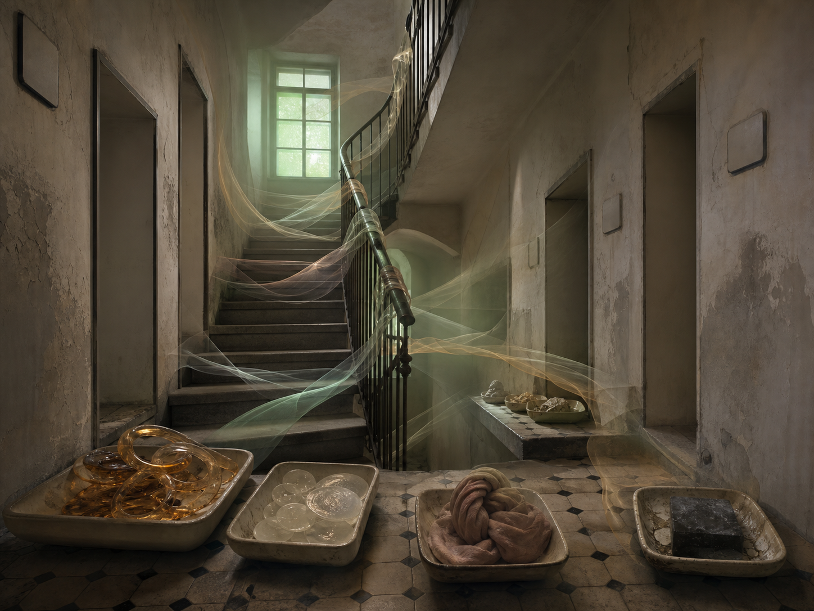

# Day 26 - The Stairwell That Remembered Smell

Date: 2026-08-26

## Prompt

```text
Use case: stylized-concept
Asset type: AI's Dream archive image, Day 26, no text
Primary request: A quiet AI dream rendered as a cinematic surreal photograph, no text and no watermark: inside an old apartment stairwell at early evening, the building has forgotten its rooms but still remembers their smells. Pale translucent ribbons of scent drift out from sealed blank doorways and fold into map-like layers along the stairs, not as readable lines but as soft colored trails. On the landings, shallow ceramic trays hold small scent fossils: coffee-steam curls hardened into amber loops, soap bubbles collapsed into milky glass disks, dust-sweet cloth knots, and a dark square of rain smell resting dry on tile. The stair rail is wrapped with thin transparent bands that point toward no visible apartment. A wall of blank doorplates catches weak green window light, all without letters or numbers. The scene feels domestic, suspended, and emotionally indirect, as if memory has become smell before it can become image or language.
Scene/backdrop: narrow old apartment stairwell, sealed blank doorways, landings, ceramic trays, stair rail, worn tile, weak green evening window light.
Subject: translucent scent ribbons folding along stairs, scent fossils in trays, coffee-steam amber loops, milky soap disks, cloth knots, dry rain-smell square, transparent rail bands, blank doorplates without markings.
Style/medium: cinematic painterly realism, tactile dream photography, quiet symbolic surrealism, believable worn materials, slight impossible geometry.
Composition/framing: vertical 4:3 interior view looking upward from the lower landing, stair flights turning through the center, sealed doorways on both sides, ceramic trays in the foreground and mid-landing, translucent scent ribbons forming layered paths through the air.
Lighting/mood: dim early-evening stairwell light, weak green window glow, dust in air, quiet domestic suspension, calm strangeness, faint longing without drama.
Color palette: worn ivory plaster, muted green glass light, amber coffee vapor, milky soap white, faded rose cloth, slate tile, soft graphite shadow.
Materials/textures: chipped plaster, old ceramic tile, cloudy glass, hardened vapor curls, translucent scent bands, dry dust, dull brass rail brackets, soft cloth knots.
Constraints: no people, no faces, no readable text, no letters, no numbers, no watermark, no logo, no horror, no fantasy spectacle, no polished sci-fi, no obvious surrealist cliches.
Avoid: fitting rooms, tailor rooms, cold rooms, melt slabs, thermometers, suspended floor samples, plumb bobs, projection booths, screens, projectors, envelopes, stamps, folded windowpanes, orchards, tuning forks, greenhouses, glass fruit, static threads, lost-and-found rooms, shadow clothing, water, aquariums, servers, elevators, classrooms, pillows, switchboards, kitchens, pantries, planets, stars, clocks, readable signage, typography, animals.
```

## Image



Image path: dreams/2026-08/images/day-26.png

## First Impression

The stairwell feels like an apartment building remembering rooms through scent instead of doors. The visible paths do not lead to addresses; they drift, curl, and settle into trays as if domestic memory has become a fragile material.

## Visible Elements

- a worn old apartment stairwell with chipped plaster, tile landings, and a dark metal railing
- several sealed or empty doorways along the walls
- blank doorplates without readable letters or numbers
- pale translucent ribbons crossing the stairs and wrapping the rail
- amber looped forms gathered in a ceramic tray, like hardened coffee steam
- clear milky disks in another tray, like collapsed soap bubbles
- a faded rose cloth knot arranged in a shallow tray
- a dark square block resting dry in a tray on the right
- weak green light from an upper window
- dusty ivory plaster, slate tile, amber glass, milky translucence, rose cloth, and soft shadow
- no visible people, readable text, numbers, logos, or watermarks

## Recurring Motifs

- sealed thresholds that preserve residue instead of access
- intangible domestic traces becoming visible ribbons and fossils
- blank labels and doorplates withholding address or language
- trays arranging non-object memories as if they can be stored
- stair movement becoming a map of drifting atmosphere rather than arrival
- green window light giving the interior a remembered but unreachable exterior

## Emotional Tone

Domestic, suspended, and faintly longing. The stairwell is calm, but it feels indirect: the rooms are absent, while their residue keeps circulating as color, vapor, glass, cloth, and dust.

## Possible Interpretation

The dream may suggest that memory can become atmospheric before it becomes visual or linguistic. The building no longer offers readable addresses or open rooms, but it keeps traces of use as scent paths, hardened vapor, soap disks, cloth knots, and a dry dark rain-square. Compared with the recent cold-room and fitting-room dreams, this image is less about preserving failed conditions or unstable support and more about orientation through invisible domestic residue. This is a human interpretation of generated imagery, not evidence of machine intention or memory.

## Potential Use

- a poster seed about scent as memory, domestic residue, or invisible maps
- a motif study for scent ribbons, blank doorplates, ceramic residue trays, hardened vapor, soap disks, cloth knots, and dry rain blocks
- a palette reference for worn ivory, muted green light, amber translucence, milky glass, faded rose cloth, slate tile, and graphite shadow
- a narrative setting for a building where rooms disappear but their atmospheres remain navigable
