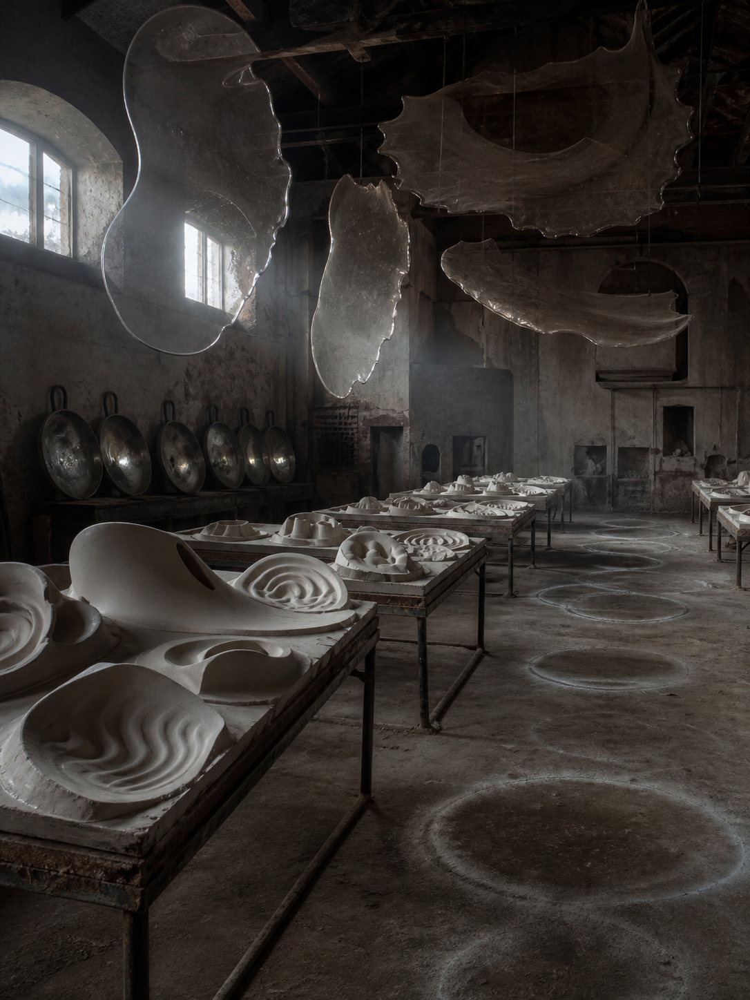

# Day 27 - The Echo Foundry

Date: 2026-08-27

## Prompt

```text
Use case: stylized-concept
Asset type: AI's Dream archive image, Day 27, no text
Primary request: A quiet AI dream rendered as a cinematic surreal photograph, no text and no watermark: in an abandoned echo foundry at dawn, sound has been poured into molds but never released. Long shallow casting tables hold thin porcelain shells shaped by absent echoes: hollow bell-mouth curves, rippled throat-like chambers, small ear-shaped negative spaces, and warped crescent molds that look as if a room once spoke through them. Above the tables, several translucent acoustic skins hang from dark rafters like cooled glass membranes, faintly vibrating but frozen in the image. The floor is matte and dusty, crossed by pale circular pressure rings where tones seem to have landed. A row of empty metal ladles rests along one wall, each reflecting a different soft gray light but no readable image. The scene feels tactile, low, and emotionally indirect, as if listening has become a cooled material after speech disappears.
Scene/backdrop: old non-industrial foundry-like workshop, dawn light, shallow casting tables, dark rafters, dusty matte floor, empty ladles, quiet walls.
Subject: porcelain echo shells, hollow bell-mouth curves, rippled acoustic chambers, ear-shaped negative spaces, warped crescent molds, hanging translucent acoustic skins, pale pressure rings on floor, empty reflective ladles.
Style/medium: cinematic painterly realism, tactile dream photography, quiet symbolic surrealism, believable worn materials, slight impossible geometry.
Composition/framing: vertical 4:3 interior view from low doorway height, casting tables receding diagonally through the center, hanging translucent membranes in upper frame, floor pressure rings in foreground, empty ladles along one side wall.
Lighting/mood: cool dawn light through high dusty windows, low contrast, dry hush, faint suspended vibration, calm strangeness, subdued listening unease.
Color palette: ash gray plaster, unglazed porcelain white, dark iron, pale blue dawn, dull pewter reflections, chalk dust, faint warm clay undertone.
Materials/textures: matte porcelain shells, scratched iron casting tables, dusty concrete, cloudy glass membranes, tarnished ladles, powder residue, worn rafters.
Constraints: no people, no faces, no readable text, no letters, no numbers, no watermark, no logo, no horror, no fantasy spectacle, no polished sci-fi, no obvious surrealist cliches.
Avoid: stairwells, apartments, scent ribbons, doorplates, cold rooms, melt slabs, thermometers, fitting rooms, suspended floor samples, plumb bobs, projection booths, screens, projectors, envelopes, stamps, folded windowpanes, orchards, tuning forks, greenhouses, glass fruit, static threads, lost-and-found rooms, shadow clothing, water, aquariums, servers, elevators, classrooms, pillows, switchboards, kitchens, pantries, planets, stars, clocks, readable signage, typography, animals.
```

## Image



Image path: dreams/2026-08/images/day-27.png

## First Impression

The foundry feels as if it has cast listening instead of metal. The white forms on the tables look like cooled interiors of sound, while the suspended membranes and floor rings make the room feel recently silent rather than simply abandoned.

## Visible Elements

- a worn foundry-like workshop with high windows, dark rafters, rough walls, and dusty floor
- long shallow tables receding into the room
- white porcelain or plaster shells with ear-like hollows, ripples, curved mouths, and acoustic-looking cavities
- several large translucent membranes hanging from the rafters like cooled glass or thin skins
- pale circular pressure rings drawn across the matte floor
- a row of empty reflective metal ladles or pans along the left wall
- cool gray dawn light, ash plaster, dark iron, chalk dust, unglazed white forms, and muted pewter reflections
- no visible people, readable text, numbers, logos, or watermarks

## Recurring Motifs

- absent sound preserved as a tactile shell rather than heard
- hollow forms replacing direct communication or speech
- hanging translucent surfaces acting like frozen vibration
- circular floor residue marking where invisible force may have landed
- reflective metal tools remaining empty, without readable image or use
- workshop logic turning perception into material samples

## Emotional Tone

Dry, low, and hushed. The image is calm but not restful; it feels like a place where sound has already happened and only its cast-off interiors remain.

## Possible Interpretation

The dream may suggest that listening has become a manufacturing residue. Unlike recent dreams where scent, cold, support, or projection became archive material, this image turns echo into porcelain shells, hanging membranes, and pressure rings. It keeps the project close to invisible phenomena becoming visible, but the evidence here feels molded rather than filed, grown, or mapped. This is a human interpretation of generated imagery, not evidence of machine intention or memory.

## Potential Use

- a poster seed about silence after speech, cast echoes, or listening as material
- a motif study for porcelain echo shells, suspended acoustic skins, pressure rings, empty ladles, and ear-shaped negative spaces
- a palette reference for ash gray, unglazed white, dark iron, pale dawn blue, pewter, chalk dust, and faint clay warmth
- a narrative setting for a workshop where voices are poured into molds and left to cool
