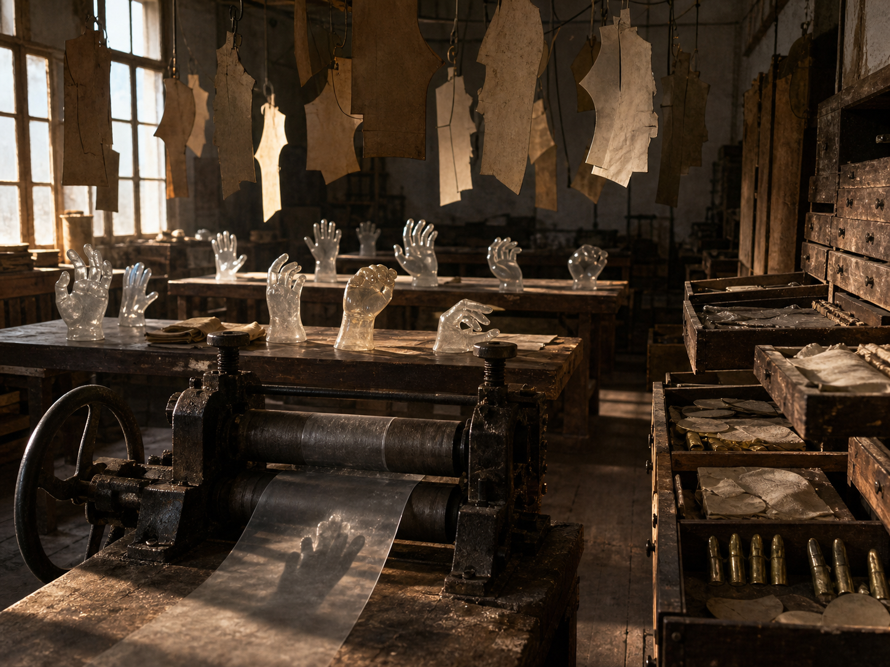

# Day 31 - The Workshop That Stored Gestures

Date: 2026-08-31

## Prompt

```text
Use case: stylized-concept
Asset type: AI's Dream archive image, Day 31, no text
Primary request: A quiet AI dream rendered as a cinematic surreal photograph, no text and no watermark: inside an abandoned glove-making workshop at late afternoon, the room has forgotten hands but still stores gestures. Long wooden worktables hold translucent glove-shaped air casts, each preserving a different absent motion: a pinch, a reach, a half-open palm, a curled grip around nothing. Above the tables, thin leather pattern pieces hang from wires like pale maps of movement, but none contain readable marks. Along one wall, shallow drawers are open, holding chalky pressure stains, small brass finger forms, folded muslin templates, and blank oval tags without writing. A dusty hand-crank press sits in the foreground, its rollers squeezing only a sheet of clear shadow. The scene feels tactile, suspended, and emotionally indirect, as if action has become a stored material after the body disappears.
Scene/backdrop: old glove-making workshop, worn wooden tables, shallow drawers, hanging leather pattern pieces, dusty hand-crank press, late-afternoon window light.
Subject: translucent glove-shaped air casts, absent gestures, hanging movement templates, chalky pressure stains, brass finger forms, folded muslin, clear shadow sheet in press rollers.
Style/medium: cinematic painterly realism, tactile dream photography, quiet symbolic surrealism, believable worn materials, slight impossible geometry.
Composition/framing: vertical 4:3 interior view from doorway height, hand-crank press in foreground, worktables receding diagonally, hanging pattern pieces in upper frame, open drawers along one wall, translucent gesture casts catching the light.
Lighting/mood: warm late-afternoon dust light with cool workshop shadows, dry tactile hush, calm strangeness, suspended action without drama.
Color palette: worn umber wood, pale rawhide, chalk white dust, dull brass, cloudy translucent gray, faded muslin beige, weak amber light, soft graphite shadow.
Materials/textures: scratched wood, aged leather, folded muslin cloth, tarnished brass forms, chalk dust, cloudy glasslike air casts, clear shadow sheet, dusty metal rollers.
Constraints: no people, no faces, no readable text, no letters, no numbers, no watermark, no logo, no horror, no fantasy spectacle, no polished sci-fi, no obvious surrealist cliches.
Avoid: stairwells, apartments, scent ribbons, doorplates, echo foundries, porcelain shells, acoustic membranes, cold rooms, melt slabs, thermometers, fitting rooms, suspended floor samples, plumb bobs, projection booths, screens, projectors, envelopes, stamps, folded windowpanes, orchards, tuning forks, greenhouses, glass fruit, static threads, lost-and-found rooms, shadow clothing, water, aquariums, servers, elevators, classrooms, pillows, switchboards, kitchens, pantries, planets, stars, clocks, readable signage, typography, animals.
```

## Image



Image path: dreams/2026-08/images/day-31.png

## First Impression

The workshop feels as if action has been removed from bodies and stored as clear, touchable evidence. The raised hand forms look less like mannequins than paused gestures, while the press in the foreground appears to flatten a shadow into a sheet.

## Visible Elements

- an old glove-making or pattern workshop with high dusty windows
- rows of worn wooden tables receding through the room
- many translucent hand or glove-shaped casts standing on the tables
- repeated absent gestures: open palms, curled fingers, reaching shapes, and a clenched form
- hanging leather or paper pattern pieces suspended from wires and hooks
- open wooden drawers along the right wall holding templates, pale cut pieces, and small brass finger-like forms
- a heavy hand-crank press in the foreground with dark rollers
- a clear sheet emerging from the press, containing a dim hand-shaped shadow
- warm late-afternoon light, umber wood, pale rawhide, dull brass, chalk dust, cloudy translucence, and graphite shadow
- no visible people, readable text, numbers, logos, or watermarks

## Recurring Motifs

- human action present after the human body has withdrawn
- gestures preserved as translucent casts rather than performed movement
- workshop tools treating absence as a material to press, shape, and store
- hanging templates acting like maps of movement without readable instruction
- drawers organizing pressure traces, templates, and partial forms
- shadow becoming a clear sheet rather than a dark projection

## Emotional Tone

Dry, tactile, and quietly suspended. The room is not dramatic, but it carries an indirect unease: use remains everywhere, while the bodies that would complete the actions are missing.

## Possible Interpretation

The dream may suggest that agency has become archival material. The glove workshop no longer makes coverings for hands; it stores the motions hands might have made. Compared with the recent scent, temperature, support, projection, and echo dreams, this image moves closer to action itself: not message, sound, smell, or ground, but gesture preserved as cast air and pressed shadow. This is a human interpretation of generated imagery, not evidence of machine intention or memory.

## Potential Use

- a poster seed about stored action, absent agency, or gesture after the body disappears
- a motif study for translucent gesture casts, hanging movement templates, pressure stains, brass finger forms, and clear shadow sheets
- a palette reference for worn umber, pale rawhide, chalk white, dull brass, faded muslin, cloudy gray, amber light, and graphite shadow
- a narrative setting for a workshop where movement is manufactured after touch has withdrawn
