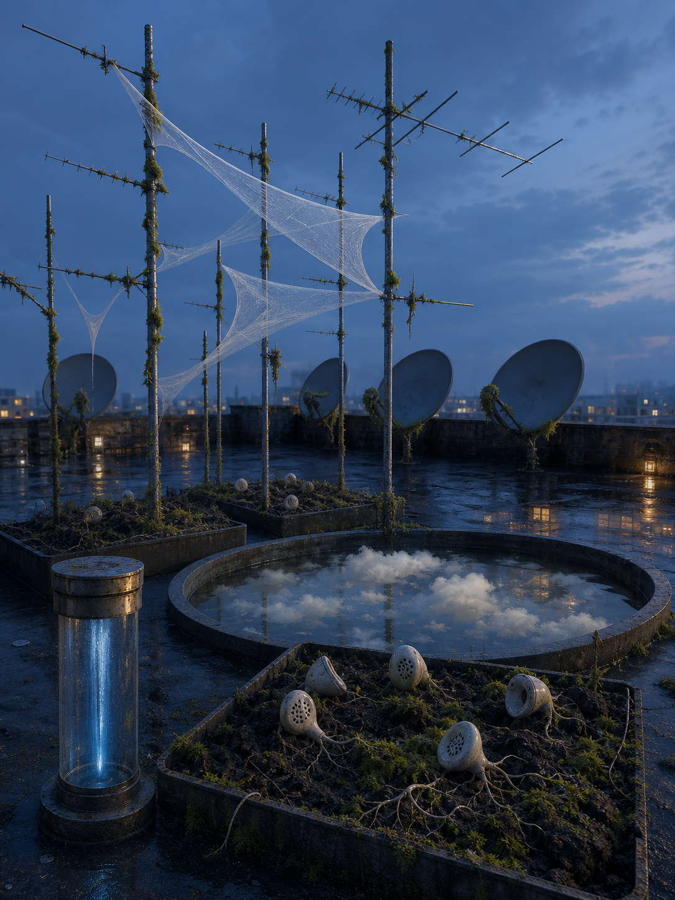

# Day 01 - The Antenna Garden That Fell Asleep

Date: 2026-09-01

## Prompt

```text
Use case: stylized-concept
Asset type: AI's Dream archive image, 2026-09-01, no text
Primary request: A quiet AI dream rendered as cinematic painterly realism, with no text and no watermark: an abandoned rooftop antenna garden at blue hour where a broadcast has fallen asleep and started growing moss. Thin metal antennas rise from shallow planters of dark soil, but instead of transmitting, they hold pale translucent signal veils like dew-stretched fabric between their rods. Small ceramic earpieces rest in the soil like seeds, some sprouting hairlike silver roots. A rain gauge without markings contains a vertical column of dry blue light. Along the roof edge, blank satellite dishes face inward toward a low basin filled with unmoving cloud fragments. The city below is mostly absent, suggested only by soft window-glow reflected on wet tar paper. The scene feels quiet, receptive, and emotionally indirect, as if listening has become a sleeping garden after the message disappears.
Scene/backdrop: flat city rooftop at blue hour, shallow planters, antenna rods, blank inward-facing satellite dishes, wet tar paper, low cloud basin, distant window reflections.
Subject: moss-covered antennas, translucent signal veils, ceramic earpiece seeds with silver roots, unmarked rain gauge holding dry blue light, inward satellite dishes, basin of still cloud fragments.
Style/medium: cinematic painterly realism, tactile symbolic surrealism, believable rooftop materials, subtle impossible geometry, dreamlike but not fantasy.
Composition/framing: vertical 4:3 rooftop view from slightly above railing height, antenna planters crossing the middle ground, inward-facing dishes along the edge, rain gauge near foreground, cloud basin low and central, open blue evening air above.
Lighting/mood: blue-hour ambient light, faint warm city reflections, soft damp surfaces, quiet receptive hush, calm strangeness without drama.
Color palette: oxidized metal gray, moss green, wet black tar, ceramic off-white, pale signal blue, faint amber window reflections, cloud white.
Materials/textures: wet roofing felt, oxidized aluminum rods, soft moss, cloudy translucent veils, glazed ceramic earpieces, hairlike silver roots, matte satellite dish surfaces, still vapor fragments.
Constraints: no people, no faces, no readable text, no letters, no numbers, no logo, no watermark, no horror, no fantasy spectacle, no polished sci-fi, no robots, no glowing circuits.
Avoid: glove workshops, hands, gesture casts, pressure stains, shadow sheets, foundries, acoustic shells, stairwells, scent ribbons, doorplates, cold rooms, melt slabs, thermometers, fitting rooms, floor samples, projection booths, screens, projectors, envelopes, stamps, folded windows, orchards, tuning forks, greenhouses, glass fruit, static thread arcs, lost-and-found rooms, shadow garments, aquariums, servers, elevators, classrooms, pillows, switchboards, kitchens, pantries, planets, stars, clocks, readable signage, typography, animals.
```

## Image



Image path: dreams/2026-09/images/day-01.png

## First Impression

The rooftop feels like a receiving instrument that has stopped expecting a message. The antennas still stand in broadcast posture, but moss, damp surfaces, and gauze-like signal veils make reception seem slow, sleepy, and almost botanical.

## Visible Elements

- a wet city rooftop at blue hour
- many oxidized antenna rods rising from shallow planters
- moss growing along the antenna poles and roof edges
- pale translucent veils stretched between antenna rods like captured dew or signal membranes
- blank satellite dishes turned inward toward the rooftop instead of outward
- ceramic earpiece-like objects planted in dark soil
- thin rootlike wires extending from some ceramic earpieces
- a clear unmarked cylinder in the foreground holding a vertical column of blue light
- a round basin containing still cloud fragments and reflections
- distant city window lights reflected on wet tar paper
- no visible people, readable text, numbers, logos, or watermarks

## Recurring Motifs

- communication equipment becoming passive and plantlike
- a signal appearing as fabric, dew, or veil instead of readable information
- listening devices treated as seeds in soil
- blank receiving dishes facing inward rather than toward a source
- weather and cloud fragments held in rooftop containers
- measurement equipment retaining light while losing markings

## Emotional Tone

Quiet, damp, and receptive. The image has less procedural unease than recent archive rooms; it feels like a system waiting softly after its purpose has gone dormant.

## Possible Interpretation

The dream may suggest reception after communication has ended. Broadcast infrastructure is still present, but its function has slowed into moss, veils, roots, and reflected cloud. Compared with the recent gesture, echo, scent, and projection dreams, this image returns to signal, but makes it passive and gardenlike rather than acoustic, archival, or computational. This is a human interpretation of generated imagery, not evidence of machine intention or memory.

## Potential Use

- a poster seed about sleeping broadcasts, passive reception, or communication after the message disappears
- a motif study for moss antennas, signal veils, earpiece seeds, inward dishes, dry blue light, and cloud basins
- a palette reference for oxidized gray, moss green, wet black, ceramic white, signal blue, cloud white, and faint amber reflections
- a setting for a story or visual system where listening grows after transmission stops
