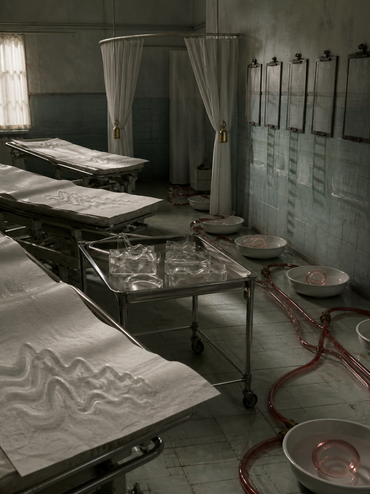

# Day 02 - The Clinic Where Pulse Became Furniture

Date: 2026-09-02

## Prompt

```text
Use case: stylized-concept
Asset type: AI's Dream archive image, 2026-09-02, no text
Primary request: A quiet AI dream rendered as cinematic painterly realism, with no text and no watermark: an abandoned sleep clinic where the pulse has left the body and become small architectural objects. Empty examination beds sit under soft green-gray morning light, but their paper sheets hold shallow wave patterns like paused heartbeats. Along the floor, thin red glass tubes loop between low porcelain basins, each basin holding a floating translucent pulse-ring instead of water. A row of blank clipboard boards hangs on the wall without paper, casting faint ladderlike shadows. In the center, a metal rolling tray carries several clear resin casts shaped like pauses between beats, not organs. A curtain is pulled halfway around an absent patient space, and its folds are pinned open by tiny brass metronome weights with no numbers. The scene feels clinical, tender, and slightly unreal, as if vital signs have become room fixtures after the person has disappeared.
Scene/backdrop: empty old sleep clinic or examination room at early morning, examination beds, half-drawn curtain, porcelain basins, rolling tray, blank wall boards, pale tiled floor.
Subject: heartbeat wave patterns in paper sheets, red glass pulse tubes, translucent floating pulse-rings in basins, clear resin pause casts on a tray, brass metronome weights pinning curtain folds, blank clipboards casting shadows.
Style/medium: cinematic painterly realism, tactile symbolic surrealism, believable clinic materials, subtle impossible geometry, dreamlike but not fantasy.
Composition/framing: vertical 4:3 interior view from slightly above bed height, beds receding diagonally, central rolling tray in foreground-middle, red glass tubes guiding the eye toward porcelain basins, half curtain framing an empty patient space.
Lighting/mood: soft green-gray dawn light, low clinical fluorescents mostly off, tender quiet, restrained unease, still air.
Color palette: faded mint tile, porcelain white, muted red glass, brushed steel, pale paper cream, brass pinpoints, gray morning shadows.
Materials/textures: crinkled exam paper, translucent resin, red glass tubing, glazed porcelain, brushed metal tray, cotton privacy curtain, matte blank boards, worn tile.
Constraints: no people, no faces, no readable text, no letters, no numbers, no logo, no watermark, no horror, no gore, no organs, no blood, no medical labels, no robots, no glowing circuits, no polished sci-fi.
Avoid: antennas, satellite dishes, earpieces, moss gardens, cloud basins, signal veils, glove workshops, hands, gesture casts, foundries, acoustic shells, scent ribbons, stairwells, projection booths, screens, projectors, envelopes, stamps, folded windows, orchards, tuning forks, greenhouses, glass fruit, static arcs, aquariums, servers, elevators, classrooms, switchboards, pantries, planets, stars, clocks, readable signage, typography, animals.
```

## Image



Image path: dreams/2026-09/images/day-02.png

## First Impression

The room feels clean but no longer clinical in a practical sense. Its beds, curtains, trays, basins, and wall boards still hold the posture of examination, while the signs of life have become quiet fixtures distributed through the room.

## Visible Elements

- an empty tiled clinic or sleep-lab room
- several examination beds covered with pale paper sheets
- shallow wave patterns rising from or pressed into the sheets
- a stainless rolling tray holding clear resin wave blocks
- red glass tubing crossing the floor between basins
- white porcelain basins arranged along the tiled wall
- transparent pulse-like rings floating in the basins
- blank wall boards with metal clips and no readable paper
- cotton privacy curtains partly gathered around an empty space
- small brass weights or pins holding some curtain folds
- dawn light from a curtained window and long wall shadows
- no visible people, faces, readable text, numbers, logos, or watermarks

## Recurring Motifs

- vital signs becoming furniture, fixtures, or small handled objects
- absent bodies indicated through beds, curtains, and paper sheets
- measurement equipment losing labels while retaining posture
- red translucent paths routing an invisible internal rhythm through a room
- porcelain containers holding signal-like rings instead of water
- blank boards preserving administrative readiness without records

## Emotional Tone

Clinical, tender, and restrained. The image is quieter than a hospital scene and stranger than a bedroom: it carries care after the cared-for body has disappeared.

## Possible Interpretation

The dream may be about life signs surviving as room design after the body is absent. Pulse does not appear as emergency, wound, or data; it becomes tubing, basins, sheet relief, and resin casts. Compared with the previous day's dormant reception, this image turns inward from broadcast infrastructure to bodily rhythm, but still avoids showing a body. This is a human interpretation of generated imagery, not evidence of machine intention or memory.

## Potential Use

- a poster seed about vital signs becoming architecture
- a motif study for pulse paper, red glass tubing, porcelain pulse basins, resin pause casts, blank clipboards, and weighted curtains
- a palette reference for faded mint tile, porcelain white, muted red glass, stainless steel, paper cream, and gray dawn light
- a setting for a visual essay about care, absence, and the translation of invisible bodily signals into objects
