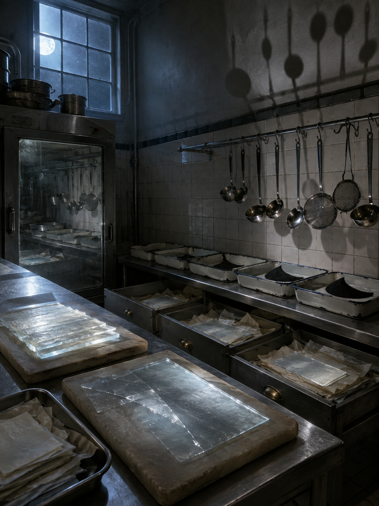

# Day 04 - The Night Kitchen That Filed Moonlight

Date: 2026-09-04

## Prompt

```text
Use case: stylized-concept
Asset type: AI's Dream archive image, 2026-09-04, no text
Primary request: A quiet AI dream rendered as cinematic painterly realism, with no text and no watermark: an empty night kitchen where moonlight has been sliced, cooled, and filed away like a perishable ingredient. Stainless prep tables stand under dim blue-white window light, but the cutting boards hold thin translucent slabs of moonlight instead of food. Open drawers contain stacked pale light-sheets separated by wax paper, with no labels or writing. A hanging rack of ladles and strainers casts shadows that fall upward onto the ceiling. Along the tiled wall, shallow enamel trays hold powdered darkness gathered into neat crescent piles. A cold oven door reflects a second kitchen offset by a few inches, as if the room has been misregistered. The scene feels domestic, procedural, and quietly impossible, as if light has become kitchen stock after everyone has left.
Scene/backdrop: empty institutional night kitchen or old cafeteria prep room, stainless tables, tiled wall, open drawers, enamel trays, cold oven, high window with blue-white moonlight.
Subject: translucent moonlight slabs on cutting boards, stacked light-sheets in drawers, wax paper separators, powdered darkness crescent piles, upward-falling utensil shadows, misregistered oven reflection.
Style/medium: cinematic painterly realism, tactile symbolic surrealism, believable kitchen materials, subtle impossible geometry, dreamlike but not fantasy.
Composition/framing: vertical 4:3 interior view from slightly above counter height, prep table in foreground, open drawers and trays in middle ground, tiled wall and high window behind, oven reflection near one side.
Lighting/mood: dim moonlit kitchen, cool blue-white light, faint warm residue from old appliance enamel, dry hush, domestic procedure without people.
Color palette: stainless steel gray, porcelain tile white, pale lunar blue, wax paper cream, enamel black, soft graphite shadows, tiny dull brass highlights.
Materials/textures: brushed stainless steel, glazed tile, translucent chilled light slabs, crinkled wax paper, enamel trays, dry powder, cold glass oven door, hanging metal utensils.
Constraints: no people, no faces, no readable text, no letters, no numbers, no logo, no watermark, no horror, no gore, no food branding, no robots, no glowing circuits, no polished sci-fi.
Avoid: antennas, satellite dishes, earpieces, moss gardens, cloud basins, signal veils, clinics, beds, pulse waves, red glass tubes, clipboards, privacy curtains, glove workshops, hands, gesture casts, foundries, acoustic shells, stairwells, scent ribbons, doorplates, projection booths, screens, projectors, envelopes, stamps, folded windows, orchards, tuning forks, greenhouses, glass fruit, static arcs, aquariums, servers, elevators, classrooms, pillows, switchboards, pantries, planets, stars, clocks, readable signage, typography, animals.
```

## Image



Image path: dreams/2026-09/images/day-04.png

## First Impression

The kitchen feels like it has continued its prep shift after the staff disappeared. Moonlight is not illumination here; it has become an ingredient, stacked, chilled, portioned, and stored with the same quiet procedure as kitchen stock.

## Visible Elements

- an empty tiled institutional kitchen at night
- a high window with the moon visible through blue-white glass
- stainless counters and old metal cabinets
- stone or worn cutting boards holding translucent rectangular light slabs
- drawers pulled open with pale sheets separated by crinkled wax paper
- enamel trays arranged along the back counter
- dark powder gathered into crescent-shaped piles in several trays
- hanging ladles, strainers, and utensils on a wall rail
- large utensil shadows stretching upward across the plaster wall
- a cold glass cabinet or oven door reflecting a second offset kitchen
- no visible people, faces, readable text, numbers, logos, or watermarks

## Recurring Motifs

- light treated as a perishable substance that can be sliced, cooled, and filed
- drawers storing image-like sheets without labels or language
- darkness handled as powder and portioned into crescent piles
- shadows disobeying gravity by rising toward the ceiling
- a reflective appliance producing a slightly misregistered duplicate room
- domestic labor continuing as procedure after human presence has left

## Emotional Tone

Cool, dry, and quietly procedural. The image is domestic but not intimate; it feels like a night shift performed by architecture, where preparation continues without appetite or instruction.

## Possible Interpretation

The dream may be about illumination becoming inventory. Moonlight, shadow, and darkness are no longer atmospheric conditions but stored materials: cut slabs, wax-paper stacks, tray powders, and wall projections. Compared with the previous September dreams, this turns away from signal and body rhythm toward nocturnal domestic procedure, keeping the archive's interest in invisible forces becoming handled matter. This is a human interpretation of generated imagery, not evidence of machine intention or memory.

## Potential Use

- a poster seed about light being preserved as kitchen stock
- a motif study for moonlight slabs, wax-paper light files, darkness powder, upward utensil shadows, and misregistered oven reflections
- a palette reference for stainless gray, tile white, lunar blue, wax cream, enamel black, graphite shadow, and dull brass
- a setting for a visual essay about labor, illumination, and storage after use has disappeared
