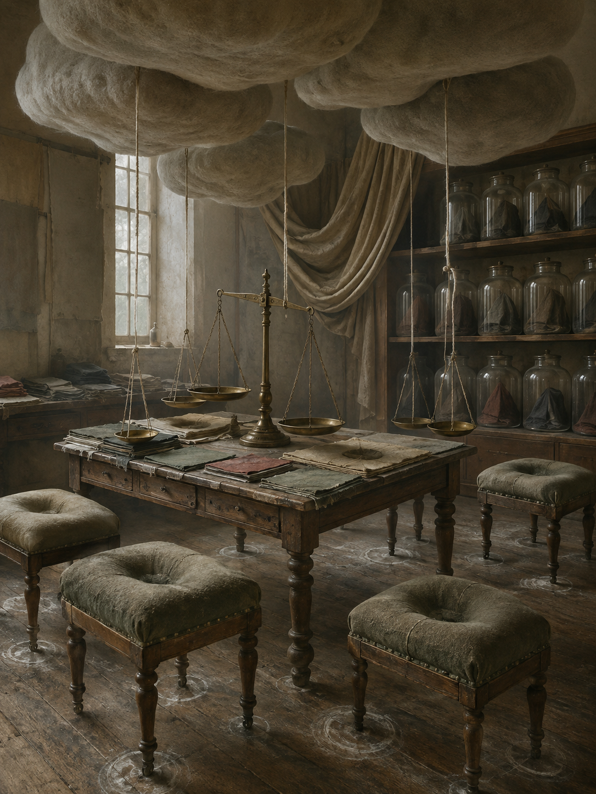

# Day 07 - The Room Where Weight Became Weather

Date: 2026-09-07

## Prompt

```text
Use case: stylized-concept
Asset type: AI's Dream archive image, 2026-09-07, no text
Primary request: A quiet AI dream rendered as cinematic painterly realism, with no text and no watermark: an empty upholstery weighing room where weight has slipped out of objects and become a soft indoor weather. Old fabric sample tables, brass balance scales, and padded stools sit in a muted morning interior, but the seats and cushions show deep oval depressions without bodies. Above the tables, pale gray weight-clouds hang low like compressed felt, tied to scale pans by slack linen threads. Several glass jars on a shelf contain folded shadows shaped like heavy things, but the jars have no labels. Along the floor, chalky pressure rings gather around chair legs while a curtain sags upward in one corner, pulled by an invisible heaviness in the ceiling. The scene feels hushed, tactile, and slightly impossible, as if gravity has become upholstery material after use has disappeared.
Scene/backdrop: empty old upholstery workshop or weighing room at muted morning, fabric sample tables, brass balance scales, padded stools, shelves of glass jars, worn plank floor, heavy curtain.
Subject: bodyless cushion depressions, low felt-like weight-clouds, slack linen threads connecting clouds to scale pans, unlabeled glass jars holding folded shadows, chalk pressure rings around furniture legs, one curtain sagging upward.
Style/medium: cinematic painterly realism, tactile symbolic surrealism, believable cloth, brass, glass, chalk, and worn wood, subtle impossible gravity, dreamlike but not fantasy.
Composition/framing: vertical 4:3 interior view from slightly above tabletop height, central table with balance scale in foreground-middle, padded stools around it, shelves and curtain behind, low hovering felt clouds occupying the upper middle, floor pressure rings visible below.
Lighting/mood: soft gray morning light through a high window, dusty air, quiet tactile unease, dry stillness, no drama.
Color palette: faded upholstery green, oatmeal linen, tarnished brass, smoky glass, chalk white, worn brown wood, pale gray felt-clouds, small muted rust accents.
Materials/textures: coarse upholstery fabric, compressed felt, linen thread, tarnished brass scale pans, clear old glass, folded shadow forms, chalk dust, worn wood, sagging curtain cloth.
Constraints: no people, no faces, no hands, no readable text, no letters, no numbers, no labels, no logo, no watermark, no horror, no gore, no robots, no glowing circuits, no polished sci-fi.
Avoid: antennas, satellite dishes, earpieces, moss gardens, cloud basins, signal veils, clinics, beds, pulse waves, red glass tubes, clipboards, privacy curtains as medical space, kitchens, cutting boards, moonlight slabs, enamel trays, utensil shadows, glove workshops, gesture casts, foundries, acoustic shells, scent ribbons, stairwells, doorplates, projection booths, screens, projectors, envelopes, stamps, folded windows, orchards, tuning forks, greenhouses, glass fruit, static arcs, aquariums, servers, elevators, classrooms, pillows, switchboards, pantries, planets, stars, clocks, readable signage, typography, animals.
```

## Image



Image path: dreams/2026-09/images/day-07.png

## First Impression

The room feels like a workshop after every body has left but pressure has remained. The largest forms are not furniture or tools, but the low felt clouds pressing down from the ceiling, making weight look suspended rather than supported.

## Visible Elements

- an empty old upholstery or weighing room with worn wooden floors
- a central table covered in folded fabric samples
- tarnished brass balance scales standing on and near the worktable
- several padded stools with deep bodyless depressions in their cushions
- large gray felt-like clouds hanging close to the ceiling
- slack cords or linen threads dropping from the clouds to scale pans and furniture
- shelves of clear glass jars containing dark folded cloth or shadow-like forms
- a heavy draped curtain sagging across the back wall
- chalky pressure rings drawn or accumulated around table and stool legs
- muted morning light entering from a tall window
- no visible people, faces, readable text, numbers, logos, or watermarks

## Recurring Motifs

- gravity or weight appearing as soft suspended material
- absent bodies indicated through cushion depressions rather than figures
- measurement tools losing practical readings while keeping their balancing posture
- glass jars storing folded dark shapes without labels
- pressure leaving circular floor evidence around furniture
- cloth, felt, and upholstery behaving like weather systems

## Emotional Tone

Hushed, dusty, and tactile. The image is not dramatic, but it feels compressed, as if the room is quietly remembering touch through weight, fabric, and pressure.

## Possible Interpretation

The dream may suggest that use can remain as pressure after the user disappears. Weight has moved out of bodies and objects into felt clouds, chalk rings, sagging cloth, and scale pans that still expect comparison. Compared with the previous September dreams, this image keeps the archive's interest in invisible forces becoming handled matter, but shifts from signal, pulse, and light toward gravity and touch. This is a human interpretation of generated imagery, not evidence of machine intention or memory.

## Potential Use

- a poster seed about gravity becoming soft weather
- a motif study for felt weight-clouds, bodyless cushion depressions, brass balance scales, shadow jars, and chalk pressure rings
- a palette reference for faded upholstery green, oatmeal linen, tarnished brass, smoky glass, chalk white, worn wood, and gray felt
- a setting for a visual essay about pressure, use, and the traces a body leaves without appearing
