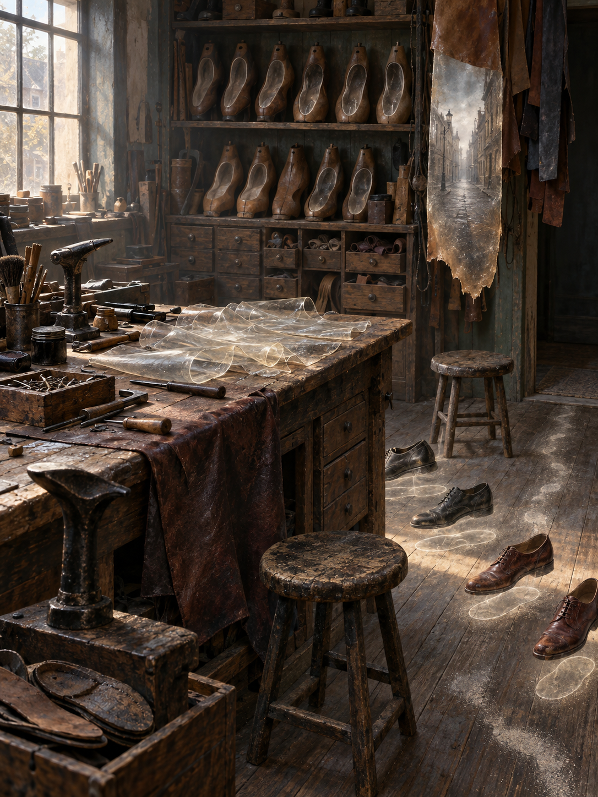

# Day 10 - The Shoe Repair Shop of Absent Walking

Date: 2026-09-10

## Prompt

```text
Use case: stylized-concept
Asset type: AI's Dream archive image, 2026-09-10, no text
Primary request: A quiet AI dream rendered as cinematic painterly realism, with no text and no watermark: an empty old shoe repair shop where walking has slipped out of shoes and become a repairable transparent material. Cobblers' benches, wooden shoe lasts, worn soles, awls, brushes, and small drawers sit in a muted afternoon interior, but no people are present. Across the central bench, translucent folded stride-skins lie like thin glass leather waiting to be patched. Several empty shoes cast faint step-shaped halos that hover slightly above the floor instead of touching it. A rack of wooden lasts holds clear missing-foot impressions, not feet. Fine pale dust gathers into short paths between stools, then stops before any doorway. In one corner, a hanging strip of waxed leather contains a cloudy miniature street with no signs or readable marks. The scene feels hushed, tactile, and slightly impossible, as if motion has become workshop material after every walker has disappeared.
Scene/backdrop: empty old shoe repair shop at muted afternoon, cobbler bench, worn wooden floor, shelves of lasts, shoe brushes, awls, waxed leather strips, unlabeled drawers.
Subject: translucent folded stride-skins on the bench, empty shoes with hovering step halos, wooden lasts holding clear missing-foot impressions, dust paths that stop before thresholds, a waxed leather strip containing a cloudy signless street.
Style/medium: cinematic painterly realism, tactile symbolic surrealism, believable leather, wood, glasslike film, dust, brass tools, and muted interior light; dreamlike but not fantasy.
Composition/framing: vertical 4:3 interior view from slightly above bench height, central cobbler bench in foreground-middle, shelves and hanging leather behind, dust paths visible across floor, hovering step halos low in the room.
Lighting/mood: soft slanting afternoon light through a high shop window, dry dust in the air, quiet tactile unease, patient stillness, no drama.
Color palette: worn oxblood leather, pale cobbler's dust, old honey wood, muted gray-green walls, tarnished brass, cloudy translucent glass, faded black rubber, small dull blue accents.
Materials/textures: cracked leather, glasslike transparent stride skins, shoe polish residue, wood grain, brass tacks, soft dust paths, waxed leather, clear missing-foot impressions.
Constraints: no people, no faces, no hands, no readable text, no letters, no numbers, no labels, no logo, no watermark, no horror, no gore, no robots, no glowing circuits, no polished sci-fi.
Avoid: antennas, satellite dishes, earpieces, moss gardens, cloud basins, signal veils, clinics, beds, pulse waves, red glass tubes, clipboards, kitchens, cutting boards, moonlight slabs, utensil shadows, upholstery weighing rooms, felt weight-clouds, balance scales, shadow jars, gravity curtains, glove workshops, gesture casts, foundries, acoustic shells, scent ribbons, stairwells, doorplates, projection booths, screens, projectors, envelopes, stamps, folded windows, orchards, tuning forks, greenhouses, glass fruit, static arcs, aquariums, servers, elevators, classrooms, pillows, switchboards, pantries, planets, stars, clocks, readable signage, typography, animals.
```

## Image



Image path: dreams/2026-09/images/day-10.png

## First Impression

The image feels like a workplace after motion has been removed from the body and left behind as repair stock. The transparent forms on the bench read less like decoration than like fragile strips of used walking waiting to be mended.

## Visible Elements

- an empty old shoe repair shop with worn wooden floors and muted afternoon light
- a central cobbler bench covered with tools, brushes, tacks, leather, and cloudy transparent sheets
- shelves of wooden shoe lasts, many holding clear missing-foot impressions
- several empty shoes on the floor
- faint step-shaped halos hovering around or just above the shoes
- pale dust gathered into interrupted paths between stools and benches
- a hanging strip of translucent waxed leather containing a cloudy signless street scene
- old drawers, stools, awls, and shoe-repair tools without visible users
- no visible people, faces, readable text, numbers, logos, or watermarks

## Recurring Motifs

- absent bodies indicated through tools, shoes, and impressions rather than figures
- movement preserved as transparent material
- functional repair space continuing after the function's user disappears
- ordinary craft tools arranged around an intangible residue
- street or route imagery contained inside a small hanging material fragment
- dust forming paths that imply movement but do not reach a destination

## Emotional Tone

Warm, dry, and quietly worklike. The room is not abandoned in a dramatic way; it feels paused, as if it still expects walking to return as something that can be patched by hand.

## Possible Interpretation

The dream may suggest that motion can remain after the walker disappears, not as footprints alone but as a delicate material needing maintenance. Compared with earlier September images, it keeps the archive's interest in invisible forces becoming handled matter, but shifts from signal, pulse, light, and gravity toward locomotion and craft. This is a human interpretation of generated imagery, not evidence of machine intention or memory.

## Potential Use

- a poster seed about walking becoming a repairable transparent skin
- a motif study for stride-skins, missing-foot impressions, hovering step halos, interrupted dust paths, and street-bearing leather
- a palette reference for oxblood leather, honey wood, gray-green walls, pale dust, cloudy glass, faded black rubber, and tarnished brass
- a setting for a visual essay about use, repair, and the traces left by repeated movement
