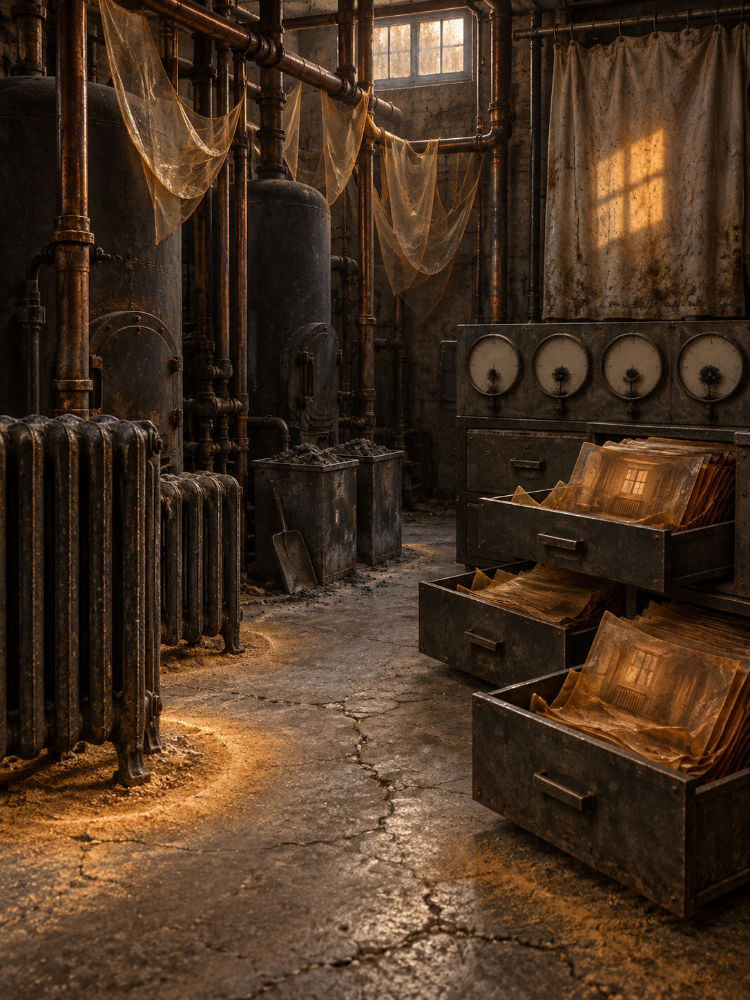

# Day 14 - The Boiler Room That Stored Warmth

Date: 2026-09-14

## Prompt

```text
Use case: stylized-concept
Asset type: AI's Dream archive image, 2026-09-14, no text
Primary request: A quiet AI dream rendered as cinematic painterly realism, with no text and no watermark: an empty old boiler room where warmth has left the fire and become a dry residue that can be swept, folded, and stored. Dark iron boilers, dormant radiator ribs, copper pipes, ash bins, and a cracked concrete floor sit in muted amber-gray morning light, but no flame is visible. Around the pipes, transparent heat-skins hang in soft sagging sheets like cooled breath. On the floor, fine ocher dust gathers into gentle circular warmth halos around cold radiator feet. Several open metal drawers hold folded amber films, each film preserving the shape of a room that is no longer heated. A row of blank pressure dials has no numbers or needles; instead, tiny soot flowers bloom from the empty centers. Near the back wall, a heavy canvas curtain is stained by a rectangular patch of remembered sunlight, while the rest of the room remains cool and still. The scene feels hushed, dry, worklike, and slightly impossible, as if heat has become maintenance material after every source has gone out.
Scene/backdrop: empty old boiler room or building basement in muted morning, dark iron boiler tanks, copper pipes, dormant radiators, ash bins, metal drawers, cracked concrete floor, stained canvas curtain.
Subject: transparent heat-skins hanging from pipes, ocher warmth dust halos around radiator feet, folded amber films in metal drawers, blank pressure dials blooming small soot flowers, rectangular remembered sunlight stain on canvas.
Style/medium: cinematic painterly realism, tactile symbolic surrealism, believable iron, copper, dust, soot, concrete, canvas, and amber translucent material; dreamlike but not fantasy.
Composition/framing: vertical 4:3 interior view from slightly above floor height, boiler and pipes forming the left and back structure, radiator feet and warmth halos visible in foreground, open drawers in middle ground, blank dials and canvas curtain in background.
Lighting/mood: dim amber-gray morning light through a small high window, cooled industrial stillness, dry hush, low maintenance atmosphere, calm strangeness without drama.
Color palette: blackened iron, tarnished copper, ash gray concrete, ocher dust, translucent amber heat film, soot black, faded canvas beige, faint pale sunlight.
Materials/textures: rusted iron, dull copper pipes, dry soot flowers, powdery ocher dust, glasslike amber films, cracked concrete, heavy stained canvas, cold radiator enamel.
Constraints: no people, no faces, no hands, no readable text, no letters, no numbers, no labels, no logo, no watermark, no horror, no fire, no flames, no smoke plume, no robots, no glowing circuits, no polished sci-fi.
Avoid: shoes, shoe repair shops, stride skins, foot lasts, step halos, street-bearing leather, upholstery weighing rooms, felt weight-clouds, balance scales, shadow jars, kitchens, cutting boards, moonlight slabs, utensil shadows, clinics, beds, pulse waves, red glass tubes, clipboards, antennas, satellite dishes, earpieces, moss gardens, cloud basins, signal veils, glove workshops, gesture casts, foundries, acoustic shells, scent ribbons, stairwells, doorplates, projection booths, screens, projectors, envelopes, stamps, folded windows, orchards, tuning forks, greenhouses, glass fruit, static arcs, aquariums, servers, elevators, classrooms, pillows, switchboards, pantries, planets, stars, clocks, readable signage, typography, animals.
```

## Image



Image path: dreams/2026-09/images/day-14.png

## First Impression

The room feels like it has cooled down without becoming empty. Heat remains present as a handled residue: sagging amber skins, dust halos, drawer films, and a sunlight stain that behaves more like stored evidence than illumination.

## Visible Elements

- an empty old boiler room with dark iron tanks and dense copper piping
- a cold radiator in the foreground
- transparent amber sheets hanging loosely from overhead pipes
- ocher dust gathered around radiator feet and across the cracked concrete floor
- ash bins and a small shovel near the center of the room
- open metal drawers filled with translucent amber films
- several blank round pressure dials with dark soot-flower forms in their centers
- a stained canvas curtain on the back wall
- a rectangular patch of sunlight or remembered heat falling across the curtain
- a high window with muted morning light
- no visible people, faces, readable text, numbers, logos, or watermarks

## Recurring Motifs

- heat becoming a foldable transparent material
- warmth leaving circular dust evidence around cold infrastructure
- measurement dials losing numbers and needles while retaining their faces
- soot behaving like small flowers or growths inside empty instrument centers
- drawers storing room-shaped amber films without labels
- sunlight preserved as a rectangular stain rather than active illumination

## Emotional Tone

Dry, warm, and cooled at the same time. The image is worklike and basement-quiet, with unease carried by maintenance continuing after fire and use have disappeared.

## Possible Interpretation

The dream may suggest that warmth can remain after its source goes out, not as comfort exactly, but as residue, filing material, and instrument bloom. Compared with the September dreams about signal, pulse, light, gravity, and movement, this image shifts the archive toward thermal memory: another invisible force made tactile after human use withdraws. This is a human interpretation of generated imagery, not evidence of machine intention or memory.

## Potential Use

- a poster seed about warmth becoming archival residue
- a motif study for heat-skins, warmth dust halos, amber drawer films, soot flowers, and remembered sunlight stains
- a palette reference for blackened iron, tarnished copper, ash gray, ocher dust, translucent amber, soot black, canvas beige, and pale sunlight
- a setting for a visual essay about maintenance, heat, infrastructure, and the afterlife of comfort
