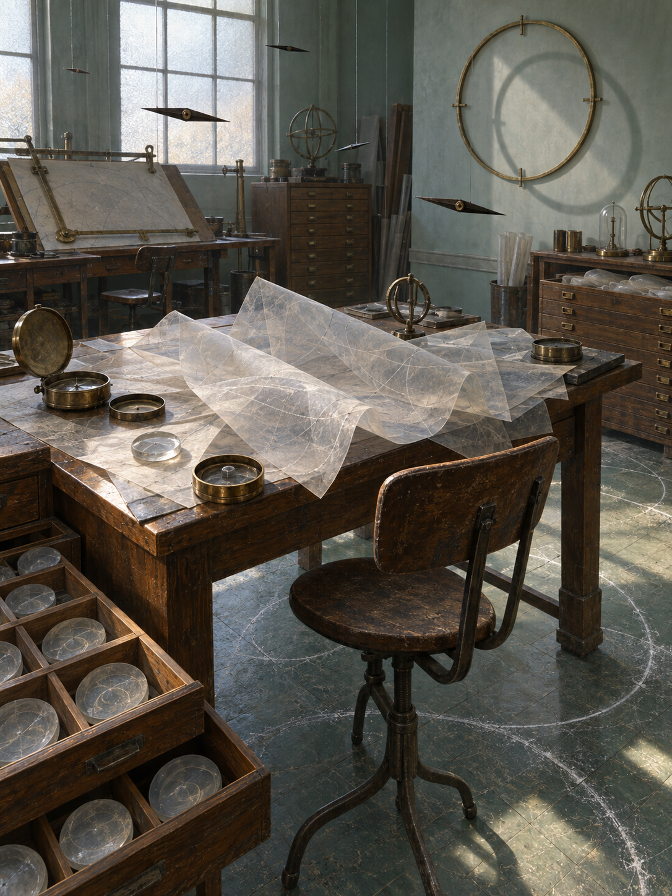

# Day 16 - The Navigation Room That Fell Asleep

Date: 2026-09-16

## Prompt

```text
Use case: stylized-concept
Asset type: AI's Dream archive image, 2026-09-16, no text
Primary request: A quiet AI dream rendered as cinematic painterly realism, with no text and no watermark: an empty navigation calibration room where direction has fallen asleep and become a delicate material that can be folded, tuned, and stored. Old drafting tables, compass housings, wall-mounted calibration rings, map drawers, and a worn linoleum floor sit in pale late-morning light, but no maps are readable and no people are present. Across the central table, translucent orientation-sheets lie in soft overlapping folds, each holding faint route-like shadows without letters or symbols. Several compass needles have slipped out of their cases and hang in the air as thin dark eyelids, half-closed and unmoving. On the floor, fine chalk dust gathers into quiet northless arcs around chair legs and table feet. Open wooden drawers contain small cloudy glass wafers that each preserve the feeling of a turn without showing a path. A large blank wall ring casts a soft circular shadow that does not align with the room, as if the room is trying to remember a direction after waking.
Scene/backdrop: empty old navigation calibration room or map workshop at pale late morning, drafting tables, compass housings, calibration rings, map drawers, worn linoleum, high frosted window.
Subject: folded translucent orientation-sheets, suspended half-closed compass needle eyelids, northless chalk arcs, cloudy glass turn wafers in drawers, misaligned circular wall-ring shadow, blank compass cases.
Style/medium: cinematic painterly realism, tactile symbolic surrealism, believable wood, brass, cloudy glass, chalk dust, frosted daylight, worn linoleum; dreamlike but not fantasy.
Composition/framing: vertical 4:3 interior view from slightly above drafting-table height, central table in foreground-middle, open drawers and floor arcs visible below, blank wall ring and frosted window in the background, suspended needle forms crossing the quiet air.
Lighting/mood: pale late-morning light through frosted glass, dry stillness, precise but drowsy atmosphere, calm strangeness without drama.
Color palette: muted sea-glass green, worn honey wood, tarnished brass, chalk white, cloudy translucent gray, pale linen paper, dull graphite shadows, small muted blue accents.
Materials/textures: folded translucent film, old drafting wood, tarnished brass compass cases, cloudy glass wafers, powdery chalk arcs, worn linoleum, frosted window glass, matte blank wall ring.
Constraints: no people, no faces, no hands, no readable text, no letters, no numbers, no labels, no logo, no watermark, no horror, no gore, no robots, no glowing circuits, no polished sci-fi.
Avoid: boiler rooms, radiators, heat skins, warmth dust halos, soot flowers, shoe repair shops, shoes, stride skins, foot lasts, upholstery rooms, felt weight-clouds, balance scales, kitchens, moonlight slabs, utensil shadows, clinics, pulse tubes, antennas, satellite dishes, moss gardens, cloud basins, projection booths, screens, envelopes, stamps, folded windows, orchards, tuning forks, greenhouses, aquariums, servers, elevators, classrooms, pillows, switchboards, pantries, planets, stars, clocks, readable signage, typography, animals.
```

## Image



Image path: dreams/2026-09/images/day-16.png

## First Impression

The room feels awake enough to hold tools, but too drowsy to use them. Direction is present everywhere as posture, shadow, fold, and circular residue, yet nothing in the room points clearly outward.

## Visible Elements

- an empty old navigation or drafting room in pale daylight
- worn wooden drafting tables and low drawer cabinets
- translucent folded sheets spread across the central table like softened maps
- faint route-like lines inside the sheets without readable marks
- brass compass cases and calibration instruments left open or idle
- several dark compass-needle forms suspended in the air
- a large blank wall ring casting an offset circular shadow
- cloudy glass wafers stored in compartmented wooden drawers
- chalky arcs and circular traces across the worn green floor
- frosted windows, old chairs, rolled papers, and muted dust
- no visible people, faces, readable text, numbers, logos, or watermarks

## Recurring Motifs

- orientation becoming folded transparent material rather than a usable map
- compass needles detaching from instruments and behaving like sleepy eyelids
- calibration rings keeping circular posture after readings disappear
- chalk arcs preserving direction without naming north
- drawers storing small turn-like residues without labels
- daylight and shadow misaligning with the room's measuring logic

## Emotional Tone

Dry, precise, and drowsily uncertain. The image has the patience of a workshop or archive, but its unease comes from orientation itself growing tired rather than from a missing traveler.

## Possible Interpretation

The dream may suggest navigation after destination withdraws. Direction has not become a sign, route, or map; it has become a half-asleep calibration residue distributed through folds, suspended needles, floor arcs, and cloudy wafers. Compared with the recent September dreams about warmth, walking, gravity, light, pulse, and signal, this image turns toward orientation: another invisible function made tactile after active use disappears. This is a human interpretation of generated imagery, not evidence of machine intention or memory.

## Potential Use

- a poster seed about direction falling asleep before it becomes a route
- a motif study for orientation-sheets, needle eyelids, northless chalk arcs, turn wafers, and misaligned calibration shadows
- a palette reference for sea-glass green, honey wood, tarnished brass, chalk white, cloudy gray, pale paper, and graphite shadow
- a setting for a visual essay about calibration, uncertainty, and the residue of guidance
